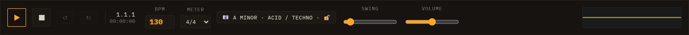

# Transport

The transport bar runs across the top of the interface and controls every aspect of playback timing.

---

## Play / Stop

Press **▶** (`#play`) to start playback. The button acts as a toggle — pressing it again stops the transport. When you press Play the browser's `AudioContext` resumes automatically if it was suspended (a browser policy requirement on first interaction).

---

## Position and time readout

The readout shows two values side by side:

- **Bar.Beat.Step** (`#transport-position`, e.g. `1.1.1`) — the current song position derived from elapsed time, BPM, and the active meter. The counter resets to `1.1.1` on each new Play.
- **Elapsed** (`#transport-time`, e.g. `00:00:00`) — wall-clock time since the most recent Play press.

Both readouts update via `requestAnimationFrame` while playing and freeze on stop so you can read the final position. Because each lane has its own independent loop clock, the global position is computed from elapsed seconds rather than a single sequencer cursor. The visual playhead is similarly a display-only timer matched to scheduled audio time; it may drift slightly under browser tab throttling, but audio scheduling is unaffected.

---

## Tempo controls

**BPM** (`#bpm`) — sets the tempo. Range: 40–240 BPM, default 130. You can type a value directly or use the number-input spinners. BPM changes propagate immediately to the sequencer, all lane engines, delay/LFO sync, and stretch-mode loop buffers. The change takes effect on the next scheduled step; it does not alter a note that is already held.

Each 16th-note step lasts `60 / bpm / 4` seconds.

**Meter** (`#meter`) — sets the global time signature. The dropdown offers common meters: 4/4, 3/4, 2/4, 5/4, 6/8, 7/8, 9/8, and 12/8. The meter controls how bars map onto the 16th-step grid and how the position readout counts beats. Changing the meter takes effect on the next loop cycle.

**Swing** (`#swing`) — delays every odd 16th-note step to add a shuffle feel. Range: 0 (straight) to 0.6 (heavy swing). The value is saved and restored with the session. Swing is stored in the sequencer and persisted but its full scheduling effect is reserved for a future update; the slider is present and functional as a parameter store.

---

## Master volume

**Volume** (`#volume`) — the master output level, range 0–1 (default 0.5). This is a post-mix gain applied before the output visualiser.

---

## Bars

**Bars** (`#bars`) — sets the default clip length for new clips: 1, 2, 3, or 4 bars. This controls the view length in the clip editors and the length assigned to clips you create.

---

## Mode toggle and REC

**Session / Performance** (`#mode-toggle`) — switches the main view between the Session clip grid and the Performance arrangement view.

- **Session** is the default mode: you see the clip grid and can trigger scenes, edit clips, and record automation in real time.
- **Performance** shows the arrangement timeline where recorded takes are displayed as timeline bands and automation curves can be drawn directly. Performance mode is functional — takes can be recorded, saved, and reloaded — but the workflow is still evolving. See [Saving & Export](09-saving-and-export.md) for save/load details.

**● REC** (`#rec`) — arms knob-movement recording. When armed (button shows "● REC ON"), any knob you move during playback is captured as automation in the current take. Click again to disarm. See [Modulation & Note FX](06-modulation-and-note-fx.md) for how automation lanes work.

---

## Output visualiser

The canvas at the far right (`#viz`) shows a real-time waveform of the master output. It updates continuously while the page is open and gives a quick visual check that audio is flowing.

---

## Session management, export, and demos

The remaining controls in the transport row are covered in dedicated chapters:

- **↓ WAV ▾** (`#export-scene`) — opens an export menu with Real-time and Offline (fast) options. See [Saving & Export](09-saving-and-export.md).
- **New / Save / Load** (`#new-session`, `#save`, `#load`) — session file management. See [Saving & Export](09-saving-and-export.md).
- **— load a demo —** (`#demo-picker`) — loads a bundled demo arrangement into the session.
- **▶ MIDI IMPORT** (`.midi-panel`) — imports a Standard MIDI File. See the MIDI Import chapter for details.
