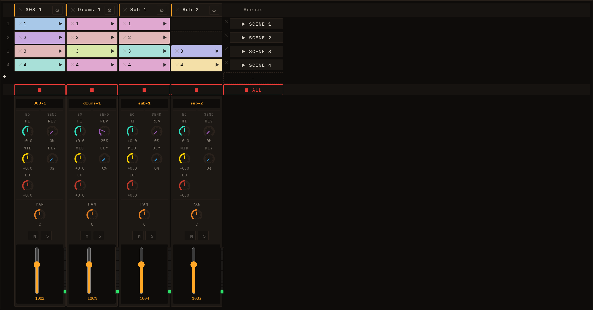
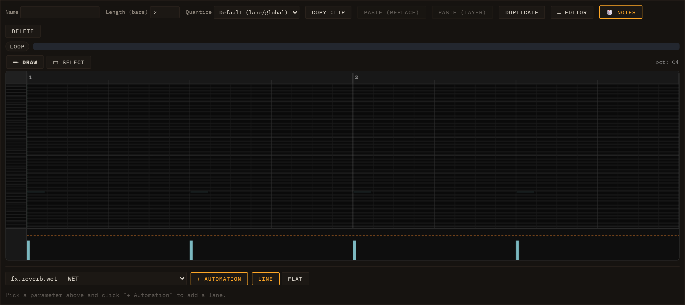

# Sessions, Lanes, Clips & Scenes

The session view is the main workspace in Loom. It organises everything you hear into a compact grid of lanes and clips that you can launch, edit, and rearrange in any order.

## The model

**Lane** — one instrument track. Each lane runs its own synthesis engine (TB-303, Drums, Subtractive, FM, Wavetable, Karplus, or Sampler) with its own mixer strip and insert chain. Lanes appear as columns in the grid.

**Clip** — a pattern of notes that lives at one lane × scene cell. Every clip stores a list of note events, an optional name, a colour, and a length in bars. A cell is either filled (it holds a clip) or empty.

**Scene** — a row in the grid. Launching a scene fires one clip per lane simultaneously, aligning all starts to the same quantize boundary so the whole arrangement snaps together cleanly.

## The grid

Lane names run along the top header row; row numbers (1, 2, 3 …) label the scenes down the left edge. Scenes launch buttons sit in the rightmost column. Each filled cell shows the clip's name (or its row number as a fallback) against the clip's pastel colour. A ⚙ icon in the lane header opens that lane's instrument editor.

A newly created instrument lane starts out empty — no placeholder clips are added to its column; you fill cells yourself. Audio and Sampler lanes created from a dropped WAV or loop place their clip in row 1 only. The grid always keeps at least one launchable scene available even when every lane is empty.

Right-clicking grid elements opens a context menu. On a **lane header**: *Editar instrumento*, *Parar pista*, and *Borrar pista* (red). On a **scene cell**: *Lanzar escena*, *Añadir escena*, and *Borrar escena* (red). On a **filled clip**: *Abrir editor*, *Reproducir / Parar*, and *Borrar clip* (red). On an **empty cell**: *Crear clip* — on audio lanes this entry is disabled and instead reads *Importar audio (arrastra un WAV)*.

Below the scene rows there is a stop row: each lane has its own ⏹ stop button, and a global **⏹ all** button at the far right stops every lane at once.

### Deleting from the grid

A small **✕** cross appears on every lane header (*Borrar pista*), every filled clip cell (*Borrar clip*), and every scene cell (*Borrar escena*). Deleting a clip is immediate. Deleting a lane or scene asks you to confirm in an in-app dialog (**Aceptar** / **Cancelar**, with the destructive choice in red) only when the target still has content — an empty lane or scene is removed straight away. Every deletion is undoable with **Ctrl+Z**, which restores the lane, scene, or clip along with its audio resources.

## Launching clips and scenes

Click the **▶ icon** on any filled cell to launch that clip. The icon switches to ⏸ once the clip is playing; clicking ⏸ stops that lane. Clicking anywhere else on the cell body — outside the play icon — opens the inspector without affecting playback.

When the transport is stopped, launching a clip starts it immediately. When the transport is running, the launch is held until the next quantize boundary, then the clip starts in sync with the rest of the session.

Click the **▶ N** button at the right of a scene row to launch all clips in that row together. All lanes share the same boundary, so they start aligned. The toolbar's **⏹ All** button stops every lane at once.

The quantize boundary is determined by the clip's own `Quantize` setting (see the inspector below). If the clip has no override, the lane's quantize applies; if the lane has none, the session's global quantize is used.

## The inspector

Clicking a clip cell body opens the inspector below the grid with controls for that clip.

| Control | What it does |
| --- | --- |
| **Name** | Free-text label shown on the cell. |
| **Length (bars)** | How many bars the clip plays before looping. |
| **Quantize** | Per-clip launch alignment: *Default* (inherits lane/global setting), *Immediate* (no wait), or a fixed interval — 1/4, 1/2, 1 bar, 2 bars, or 4 bars. |
| **Copy Clip** | Copies the clip to an internal clipboard. |
| **Paste (Replace)** | Replaces the selected clip with the clipboard contents. |
| **Paste (Layer)** | Merges the clipboard notes into the selected clip rather than replacing it. |
| **Duplicate** | Creates a copy of the clip in the next empty cell of the same lane. |
| **↔ Editor** | Toggles between the piano-roll editor and the drum-grid editor. The appropriate editor is chosen automatically based on the lane's engine; use this button to switch if needed. See [Editing Clips](05-editing-clips.md) for the full editing reference. |
| **🎲 Notes** | Randomizes the clip's note content using the current scale and root settings. |
| **Delete** | Removes the clip from the grid (also triggered by Delete/Backspace while the inspector is open). |

The editor embedded inside the inspector is rebuilt each time a new clip is selected; deep editing of notes is covered in [Editing Clips](05-editing-clips.md).

## Arranging clips

You can move a clip to any other cell by dragging it. Hold **Ctrl** while dragging to copy instead of move. Clips remember their colour across moves and copies. Drag a clip onto a cell that already has a clip to swap or replace it.

Each clip is assigned a colour automatically from a pastel palette. You can distinguish patterns at a glance even before you give them names.

For the mixer strip, insert effects, and per-lane send levels, see [Mixing & FX](07-mixing-and-fx.md). For the available synthesis engines on each lane, see [Engines](04-engines.md).
