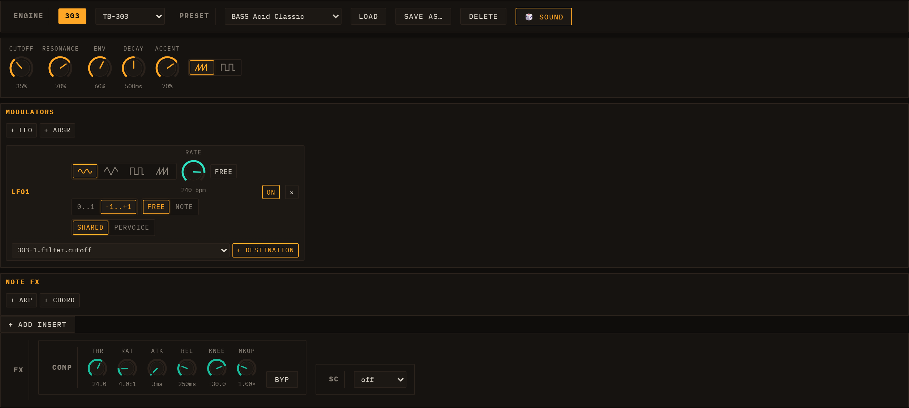
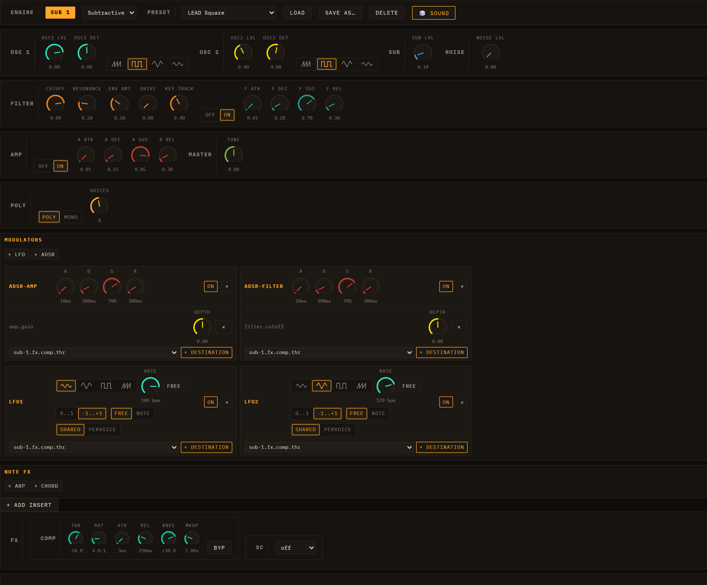
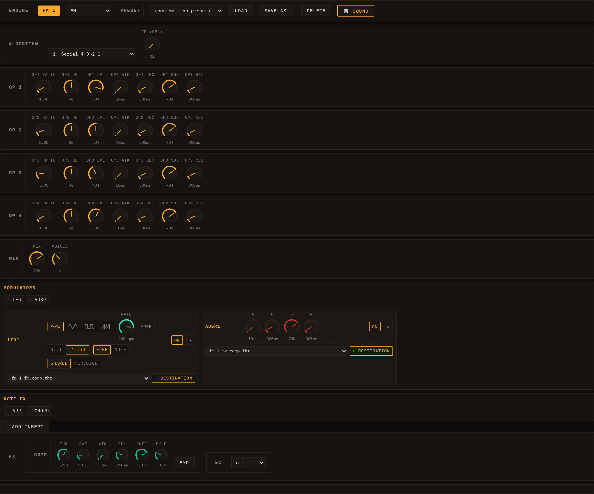
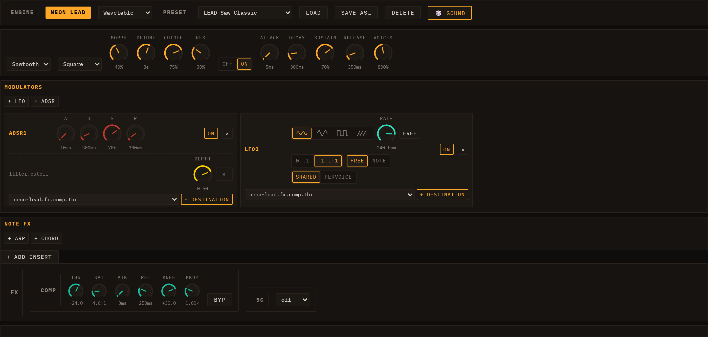
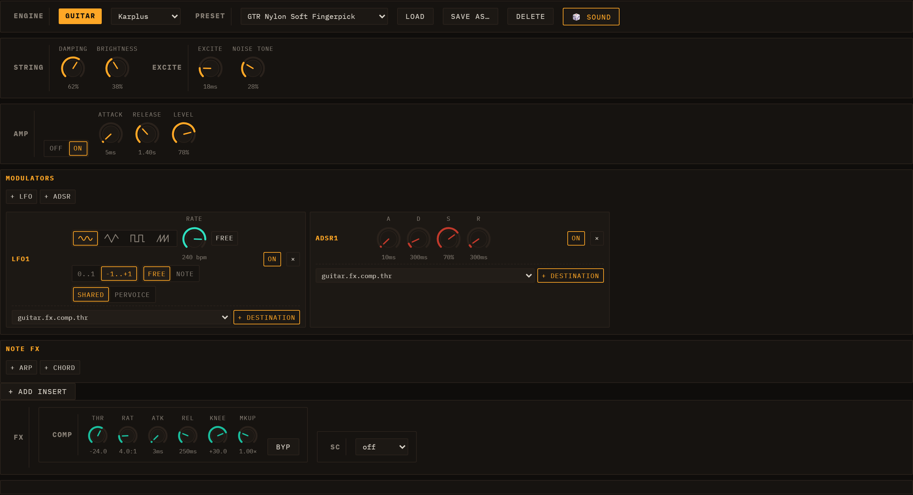
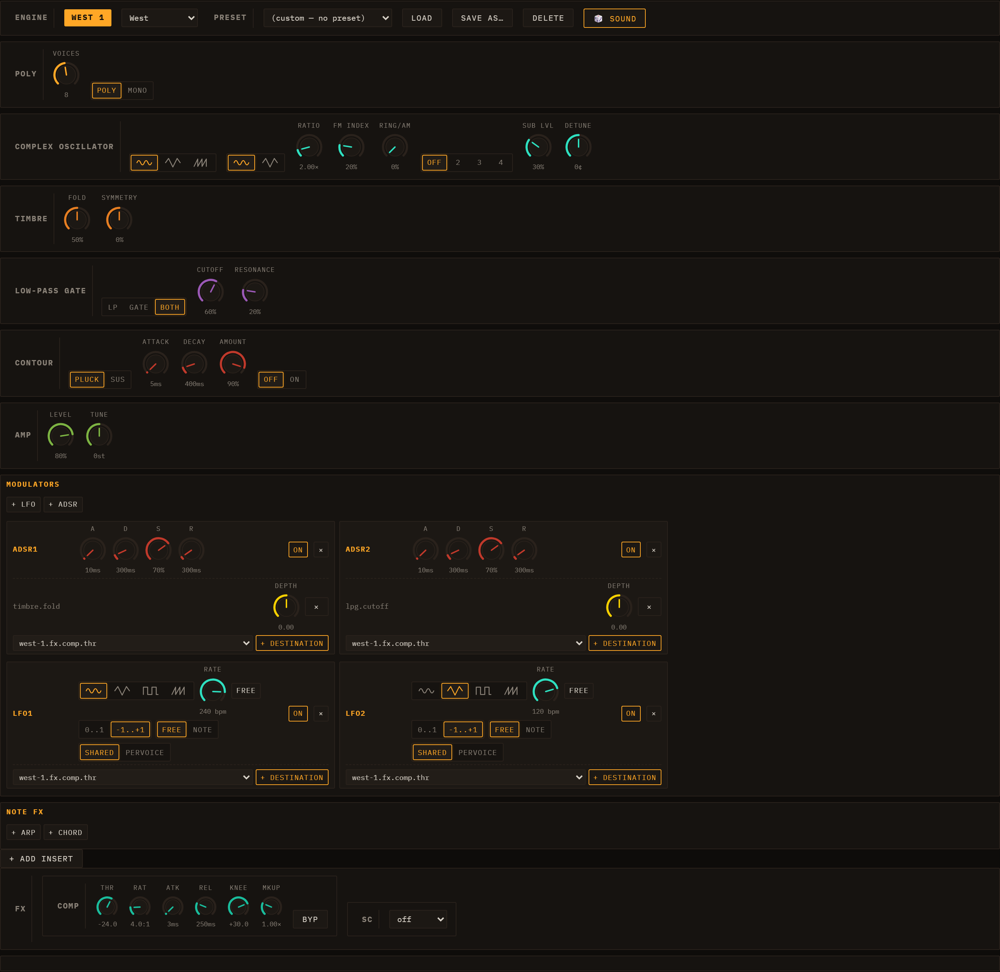
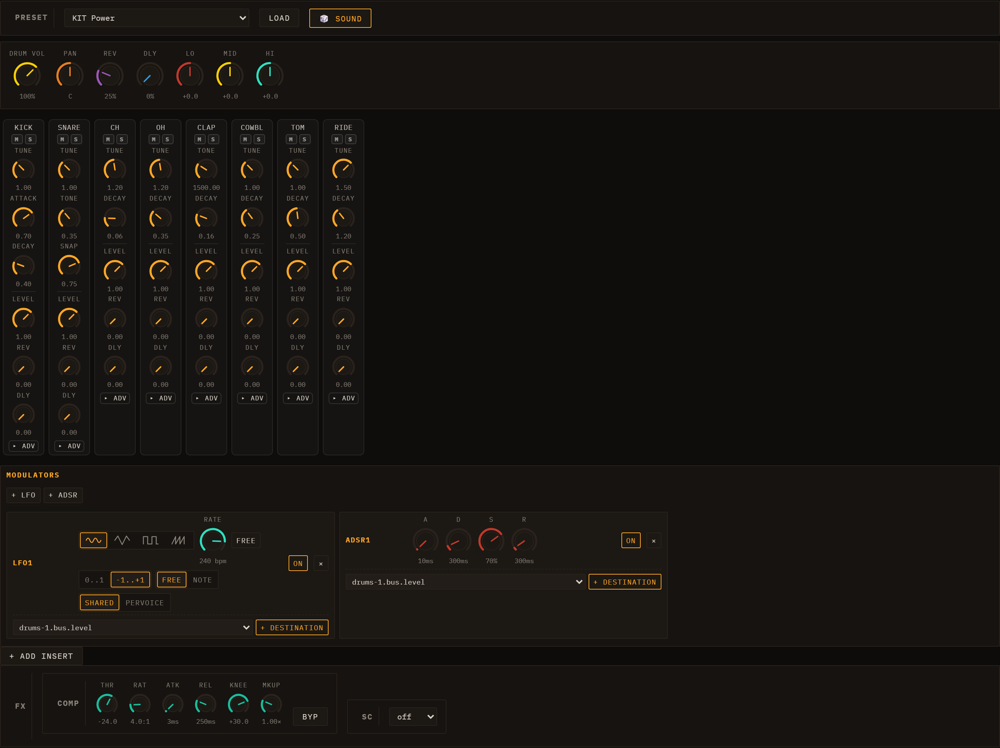

# Engines

Every lane in Loom runs exactly one synthesis engine. You choose the engine
with the ENGINE selector at the top of the lane's editor panel. Changing the
engine replaces the sound source while preserving the lane's clips and
modulation routing. Eight engines are available: six melodic synthesisers
(TB-303, Subtractive, FM, Wavetable, Karplus-Strong, West Coast), a Sampler,
and a Drum Machine.

Each engine exposes a PRESET dropdown (Load / Save As / Delete) and a
**🎲 Sound** button that randomises the patch and sets the preset name to
"Custom". Presets are JSON assets stored per-engine; they include GM programme
tags so that MIDI import can auto-assign the best engine and preset for each
track. See [Sessions, Lanes, Clips & Scenes](03-sessions-lanes-clips-scenes.md)
for how to add and configure lanes.

Every engine responds to **note velocity**. Velocity (0–127) scales each note's
loudness continuously; accent (velocity ≥ 100) layers additional character on
top — brightening the filter envelope and resonance on bass-style engines, and
adding brightness on drums. For how to view and edit velocities in the
piano-roll or drum-grid, see
[Velocity & dynamics](05-editing-clips.md#velocity--dynamics).

---

## TB-303

Above: TB-303 editor — Wave, Cutoff, Resonance, Env Mod, Decay, Accent, and a per-lane LFO.

The TB-303 is a monophonic, resonant bass synthesiser modelled on the Roland
TB-303. It is the natural choice for acid bass lines but works equally well for
aggressive leads and any sound that calls for a steep, self-oscillating filter
sweep.

### TB-303 parameters

| Parameter | Description |
| --- | --- |
| Wave | Sawtooth or Square oscillator waveform |
| Cutoff | Filter cutoff frequency (0–100%) |
| Resonance | Filter Q — self-oscillates at high values |
| Env Mod | How far the filter envelope opens the filter per step |
| Decay | Filter envelope decay time |
| Accent | Per-step level: brightens the filter, bumps Q, raises output gain |

### Slide and accent behaviour

A note's `slide` flag means "slide into the next step". When the scheduler
emits step N it checks whether step N-1 carried a slide flag; if so, it ramps
the pitch from the previous note and skips the amp re-attack so the gate stays
open across the boundary. The outgoing step gets an extended gate (1.5× step
length) so the overlap is audible.

Accent is a per-step flag that simultaneously brightens the filter envelope,
raises the resonance Q, and boosts the output gain — the classic 303 bassline
punctuation technique.

The engine ships with 20+ presets from "BASS Acid Classic" to "LEAD Squelch".
See [Editing Clips](05-editing-clips.md) for how to set slide and accent on
individual steps.

---

## Subtractive

Above: Subtractive editor — OSC 1/2, Sub oscillator, Noise, Filter (with
built-in envelope), Amp, and POLY controls.

The Subtractive engine is a classic analogue-style polyphonic synthesiser with
two oscillators, a sub oscillator, a noise source, a resonant low-pass filter,
and a full amplitude envelope. It is the most general-purpose engine in Loom
and suits pads, leads, basses, and plucks.

### Parameter sections

- **OSC 1 / OSC 2** — waveform (Saw/Sqr/Tri/Sin), level, and detune in cents.
  Detuning the two oscillators creates the classic "supersaw" chorus effect.
- **SUB / NOISE** — sub oscillator level (one octave below OSC 1) and a
  noise generator for breath and texture.
- **FILTER** — Cutoff, Resonance, Env Amount, Drive, Key Track, and a full
  ADSR filter envelope (toggle with Built-in Env).
- **AMP** — Attack/Decay/Sustain/Release amplitude envelope (toggle with
  Built-in Env).
- **MASTER** — global Tune in semitones.
- **POLY** — voice count (1–16), poly/mono mode, and legato/retrig behaviour
  in mono mode.

For modulation routing see [Modulation & Note FX](06-modulation-and-note-fx.md).

---

## FM

Above: FM editor — Algorithm selector, Op 1–4 (Ratio/Detune/Level/ADSR),
global Mix and Voices.

The FM engine is a four-operator, DX7-style frequency-modulation synthesiser.
Each operator is a sine oscillator with its own ADSR amplitude envelope and
level; operators are wired together according to one of four algorithms.

### FM parameters

| Parameter | Description |
| --- | --- |
| Algorithm | 1 = serial 4→3→2→1; 2 = three parallel mods → Op 1; 3 = two pairs; 4 = additive |
| FB (Op4) | Op 4 self-feedback — adds odd harmonics and edge |
| Op 1–4: Ratio | Frequency ratio relative to the played note (0.1–16×) |
| Op 1–4: Det | Per-operator detune in cents |
| Op 1–4: Level | Carrier output level or modulation index (modulators) |
| Op 1–4: ADSR | Per-operator amplitude envelope |
| Mix | Final output level (0–1) |
| Voices | Polyphony cap (1–16; default 6) |

FM suits metallic tones, electric pianos, bells, and evolving textures. Small
ratio changes yield very different timbres; the preset library covers bells,
organs, and electronic basses.

---

## Wavetable

Above: Wavetable editor — Wave A/B selectors, Morph, Detune, Filter, Amp
envelope, and Voices.

The Wavetable engine morphs between two pre-computed waveforms — Wave A and
Wave B — using the Morph knob or an LFO/ADSR routed to it. Both waves are
drawn from a fixed bank of eight anti-aliased tables: Sine, Triangle, Sawtooth,
Square, Pulse (25%), Organ, Brass, and Vocal.

### Wavetable parameters

| Parameter | Description |
| --- | --- |
| Wave A / Wave B | Source waveforms to interpolate between |
| Morph | Crossfade position (0 = full Wave A, 1 = full Wave B) |
| Detune | Global detune in cents |
| Cutoff / Res | Resonant low-pass filter |
| Built-in Env | Toggle the built-in amp ADSR on/off |
| Attack / Decay / Sustain / Release | Amplitude envelope |
| Voices | Polyphony cap (1–16; default 8) |

Animating Morph with an LFO is the signature technique — sweeping from Sine to
Sawtooth or Brass to Vocal while a note sustains produces evolving, living
tones. See [Modulation & Note FX](06-modulation-and-note-fx.md).

---

## Karplus-Strong

Above: Karplus-Strong editor — String section (Damping, Brightness), Excite
section (Excite time, Noise Tone), and Amp controls.

Karplus-Strong is a physical-modelling engine that synthesises plucked-string
sounds. Loom renders each note offline (sample-by-sample in JavaScript) into a
buffer and plays it back through an amplitude envelope. This gives exact pitch
at every frequency, natural high-harmonic roll-off, and no feedback runaway.

### Karplus-Strong parameters

| Parameter | Description |
| --- | --- |
| Damping | T60 decay: 0 = long sustain (~4 s), 1 = muted (~0.12 s) |
| Brightness | Loop filter: 0 = dark/cello, 1 = open/metallic |
| Excite | Excitation burst length (pluck sharpness) |
| Noise Tone | Colour of the excitation noise (dark → bright) |
| Attack / Release | Amp envelope on buffer playback |
| Level | Output amplitude |
| Voices | Polyphony cap (1–16; default 8) |

Damping and Brightness are set per-note at the moment of the pluck (baked into
the buffer). Level and its envelope are live AudioParams and can be modulated.
Karplus suits acoustic bass, guitar, harp, and marimba-style sounds.

---

## West Coast

*A Buchla-style "West Coast" voice: complex oscillator → wavefolder → low-pass gate, driven by a built-in AD contour.*

The West Coast engine takes a fundamentally different approach to synthesis from the filter-based ("East Coast") engines above. Instead of shaping a harmonically-rich waveform by subtracting frequencies with a filter, it **adds** harmonics by routing an oscillator through a **wavefolder** and then taming the result with a **low-pass gate**. The result is highly percussive and organic — metallic plucks, woody tones, evolving bell-like pads, and abstract textures that are difficult to achieve with conventional subtractive synthesis.

The engine is **monophonic** (a single voice; legato mode is planned for a future update). FM here is native-linear, not through-zero.

The signal chain is: **Complex Oscillator** → **Timbre (Wavefolder)** → **Low-Pass Gate (LPG)** driven by an **AD Contour**.

### COMPLEX OSCILLATOR section

Two cross-coupled oscillators produce the raw material. The principal oscillator's frequency is modulated by the modulator oscillator (linear FM), optionally ring-modulated, and a sub-harmonic divider can be added below.

| Parameter | Description |
| --- | --- |
| Princ Wave | Waveform of the principal oscillator: Sin, Tri, or Saw |
| Mod Wave | Waveform of the modulator oscillator: Sin or Tri |
| Ratio | Frequency ratio of the modulator relative to the principal (0.25–16×) — integer ratios produce harmonic tones; non-integers produce inharmonic, bell-like partials |
| FM Index | Depth of linear FM from the modulator into the principal (0–1) — higher values add more sidebands |
| Ring/AM | Amount of ring modulation mixed in (0 = off, 1 = full ring mod) |
| Sub ÷ | Sub-harmonic divider: Off, ÷2, ÷3, or ÷4 — adds a sub-oscillator one, two, or three octaves below |
| Sub Lvl | Output level of the sub-harmonic oscillator (0–1) |
| Detune | Fine-tune of the principal oscillator in cents (±50 ¢) |

### TIMBRE section (wavefolder)

The wavefolder processes the summed oscillator signal through a non-linear waveshaping curve. As the **Fold** amount increases it drives the signal harder into the curve, folding the waveform back on itself and adding a cascade of new harmonics. Accent (velocity ≥ 100) pushes the fold drive harder automatically.

| Parameter | Description |
| --- | --- |
| Fold | Drive into the fold curve (0 = gentle/clean, 1 = heavy folding/maximum harmonics) |
| Symmetry | DC bias applied before the folder — shifts the waveform asymmetrically for even-harmonic colouring (−1 to +1) |

### LOW-PASS GATE section

A low-pass gate combines a resonant filter and a VCA in a single, vactrol-like element so that the contour simultaneously opens the brightness and the volume. The **Mode** selector determines how the contour is routed.

| Parameter | Description |
| --- | --- |
| Mode | **LP** — contour sweeps the filter only (VCA stays open); **Gate** — contour opens the VCA only (filter stays at its base cutoff); **Both** — contour drives both, the most classic "plonky" Buchla behaviour |
| Cutoff | Base cutoff frequency (0–1, exponential scaling from ~60 Hz to 18 kHz) |
| Resonance | Filter Q (0–1) — adds resonant emphasis at the cutoff |

### CONTOUR section

A single AD (attack–decay) envelope generator, similar to the contour generator in a Buchla 281. It drives both the LPG filter and VCA according to the Mode setting above.

| Parameter | Description |
| --- | --- |
| Mode | **Pluck** — decay is gate-independent (fires and fades regardless of note length); **Sus** — holds at peak until the note ends, then decays |
| Attack | Rise time (1 ms – 2 s) |
| Decay | Fall time (5 ms – 4 s) — in Pluck mode this is the T60 envelope; in Sus mode this is the release time after gate-end |
| Amount | Peak level of the contour (0–1) — scales how far the LPG opens |
| Cycle | **On** — re-triggers the AD shape repeatedly while the note is held, turning the contour into a free-running LFO-like modulator |

### AMP section

| Parameter | Description |
| --- | --- |
| Level | Master output gain (0–1) |
| Tune | Global pitch offset in semitones (±12 st) |

The engine ships with **24 presets** — spanning percussive bass plucks (BASS Fold Sub, BASS Growl FM), bells (BELL Metallic, BELL Crystal Ring), pads (PAD Fold Drone, PAD Glass Air), keys (KEYS Fold E-Piano, KEYS Marimba Fold), and abstract textures (FX Cycle Burst, FX Sci-Fi Cycle) — selectable from the lane's preset dropdown. Per-section knob accent colours group the COMPLEX OSCILLATOR, TIMBRE, LOW-PASS GATE, and CONTOUR sections visually.

---

## Sampler

Above: Sampler editor — global Gain/Voices controls; per-pad controls appear
once samples are loaded.

The Sampler engine plays back audio samples mapped across the keyboard. Each
keymap zone (pad) has its own per-pad parameters read at trigger time, making
it possible to tune, filter, and pan individual pads independently.

### Global parameters

| Parameter | Description |
| --- | --- |
| Gain | Master output gain for the lane |
| Voices | Polyphony cap (1–16; default 8) |

### Per-pad parameters

Shown in the drum-voice rack once pads are mapped.

| Parameter | Description |
| --- | --- |
| Tune | Transposition in semitones (−24 to +24) |
| Cutoff / Res | Per-pad resonant low-pass filter |
| Attack / Decay | Per-pad amplitude envelope |
| Level | Per-pad output level |
| Pan | Stereo position |
| A / B | Send amounts to Send A (delay by default) and Send B (reverb by default) |
| Loop / Loop Start / Loop End | Loop mode (one-shot or loop-while-gated) and the loop region (start/end as a fraction of the sample) |
| Sample Start / End | Trim the played window — start/end as a fraction of the sample; draggable on the waveform in the Selected sample panel |
| Retrig | Poly (voices overlap) or Mono (re-hit cuts the previous voice) |

A Sampler lane with pads mapped to GM drum note numbers automatically enters
drumkit mode and shows the drum-grid editor instead of the piano roll. For
details on loading samples and building keymaps see
[MIDI & Samples](08-midi-and-samples.md).

---

## Drums (Drum Machine)

Above: Drums editor — Preset row, master bus knobs (Vol/Pan/Rev/Dly/Lo/Mid/Hi),
per-voice rack with Tune/Decay/Rev/Dly controls per voice.

The Drums engine is a fully synthesised eight-voice drum machine — no samples
required. All eight voices (Kick, Snare, Closed Hat, Open Hat, Clap, Cowbell,
Tom, Ride) are built from oscillators, noise generators, and simple envelopes.
Each voice routes through its own channel strip and then to a shared drum bus.

### Voice synthesis rack

The per-voice rack exposes the key parameters for each voice:

| Voice | Key parameters |
| --- | --- |
| Kick | Tune, Attack (click), Decay, Start/End Freq, Sweep, Wave |
| Snare | Tune, Tone body, Snap (noise), Body Decay, Noise Decay, Noise Tone |
| Closed Hat | Tune, Decay |
| Open Hat | Tune, Decay |
| Clap | Tone, Decay, Sharp (filter Q) |
| Tom | Tune, Decay, Sweep, Start/End Freq |
| Cowbell | Tune, Decay, Detune |
| Ride | Tune, Decay |

### Drum preset dropdown — synth kits and sample kits

The preset dropdown for any drum lane lists kits from four groups:

| Group | Kits | How it works |
| --- | --- | --- |
| GM | KIT Standard, KIT Room, KIT Power, KIT Electronic, KIT TR-808, KIT Jazz, KIT Brush, KIT Orchestra | GM-programme aliases that map to the synth kits below |
| Synth | TR-909, TR-808, TR-606, CR-78, LinnDrum | 100% synthesised DSP — no samples required |
| Samples | TR-808 (samples), Acoustic (samples), Dirt (samples) | Real one-shot WAVs bundled with Loom |
| Drum Machines | 64 sampled kits from classic boxes (Roland, LinnDrum, Korg, Oberheim, Casio, E-mu…) | Sampled one-shots from the **tidal-drum-machines** collection — a large library of vintage drum-machine sounds |

**Synth kits** seed all eight per-voice parameters from the kit's characteristic values; you can edit individual voices on top and hit 🎲 Sound to randomise all voices at once.

**Sample kits** load the matching WAV for each voice (kick, snare, closed hat, open hat, clap, tom, cowbell, ride) from `public/drumkits/` and rebuild the keymap fresh on every session load — you never need to re-import the files manually. Once a sample kit is selected, the lane uses the drum-grid editor and the full per-pad parameter rack, exactly like a Sampler lane in drumkit mode.

The sample WAVs are curated one-shots from the Dirt-Samples collection (used by TidalCycles), classic TR-808 recordings, and — for the **Drum Machines** group — the [tidal-drum-machines](https://github.com/ritchse/tidal-drum-machines) library. Full credits are in the repo `README.md` under "Credits — sample sources".

> Note: sample kits are loaded by the Sampler engine under the hood. For the Sampler's own Instrument family selector (Drumkit / Melodic / Loop) and per-pad parameters, see [MIDI & Samples](08-midi-and-samples.md).

### Bus controls

The master bus row gives Vol, Pan, Rev, Dly, Lo, Mid, and Hi (±18 dB shelves)
for the whole drum bus. These are automatable via
[Modulation & Note FX](06-modulation-and-note-fx.md). Routing to the shared
reverb and delay sends is covered in [Mixing & FX](07-mixing-and-fx.md).

### Choke groups

Each drum voice has a **Choke** dropdown in the voice's advanced area of the per-voice rack. Voices assigned to the **same non-zero choke group are mutually exclusive**: triggering one immediately cuts the tails of all other voices in the same group. A voice assigned to group 0 (the default) is never choked by anything.

The default configuration is **closed hat and open hat both in group 1**, which gives the classic hi-hat choke behaviour — hitting the closed hat silences the open hat's ring, just as on a real drum kit. You can reassign any voice to any group number to create other exclusive pairs, for example a conga and cowbell that cannot overlap.

---

## Summary table

| Engine | Best for | Standout parameters |
| --- | --- | --- |
| TB-303 | Acid bass lines, resonant leads | Slide, Accent, Env Mod |
| Subtractive | Pads, leads, basses, general-purpose | Dual OSC detune, Filter Drive, Key Track, POLY mode |
| FM | Bells, electric pianos, metallic textures | Algorithm, per-operator Ratio, FB feedback |
| Wavetable | Evolving tones, digital leads, pads | Morph (A→B crossfade), 8-waveform bank |
| Karplus-Strong | Plucked strings, guitar, harp | Damping (sustain), Brightness, Excitation |
| West Coast | Percussive plucks, metallic tones, evolving textures | Wavefolder (Fold), LPG Mode, Contour Cycle |
| Sampler | Any audio, drum kits with per-pad control | Per-pad Tune/Filter/Envelope, Loop mode |
| Drums | Synthesised drum machine, percussion | 8-voice synth rack, kits-as-presets, bus EQ, Choke groups |
