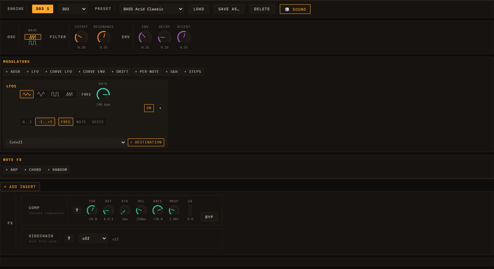
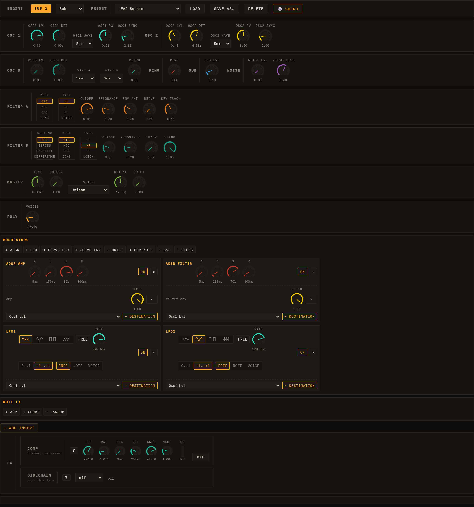
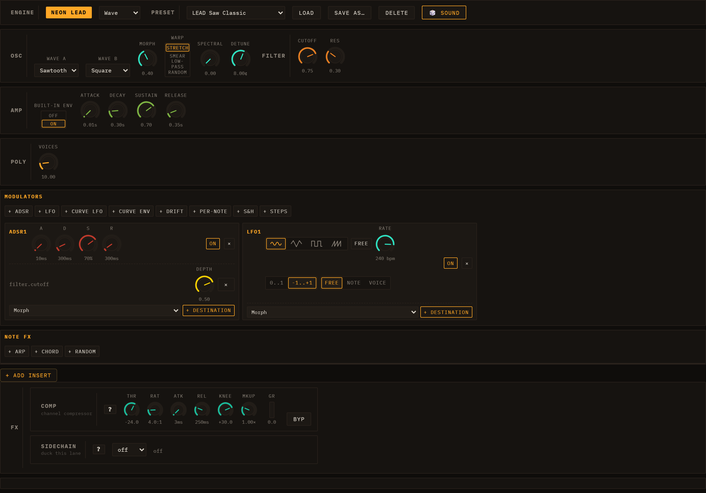
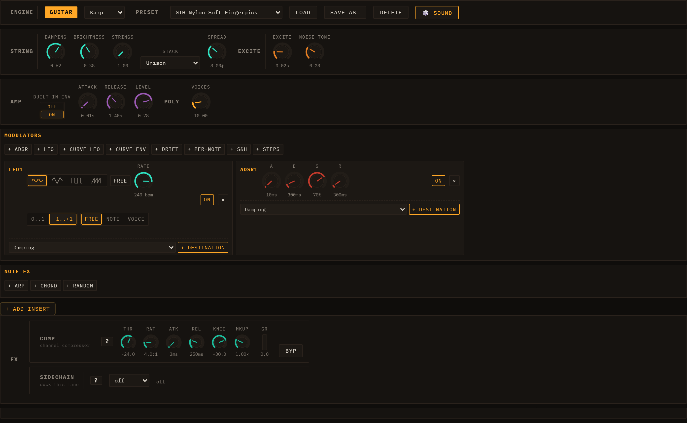
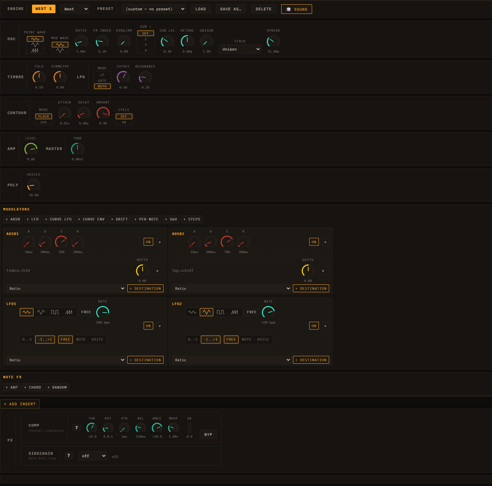
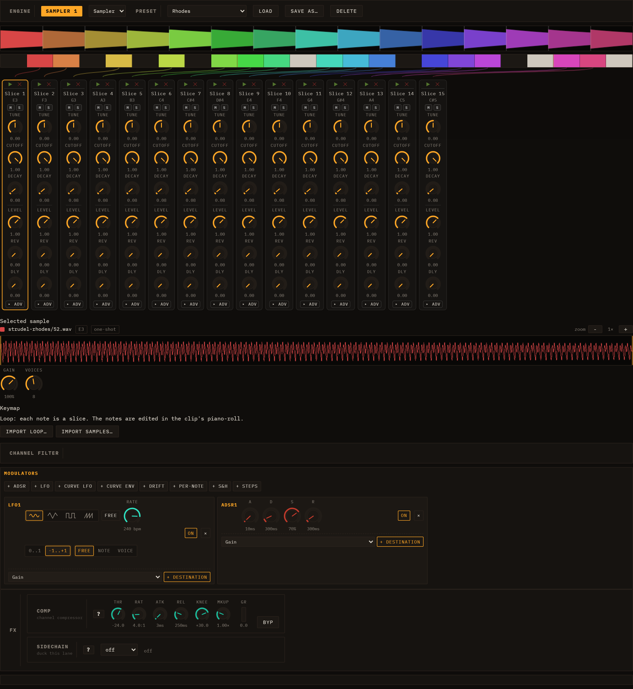
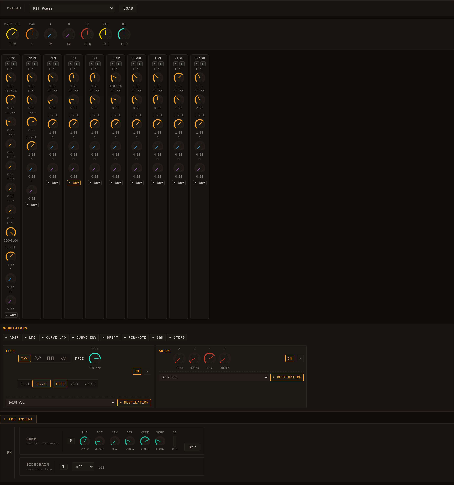

# Engines

Every lane in Loom runs exactly one synthesis engine. You pick it when you
create the lane, from the **+** menu at the top of the clip grid, which lists
every engine. Afterwards you can swap a lane's engine from the **ENGINE**
selector at the top of its editor panel — that dropdown offers the piano-roll
engines only, so a lane can be moved between them freely but not turned into a
Drum Machine, which edits on the drum grid. Changing the engine replaces the
sound source while preserving the lane's clips and modulation routing.

This chapter covers eight engines: six melodic synthesisers (TB-303,
Subtractive, FM, Wavetable, Karplus-Strong, West Coast), a Sampler, and a Drum
Machine. A ninth choice, the **Audio channel**, plays a recording rather than
synthesising one and is covered in
[MIDI & Samples](08-midi-and-samples.md#audio-channel).

Each engine exposes a PRESET dropdown with **Load**, **Save As…** and **Delete**
beside it, and a **🎲 Sound** button that randomises the patch and sets the
preset name to "Custom". See
[Sessions, Lanes, Clips & Scenes](03-sessions-lanes-clips-scenes.md) for how to
add and configure lanes.

## Factory presets and your own

The dropdown has two groups.

**Factory** are the presets the engine ships with, carried inside the engine
itself and tagged with GM programme numbers so MIDI import can pick a sensible
engine and preset for each imported track. There are 23 to 28 of them on each of
the melodic engines — and 102 on Subtractive, which is the one with the widest
range to cover. Selecting one
applies it immediately; there is no need to press Load, which only re-applies
whatever is already selected.

**User** is whatever you have saved. **Save As…** asks for a name and stores the
sound exactly as it stands on that lane. Two things about it are worth knowing:

- **A user preset belongs to its engine.** Saving "Bells" on an FM lane files it
  under FM, and it is offered on FM lanes only — a Wavetable lane can hold its
  own, different "Bells" without the two ever meeting.
- **It saves the instrument, not the desk.** The lane's volume, pan, sends and EQ
  are left out on purpose, so recalling a preset changes how the sound is made
  without moving where it sits in the mix.

**Delete** removes a user preset; factory presets cannot be deleted, and the
button says so if you try.

Your saved presets live in the browser, not in the session file. That cuts both
ways: they follow you from one song to the next, and they are **not** included
when you share a save — someone opening your session gets the sound, because the
parameter values travel with the lane, but not the entry in their own preset
list. It also means clearing your browser's site data takes them with it.

The dice rolls the *instrument*, not the desk: it leaves the lane's mixer column
(volume, pan, sends, EQ), the polyphony setting and the master tune exactly where
you put them, so a randomised sound stays at the level and in the tuning the rest
of the mix expects. Rolls are biased towards each parameter's current value
rather than spread flat across its range, so most of them land near a sound that
works and the extremes are the tail, not the norm. Hit it repeatedly: it is the
fastest way to find out what an engine can do.

Every engine responds to **note velocity**. Velocity (0–127) scales each note's
loudness continuously along a curve with a floor, so even the softest note still
sounds. Accent (velocity ≥ 100) layers additional character on top, and what it
adds is engine-specific: it brightens the filter envelope on the bass-style
engines (and on the TB-303 alone also raises the resonance), drives the
wavefolder harder on West Coast, and simply hits harder on drums. For how to
view and edit velocities in the piano-roll or drum-grid, see
[Velocity & dynamics](05-editing-clips.md#velocity--dynamics).

---

## Turning a knob while a note is sounding

Loom's continuous parameters are **live**. Hold a note — or let a pattern run —
and move a cutoff, a resonance, an FM ratio, a wavefolder amount: the sound
already playing bends with your hand, the way it does on hardware. You do not
have to wait for the next note.

A few parameters deliberately do not work that way, and they are the ones where
changing mid-note would produce a click rather than a sweep:

- **Waveform** and **filter model** — the shape itself, not a value on it.
- **Unison size** — how many copies make up a voice.
- **Every envelope time** — attack, decay, release. The envelope is computed from
  how long the note has been held, so re-reading an attack halfway through would
  jump the level instead of gliding it.

Those apply from the next note you play. Everything else is immediate. (The Drum
Machine is the exception to the whole section: its parameters are read when the
hit fires.)

---

## TB-303

Above: TB-303 editor — Wave, Cutoff, Resonance, Env, Decay, Accent, and a per-lane LFO.

The TB-303 is a monophonic, resonant bass synthesiser modelled on the Roland
TB-303. It is the natural choice for acid bass lines but works equally well for
aggressive leads and any sound that calls for a steep, self-oscillating filter
sweep.

### TB-303 parameters

| Parameter | Description |
| --- | --- |
| Wave | Sawtooth or Square oscillator waveform |
| Cutoff | Filter cutoff frequency (0–100%) |
| Resonance | Filter Q — see the note on the diode ladder below |
| Env | How far the filter envelope opens the filter per step (the classic "env mod") |
| Decay | Filter envelope decay time |
| Accent | Per-step level: brightens the filter, bumps Q, raises output gain |

> **The filter is a diode ladder.** This is the circuit that gives the 303 its
> voice: its asymmetric clipping adds even harmonics, which is where the
> squelch comes from. One consequence surprises people used to other synths —
> a ladder *loses* level as resonance rises, instead of growing a peak on top of
> the signal. Turning Resonance up thins and quietens the sound rather than
> making it louder. That is correct behaviour, and the engine compensates
> internally so that accented steps still punch through.

### Slide and accent behaviour

A note's `slide` flag means "slide into the next step". When the scheduler
emits step N it checks whether step N-1 carried a slide flag; if so, it ramps
the pitch from the previous note and skips the amp re-attack so the gate stays
open across the boundary. The outgoing step gets an extended gate (1.5× step
length) so the overlap is audible.

Accent is a per-step flag that simultaneously brightens the filter envelope,
raises the resonance Q, and boosts the output gain — the classic 303 bassline
punctuation technique.

The engine ships with 20+ presets from "BASS Acid Classic" to "LEAD Squelch".
See [Editing Clips](05-editing-clips.md) for how to set slide and accent on
individual steps.

---

## Subtractive

Above: Subtractive editor — OSC 1/2, Sub oscillator, Noise, Filter (with
built-in envelope), Amp, and POLY controls.

The Subtractive engine is a classic analogue-style polyphonic synthesiser with
two oscillators, a sub oscillator, a noise source, a multimode filter, and a
full amplitude envelope. It is the most general-purpose engine in Loom and
suits pads, leads, basses, and plucks — and with **102 presets** it has by far
the largest library of any engine here.

### Parameter sections

- **OSC 1 / OSC 2** — waveform, level, detune in cents, **PW**, and **Sync**.
  Detuning the two oscillators creates the classic "supersaw" chorus effect.
  See [Oscillator extras](#oscillator-extras-pw-and-sync) below for PW and Sync.
- **RING** — level of the ring modulator, OSC 1 × OSC 2. See
  [Ring modulation](#ring-modulation) below.
- **SUB / NOISE** — sub oscillator level (one octave below OSC 1) and a
  noise generator for breath and texture.
- **FILTER A** — **Mode**, **Type**, Cutoff, Resonance, Env Amount, Drive, Key
  Track, and a full ADSR filter envelope (toggle with Built-in Env). See
  [Mode and Type](#mode-and-type) and
  [The comb, and its two borrowed knobs](#the-comb-and-its-two-borrowed-knobs).
- **FILTER B** — a second filter with its own Mode, Type, Cutoff and Res, plus
  **Routing**, **Blend** and **Track**, which decide how it combines with
  Filter A. See
  [Two filters, and how they are wired](#two-filters-and-how-they-are-wired).
- **AMP** — Attack/Decay/Sustain/Release amplitude envelope (toggle with
  Built-in Env).
- **MASTER** — global Tune in semitones, plus **Unison**, **Detune** and
  **Drift**. See [Unison](#unison-detune-and-drift).
- **POLY** — voice count (1–16), poly/mono mode, and legato/retrig behaviour
  in mono mode.

### Mode and Type

Two controls. **Mode** picks the circuit; **Type** picks the response you take
out of it — and Type only ever offers the responses that circuit can honestly
produce.

| Mode | Slope | Character | Types it offers |
| --- | --- | --- | --- |
| **DIG** (default) | 12 dB/oct | A clean state-variable filter. Precise and neutral, and what most presets are voiced against. | LP, HP, BP, NOTCH |
| **MOG** | 24 dB/oct | A four-pole Moog-style ladder. Warmer, and it thins as it resonates. | LP, HP, BP |
| **303** | 24 dB/oct | The diode ladder from the TB-303. Asymmetric clipping adds even harmonics — the acid voice. | LP, HP, BP |
| **COMB** | — | A delay summed back on itself: a whole series of peaks instead of one corner. Metallic and hollow. | POS, NEG, FF |

**Why the ladders have no NOTCH.** A ladder's resonance feedback fills a notch's
null in, and on the diode model at high resonance the null inverts into a *peak*.
A notch that becomes a bump is not a notch, so under MOG or 303 the button is
not there — rather than being there and quietly handing you the lowpass, which
is what this used to do.

The ladders' HP and BP are the real thing, not the lowpass relabelled: a ladder
is four one-pole filters in a feedback loop, and the other responses come out of
its stage taps the same way the Oberheim Xpander derives its modes.

A second thing worth knowing about the ladders: they *lose* level as resonance
climbs, rather than growing a resonant peak on top. Turning Q up on MOG or 303
thins and quietens the sound. That is faithful to the hardware, and it is why
the TB-303 engine compensates with a dedicated accent gain.

### The comb, and its two borrowed knobs

Under **COMB** the filter delays the signal and adds it back to itself. The
delayed copy reinforces every frequency whose period fits the delay and cancels
the ones that fall between, so instead of one corner you get a series of evenly
spaced peaks — which is why it sounds like a plucked string or a hollow tube
rather than a filter.

Its three types are three different instruments:

| Type | What it does | Sounds like |
| --- | --- | --- |
| **POS** | Peaks on every harmonic of the tuning | a plucked string |
| **NEG** | Peaks on the ODD harmonics only | a stopped pipe, a clarinet |
| **FF** | No feedback: notches instead of peaks | a flanger frozen mid-sweep |

POS and NEG differ by a single sign and sound nothing alike — cancelling the
even harmonics is what makes a clarinet a clarinet.

Two knobs mean something else while COMB is selected, and it is worth knowing
before you reach for them:

- **Cutoff is the comb's TUNING** — the frequency its peaks are spaced by, not a
  corner frequency. Sweeping it slides the whole series.
- **Resonance is the feedback** — how much comes back round, so how long it
  rings and how sharp the peaks are. Under **FF** there is no feedback path at
  all, so it sets how deep the notches cut and cannot ring however far you push
  it.

### Two filters, and how they are wired

**FILTER B** is a second filter with its own Mode, Type, Cutoff and Res. It is
off until **Routing** says otherwise:

| Routing | What comes out |
| --- | --- |
| **Off** (default) | Filter A alone. Filter B is not even built. |
| **Series** | A feeds B — two filters in a row, steeper and darker. |
| **Parallel** | Both filters see the same signal and the results are summed. |
| **Difference** | A minus B. |

**Blend** always means the same thing: how much of B is in the result. At 0 all
three modes sound exactly like Off, so you can bring the second filter in by
hand — or put an LFO on Blend and have the routing itself breathe.

**Difference is the one worth explaining.** Subtracting one lowpass from another
leaves only what sits between their two cutoffs: a band-pass whose two edges you
set separately, with its own resonance on each. No single circuit here produces
that, and it is why having the same filter in both slots is useful rather than
redundant.

**A comb added to a filter needs no special setting** — that is Filter A = DIG,
Filter B = COMB, Routing = Parallel, which IS a sum. Series combs what the
filter left, and Difference removes exactly what the comb reinforces.

**Track** (0–1) decides how filter B moves. Everything that sweeps filter A —
its envelope and its key tracking — is expressed as a ratio, and Track is how
much of that ratio B follows:

- **0** — B stays exactly where its knob puts it. The classic fixed high-pass
  sitting under a low-pass that sweeps.
- **1** — B moves by the same ratio as A, so the interval between the two stays
  constant in octaves. Two formants sweeping as a block.

### Oscillator extras: PW and Sync

**PW (Pulse Width)** — 0.05 to 0.95, centred at 0.5. On its own it reshapes a
square wave from a hollow, nasal thin pulse through the full-bodied square at
0.5 and out the other side. The classic use is **PWM**: assign an LFO to
`osc1.pw` and the width breathes back and forth, turning a static square into a
wide, shimmering pad. This is the single most rewarding modulation target on the
engine.

**Sync (hard sync)** — select **Sync** as the waveform and the oscillator runs
a second, faster oscillator that is force-restarted on every cycle of the first.
The restart chops the waveform mid-cycle, producing the aggressive, tearing
timbre of a synced lead. Here the **Sync knob (1–8)** sets the ratio between the
two, and *that ratio is the timbre* — the pitch you hear still follows the note.
Sweeping the Sync knob (or modulating it) gives the classic sync-sweep lead.
Presets **LEAD Sync**, **LEAD Sync Sweep** and **BASS Sync** are built on it.

### Ring modulation

**Ring** (0–1, default 0) multiplies OSC 1 by OSC 2 and mixes the result in as
a source of its own, alongside Sub and Noise — it does not replace either
oscillator. Multiplying two tones produces their **sum and difference**
frequencies instead of their harmonics, so the result is inharmonic: bells,
gongs, metallic clangs and robot voices.

Two things drive the sound:

- **The interval between the oscillators.** A few cents of Osc2 Det gives a
  slow beat and a tone an octave up; wide detunes turn it clangorous. The
  interval *is* the timbre, so a note played higher changes the character as
  well as the pitch — which is exactly why ring mod sounds inharmonic.
- **The oscillator levels, which Ring ignores.** The product is taken before
  the level knobs, so you can pull OSC 1 and OSC 2 down to zero and hear the
  ring modulator alone — the classic bell — or leave them up and let the metal
  sit on top of the raw oscillators.

Ring is continuous, so it is a modulation target like any other: an ADSR on
`ring.level` gives a metallic attack that decays into a clean tone, and a slow
LFO breathes the clang in and out.

### Unison, Detune and Drift

In the MASTER section:

| Parameter | Description |
| --- | --- |
| **Unison** | Stack 1–7 copies of the whole voice per note (default 1) |
| **Detune** | How far the stack spreads apart, 0–50 cents (default 25) |
| **Drift** | Slow, random analogue pitch wander, 0–1 (default 0) |

Unison is what makes a lead enormous: seven slightly-detuned copies beating
against each other is the supersaw sound. It costs CPU in proportion — seven
copies is seven times the synthesis work per note — so raise it for leads, not
for dense pads.

**Unison is read once when the note is triggered** — it is one of the structural
parameters listed in [Turning a knob while a note is
sounding](#turning-a-knob-while-a-note-is-sounding), so it is deliberately *not*
a modulation target and changing it affects the next note you play, not the one
currently sounding. **Drift** is the opposite: a touch of it
(0.1–0.2) keeps sustained chords from sounding sterile.

For modulation routing see [Modulation & Note FX](06-modulation-and-note-fx.md).

---

## FM

Above: FM editor — Algorithm selector, Op 1–4 (Ratio/Detune/Level/ADSR),
global Mix and Voices.

The FM engine is a four-operator, DX7-style frequency-modulation synthesiser.
Each operator is a sine oscillator with its own ADSR amplitude envelope and
level; operators are wired together according to one of four algorithms.

### FM parameters

| Parameter | Description |
| --- | --- |
| Algorithm | 1 = serial 4→3→2→1; 2 = three parallel mods → Op 1; 3 = two pairs; 4 = additive |
| FB (Op4) | Op 4 self-feedback — adds odd harmonics and edge |
| Op 1–4: Ratio | Frequency ratio relative to the played note (0.1–16×) |
| Op 1–4: Det | Per-operator detune in cents |
| Op 1–4: Level | Carrier output level or modulation index (modulators) |
| Op 1–4: ADSR | Per-operator amplitude envelope |
| Mix | Final output level (0–1) |
| Voices | Polyphony cap (1–16; default 6) |

FM suits metallic tones, electric pianos, bells, and evolving textures. Small
ratio changes yield very different timbres; the preset library covers bells,
organs, and electronic basses.

---

## Wavetable

Above: Wavetable editor — Wave A/B selectors, Morph, Detune, Filter, Amp
envelope, and Voices.

The Wavetable engine morphs between two pre-computed waveforms — Wave A and
Wave B — using the Morph knob or an LFO/ADSR routed to it. Both waves are
drawn from a fixed bank of eight anti-aliased tables: Sine, Triangle, Sawtooth,
Square, PWM 25%, Organ, Brass, and Vocal.

### Wavetable parameters

| Parameter | Description |
| --- | --- |
| Wave A / Wave B | Source waveforms to interpolate between |
| Morph | Crossfade position (0 = full Wave A, 1 = full Wave B) |
| Detune | Global detune in cents |
| Cutoff / Res | Resonant low-pass filter |
| Built-in Env | Toggle the built-in amp ADSR on/off |
| Attack / Decay / Sustain / Release | Amplitude envelope |
| Voices | Polyphony cap (1–16; default 8) |

Animating Morph with an LFO is the signature technique — sweeping from Sine to
Sawtooth or Brass to Vocal while a note sustains produces evolving, living
tones. See [Modulation & Note FX](06-modulation-and-note-fx.md).

---

## Karplus-Strong

Above: Karplus-Strong editor — String section (Damping, Brightness), Excite
section (Excite time, Noise Tone), and Amp controls.

Karplus-Strong is a physical-modelling engine that synthesises plucked-string
sounds. Loom renders each note offline (sample-by-sample in JavaScript) into a
buffer and plays it back through an amplitude envelope. This gives exact pitch
at every frequency, natural high-harmonic roll-off, and no feedback runaway.

### Karplus-Strong parameters

| Parameter | Description |
| --- | --- |
| Damping | T60 decay: 0 = long sustain (~4 s), 1 = muted (~0.12 s) |
| Brightness | Loop filter: 0 = dark/cello, 1 = open/metallic |
| Excite | Excitation burst length (pluck sharpness) |
| Noise Tone | Colour of the excitation noise (dark → bright) |
| Built-in Env | Toggle the built-in amp envelope on/off |
| Attack / Release | Amp envelope on buffer playback |
| Level | Output amplitude |
| Voices | Polyphony cap (1–16; default 8) |

Damping and Brightness are set per-note at the moment of the pluck (baked into
the buffer). Level and its envelope stay live and can be modulated.
Karplus suits acoustic bass, guitar, harp, and marimba-style sounds.

---

## West Coast

*A Buchla-style "West Coast" voice: complex oscillator → wavefolder → low-pass gate, driven by a built-in AD contour.*

The West Coast engine takes a fundamentally different approach to synthesis from the filter-based ("East Coast") engines above. Instead of shaping a harmonically-rich waveform by subtracting frequencies with a filter, it **adds** harmonics by routing an oscillator through a **wavefolder** and then taming the result with a **low-pass gate**. The result is highly percussive and organic — metallic plucks, woody tones, evolving bell-like pads, and abstract textures that are difficult to achieve with conventional subtractive synthesis.

The engine is **polyphonic** — up to 16 voices, 8 by default — with a Poly/Mono switch in the AMP section if you want the classic one-voice-at-a-time behaviour. FM here is native-linear, not through-zero.

The signal chain is: **Complex Oscillator** → **Timbre (Wavefolder)** → **Low-Pass Gate (LPG)** driven by an **AD Contour**.

### COMPLEX OSCILLATOR section

Two cross-coupled oscillators produce the raw material. The principal oscillator's frequency is modulated by the modulator oscillator (linear FM), optionally ring-modulated, and a sub-harmonic divider can be added below.

| Parameter | Description |
| --- | --- |
| Princ Wave | Waveform of the principal oscillator: Sin, Tri, or Saw |
| Mod Wave | Waveform of the modulator oscillator: Sin or Tri |
| Ratio | Frequency ratio of the modulator relative to the principal (0.25–16×) — integer ratios produce harmonic tones; non-integers produce inharmonic, bell-like partials |
| FM Index | Depth of linear FM from the modulator into the principal (0–1) — higher values add more sidebands |
| Ring/AM | Amount of ring modulation mixed in (0 = off, 1 = full ring mod) |
| Sub ÷ | Sub-harmonic divider: Off, 2, 3, or 4 — it divides the frequency, so 2 is an octave below, 3 is an octave and a fifth below, and 4 is two octaves below. 3 therefore adds a fifth rather than a plain sub |
| Sub Lvl | Output level of the sub-harmonic oscillator (0–1) |
| Detune | Fine-tune of the principal oscillator in cents (±50 ¢) |

### TIMBRE section (wavefolder)

The wavefolder processes the summed oscillator signal through a non-linear waveshaping curve. As the **Fold** amount increases it drives the signal harder into the curve, folding the waveform back on itself and adding a cascade of new harmonics. Accent (velocity ≥ 100) pushes the fold drive harder automatically.

| Parameter | Description |
| --- | --- |
| Fold | Drive into the fold curve (0 = gentle/clean, 1 = heavy folding/maximum harmonics) |
| Symmetry | DC bias applied before the folder — shifts the waveform asymmetrically for even-harmonic colouring (−1 to +1) |

### LOW-PASS GATE section

A low-pass gate combines a resonant filter and a VCA in a single, vactrol-like element so that the contour simultaneously opens the brightness and the volume. The **Mode** selector determines how the contour is routed.

| Parameter | Description |
| --- | --- |
| Mode | **LP** — contour sweeps the filter only (VCA stays open); **Gate** — contour opens the VCA only (filter stays at its base cutoff); **Both** — contour drives both, the most classic "plonky" Buchla behaviour |
| Cutoff | Base cutoff frequency (0–1, exponential scaling from ~60 Hz to 18 kHz) |
| Resonance | Filter Q (0–1) — adds resonant emphasis at the cutoff |

### CONTOUR section

A single AD (attack–decay) envelope generator, similar to the contour generator in a Buchla 281. It drives both the LPG filter and VCA according to the Mode setting above.

| Parameter | Description |
| --- | --- |
| Mode | **Pluck** — decay is gate-independent (fires and fades regardless of note length); **Sus** — holds at peak until the note ends, then decays |
| Attack | Rise time (1 ms – 2 s) |
| Decay | Fall time (5 ms – 4 s) — in Pluck mode this is the T60 envelope; in Sus mode this is the release time after gate-end |
| Amount | Peak level of the contour (0–1) — scales how far the LPG opens |
| Cycle | **On** — re-triggers the AD shape repeatedly while the note is held, turning the contour into a free-running LFO-like modulator |

### AMP section

| Parameter | Description |
| --- | --- |
| Level | Master output gain (0–1) |
| Tune | Global pitch offset in semitones (±12 st) |
| Voices | Polyphony, 1–16 (default 8) |
| Mode | Poly or Mono |

The engine ships with **24 presets** — spanning percussive bass plucks (BASS Fold Sub, BASS Growl FM), bells (BELL Metallic, BELL Crystal Ring), pads (PAD Fold Drone, PAD Glass Air), keys (KEYS Fold E-Piano, KEYS Marimba Fold), and abstract textures (FX Cycle Burst, FX Sci-Fi Cycle) — selectable from the lane's preset dropdown. Per-section knob accent colours group the COMPLEX OSCILLATOR, TIMBRE, LOW-PASS GATE, and CONTOUR sections visually.

---

## Sampler

Above: Sampler editor — global Gain/Voices controls; per-pad controls appear
once samples are loaded.

The Sampler engine plays back audio samples mapped across the keyboard. Each
keymap zone (pad) has its own per-pad parameters read at trigger time, making
it possible to tune, filter, and pan individual pads independently.

### Global parameters

| Parameter | Description |
| --- | --- |
| Gain | Master output gain for the lane |
| Voices | Polyphony cap (1–16; default 8) |

### Per-pad parameters

Shown in the drum-voice rack once pads are mapped.

| Parameter | Description |
| --- | --- |
| Tune | Transposition in semitones (−24 to +24) |
| Cutoff / Res | Per-pad resonant low-pass filter |
| Attack / Decay | Per-pad amplitude envelope |
| Level | Per-pad output level |
| Pan | Stereo position |
| REV / DLY | Send amounts to Send B (a Reverb by default) and Send A (a Delay by default) |
| Loop / Loop Start / Loop End | Loop mode (one-shot or loop-while-gated) and the loop region (start/end as a fraction of the sample) |
| Sample Start / End | Trim the played window — start/end as a fraction of the sample; draggable on the waveform in the Selected sample panel |
| Retrig | Poly (voices overlap) or Mono (re-hit cuts the previous voice) |

A Sampler lane with pads mapped to GM drum note numbers automatically enters
drumkit mode and shows the drum-grid editor instead of the piano roll. For
details on loading samples and building keymaps see
[MIDI & Samples](08-midi-and-samples.md).

---

## Drums (Drum Machine)

Above: Drums editor — Preset row, master bus knobs (Vol/Pan/A/B/Lo/Mid/Hi),
per-voice rack with each voice's own synthesis and mixer controls.

The Drums engine is a fully synthesised **ten-voice** drum machine — no samples
required. All ten voices (Kick, Snare, **Rimshot**, Closed Hat, Open Hat, Clap,
Cowbell, Tom, Ride, **Crash**) are built from oscillators, noise generators, and
simple envelopes.
Each voice routes through its own channel strip and then to a shared drum bus.

### Voice synthesis rack

The per-voice rack exposes the key parameters for each voice:

| Voice | Key parameters |
| --- | --- |
| Kick | Tune, Attack (click), Decay, Start/End Freq, Sweep, Wave |
| Snare | Tune, Tone body, Snap (noise), Body Decay, Noise Decay, Noise Tone |
| Rimshot | Tune, Decay, Freq |
| Closed Hat | Tune, Decay, Filter |
| Open Hat | Tune, Decay, Filter |
| Clap | Tone, Decay, Sharp (filter Q) |
| Cowbell | Tune, Decay, Detune |
| Tom | Tune, Decay, Sweep, End Freq |
| Ride | Tune, Decay |
| Crash | Tune, Decay |

Each voice also has its own mixer row — **Level, A, B, Pan, Lo, Mid, Hi** — where
**A** and **B** are that voice's send amounts to Send A (a Delay by default) and
Send B (a Reverb by default).

### Drum preset dropdown — synth kits and sample kits

The preset dropdown for any drum lane lists kits from five groups:

| Group | Kits | How it works |
| --- | --- | --- |
| GM | KIT Standard, KIT Room, KIT Power, KIT Electronic, KIT TR-808, KIT Jazz, KIT Brush, KIT Orchestra | GM-programme aliases that map to the synth kits below |
| Synth | TR-909, TR-808, TR-606, CR-78, LinnDrum | 100% synthesised DSP — no samples required |
| Samples | TR-808 (samples), Acoustic (samples), Dirt (samples) | Real one-shot WAVs bundled with Loom |
| Drum Machines | 64 sampled kits from classic boxes (Roland, LinnDrum, Korg, Oberheim, Casio, E-mu…) | Sampled one-shots from the **tidal-drum-machines** collection — a large library of vintage drum-machine sounds |
| Percussion | GM Percussion | A 31-pad General-MIDI percussion set (sampled) |

**Synth kits** seed every voice's parameters from the kit's characteristic values; you can edit individual voices on top and hit 🎲 Sound to randomise all voices at once.

**Sample kits** load the matching WAV for each voice (kick, snare, closed hat, open hat, clap, tom, cowbell, ride) from `public/drumkits/` and rebuild the keymap fresh on every session load — you never need to re-import the files manually. Once a sample kit is selected, the lane uses the drum-grid editor and the full per-pad parameter rack, exactly like a Sampler lane in drumkit mode.

The sample WAVs are curated one-shots from the Dirt-Samples collection (used by TidalCycles), classic TR-808 recordings, and — for the **Drum Machines** group — the [tidal-drum-machines](https://github.com/ritchse/tidal-drum-machines) library. Full credits are in the repo `README.md` under "Credits — sample sources".

> Note: sample kits are loaded by the Sampler engine under the hood. For the Sampler's own PRESET dropdown (grouped Presets / Drumkit / Loop) and per-pad parameters, see [MIDI & Samples](08-midi-and-samples.md).

### Bus controls

The master bus row gives Vol, Pan, A, B, Lo, Mid, and Hi (±18 dB) for the whole
drum bus — **A** and **B** being the bus's sends to Send A and Send B. Lo and Hi
are shelves; Mid is a peaking band. These are automatable via
[Modulation & Note FX](06-modulation-and-note-fx.md). Routing to the shared
reverb and delay sends is covered in [Mixing & FX](07-mixing-and-fx.md).

### Choke groups

Each drum voice has a **Choke** dropdown in the voice's advanced area of the per-voice rack. Voices assigned to the **same non-zero choke group are mutually exclusive**: triggering one immediately cuts the tails of all other voices in the same group. A voice assigned to group 0 (the default) is never choked by anything.

The default configuration is **closed hat and open hat both in group 1**, which gives the classic hi-hat choke behaviour — hitting the closed hat silences the open hat's ring, just as on a real drum kit. You can reassign any voice to any group number to create other exclusive pairs, for example a conga and cowbell that cannot overlap.

---

## Summary table

| Engine | Best for | Standout parameters |
| --- | --- | --- |
| TB-303 | Acid bass lines, resonant leads | Slide, Accent, Env |
| Subtractive | Pads, leads, basses, general-purpose | Dual OSC detune, Filter Drive, Key Track, POLY mode |
| FM | Bells, electric pianos, metallic textures | Algorithm, per-operator Ratio, FB feedback |
| Wavetable | Evolving tones, digital leads, pads | Morph (A→B crossfade), 8-waveform bank |
| Karplus-Strong | Plucked strings, guitar, harp | Damping (sustain), Brightness, Excitation |
| West Coast | Percussive plucks, metallic tones, evolving textures | Wavefolder (Fold), LPG Mode, Contour Cycle |
| Sampler | Any audio, drum kits with per-pad control | Per-pad Tune/Filter/Envelope, Loop mode |
| Drums | Synthesised drum machine, percussion | 10-voice synth rack, kits-as-presets, bus EQ, Choke groups |
