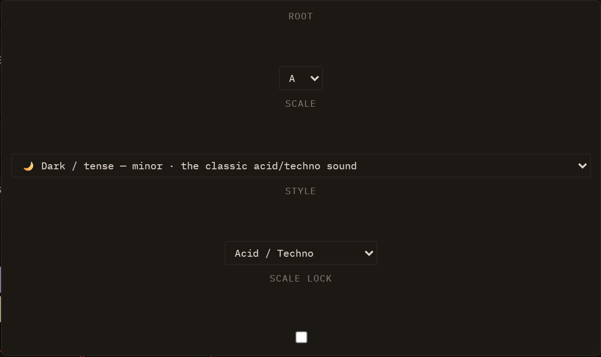
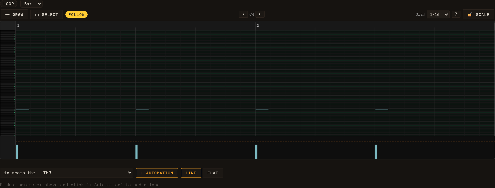
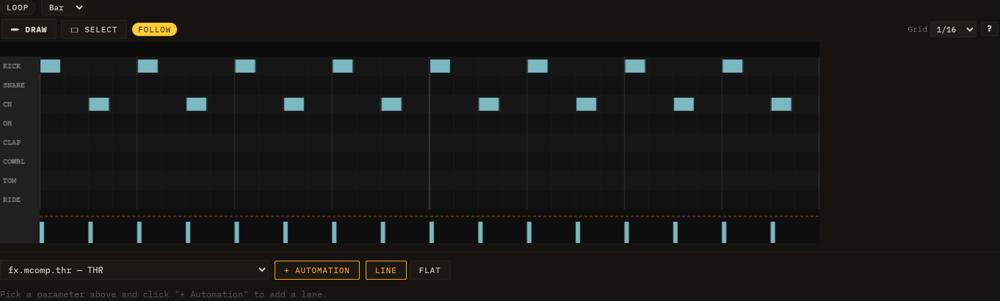

# Editing Clips

Every clip in Loom holds a sequence of notes. To edit those notes, click the **body** of any filled cell in the session grid — anywhere except the ▶ play icon or the ✕ delete cross in its corner (clicking ✕ deletes the clip outright, with no confirmation). You can also **right-click** a filled cell and choose **Open editor**. The inspector panel opens below the grid and the editor renders inside it. Closing the inspector does not stop playback — launching and editing are independent.

Melodic lanes (TB-303, Subtractive, FM, Wavetable, Karplus, West Coast, Sampler) open the **piano-roll**. Drum-machine lanes and sampler lanes that have a drum kit loaded open the **drum-grid**. If you want to switch between the two views for a given clip, click the **↔ Editor** button in the inspector toolbar.

See [Sessions, Lanes, Clips & Scenes](03-sessions-lanes-clips-scenes.md) for how clips are organised, and [Engines](04-engines.md) for the controls each engine exposes.

---

## Key, scale & musical assistance

*The project key/style bar sits in the transport strip next to Meter; the 🔒 Scale button and the 🎲, Vary, Mirror, Reverse, and Chords controls appear in the clip-editor toolbar.*

Loom's musical-assistance layer works from a single shared **project key and style** setting. Everything that generates or reshapes notes — the random generator, the examples gallery, the pattern transforms, the chord harmoniser — reads that setting and stays in key automatically. You can override it on a per-lane basis when one part needs to inhabit a different harmonic world.

### Project key & style bar

In the top transport bar, next to the **Meter** control, a button displays the current project tonality and the scale-lock state — for example **🎼 A minor · Acid / Techno · 🔓**. The 🔒/🔓 glyph at the end tells you at a glance whether the scale lock is on, without opening anything. Click the button to open the key/style panel.

The panel has three pickers and a lock toggle:

- **Root** — the tonic note (C through B).
- **Scale** — chosen by feel rather than by musical-theory name. Each option shows a mood label, the musical name in small print, and a one-line usage hint:
  - 🌙 Dark / tense — minor · the classic acid/techno sound
  - 🛡️ Safe (almost anything fits) — pentatonic minor
  - ☀️ Bright / uplifting — major
  - 🌊 Hypnotic / modal — dorian
  - 😰 Unsettling — phrygian
  - 🎨 Anything goes — chromatic (no constraint)
- **Style** — the rhythmic and harmonic character used by the generators (Acid / Techno, House, Synthwave, Lo-fi, and others). Style affects which rhythmic patterns the chord maker lays down and sets the default feel of generated basslines and melodies.
- **Scale lock** — a checkbox that turns the piano-roll's note snapping on or off **globally**. It is **off by default**, so you can play freely; tick it when you want every placed note pulled into the key. This is the same switch as the piano-roll's 🔒 button — wherever you toggle it, the other reflects it.

Every other musical-assistance feature — the piano-roll scale highlight, the generator, the examples, the transforms, and the chord maker — respects the active root and scale. Closing the panel without choosing commits no change.

#### Per-lane override

The lane inspector shows a line such as **Key: inherits A minor · Override**. Click **Override** to assign a different root and scale to that lane alone, so one part can be in a different key while the rest of the session stays in the project key.

---

### Scale highlight & lock (piano-roll)

Inside the piano-roll, in-scale pitch rows are highlighted and the keyboard strip on the left colours in-scale keys — the tonic row and key are the brightest. This gives you an instant visual map of which notes belong to the current key.

A **🔒 Scale** button in the piano-roll toolbar controls the scale lock, mirroring the **Scale lock** checkbox in the project key/style panel — both write the same global setting. The lock is **off by default**: a fresh session never constrains what you play, and a saved session always loads unlocked, so the lock can never surprise you by being on. Switch it to **🔒** whenever you want a safety net. When locked:

- Drawing a note with the pencil snaps the pitch to the nearest in-scale degree.
- Dragging an existing note vertically skips over out-of-scale rows.
- Computer-keyboard note input plays and records only in-scale pitches.
- Paste lands notes on in-scale pitches, transposing each pasted note by the minimum interval needed to put it back in key.

With the lock on it is impossible to place a wrong note; toggle it back to **🔓** (the default) for chromatic freedom — accidentals, blue notes, deliberate dissonance. The arrow-key nudge (semitone up/down) intentionally ignores the lock in both states, so you can always make precise micro-adjustments with the keyboard.

---

### Generate (🎲)

The **🎲** (dice) button in the clip-editor toolbar fills the current clip with a freshly generated musical part in the project key, scale, and style:

- **TB-303-style lanes** — a characteristic bassline (slide and accent placement influenced by the active style).
- **Drum lanes** — a beat pattern matched to the style's rhythmic vocabulary.
- **Other melodic lanes** — a melody or counterpoint line.

The result is not flat random: it is constrained to the scale, shaped by the style, and proportioned to the clip length. Press 🎲 again for another variation; change the global **Style** in the key/style panel for a different character while keeping the same root and scale.

---

### Examples gallery

An inline dropdown next to 🎲 in the toolbar lists factory riff examples **grouped by style** (Acid / House / Synthwave / Lo-fi section headers). The list is filtered by editor type: melodic editors show basslines and melodies; drum editors show beat patterns.

Selecting an example:

1. Loads it into the current clip.
2. Transposes it from its stored key into the **current project key**.
3. Repeats or trims it to exactly fill the clip length — short riffs tile; long riffs are cut at the clip boundary.

Two additional controls sit at the bottom of the dropdown:

- **+ Example** — saves the current clip's notes as your own example. It is stored in this browser (IndexedDB), persists across reloads, and is marked with a ★ in the list.
- **⤓ JSON** — exports the current clip as a portable `.json` file that you can share or import into another browser.

---

### Pattern transforms

Three buttons in the toolbar reshape the current pattern — all results stay within the project key and scale.

| Button      | Name              | What it does                                                                                                                                |
| ----------- | ----------------- | ------------------------------------------------------------------------------------------------------------------------------------------- |
| **Vary**    | Musical variation | Nudges some pitches to neighbouring scale degrees and lightly adjusts rhythm and velocity; the overall character and contour are preserved. |
| **Mirror**  | Melodic inversion | Flips the melodic contour so that rising lines fall and falling lines rise, mirrored around the first note of the clip.                     |
| **Reverse** | Retrograde        | Plays the pattern backwards in time — the last note becomes the first.                                                                      |

All three are undoable with Ctrl+Z / Cmd+Z.

---

### Chords

The **Chords** button harmonises the current melodic clip. For each bar it picks the most characteristic **diatonic triad** implied by the bar's melody notes, then writes an accompaniment using a **rhythm pattern drawn from the global style** — for example offset stabs in House, sustained pads in Lo-fi, driving eighth notes in Synthwave.

When you click Chords a small dialog asks **which lane** to write the chord part to: pick an existing melodic lane or let Loom create a new lane labelled "Chords". The original clip is not modified.

---

## Piano-roll

The piano-roll is a two-axis canvas: time runs left-to-right, pitch runs bottom-to-top. A vertical keyboard on the left names the rows; a time ruler at the top marks bars and beats.

### Zoom and pan

Scrub **vertically on the time ruler** to zoom the time axis; scrub **horizontally** on the ruler to pan. Scrub the **keyboard strip** vertically to zoom the pitch axis. The native scroll bars pan both axes. Zoom state is saved per clip and restored when you reopen it.

The **drum-grid** and the **audio-clip editor** have the same horizontal zoom and scroll: their fixed parts (the voice-name labels on the drum grid, the waveform header on an audio clip) stay pinned on the left while the timeline content scrolls and zooms beside them. The loop brace tracks the zoom in every editor.

### Follow (auto-scroll)

A session-global **Follow** toggle keeps the playhead in view: while it's on, every clip editor auto-scrolls horizontally to follow playback. It is **on by default** — turn it off when you want to inspect one region while the transport runs elsewhere. The setting is shared across all editors and saved with the session.

### Draw mode (pencil)

The default tool is **Draw**. Click an empty area of the grid to place a note at the snap resolution (default: 16th notes). Drag right while placing to extend its duration. Click and drag an existing note's right edge to resize it. Click and drag the body of a note to move it. Alt-click or right-click a note to delete it.

### Select mode

Click the **Select** tool button in the toolbar to switch. In Select mode, click a note to select it. **Drag on the grid background** to draw a marquee rectangle; every note whose body intersects the rectangle is selected. Click empty space to deselect all.

With notes selected you can:

- **Move as a group** — drag any selected note; the whole selection moves together and is clamped to the clip boundaries.
- **Delete** — press Delete or Backspace.
- **Nudge** — use the arrow keys to shift the selection one snap unit left/right or one semitone up/down.
- **Cut / Copy / Paste** — Ctrl+X / Ctrl+C / Ctrl+V (Cmd on Mac). Paste anchors the earliest clipboard note at the mouse cursor position, so move the pointer where you want the paste to land before pressing Ctrl+V.

The tool choice and clipboard contents persist across clip re-opens and across clips, so you can copy from one clip and paste into another.

### Computer-keyboard note input

When the piano-roll has focus you can record notes directly from the computer keyboard:

| Key row | Notes |
| ------- | ----- |
| `a s d f g h j k` (home row) — white keys | C D E F G A B C |
| `w e t y u` (upper row) — black keys | C# D# F# G# A# |
| `z` / `x` | Shift input octave down / up |

Pressing a key **auditions the note** immediately so you can hear it, advances the input cursor by one snap step, and **records the note into the clip** at the cursor position. Duration equals one snap step (quantised on key-up). This lets you step-enter a melody quickly without a MIDI controller.

---

## Drum-grid

The drum-grid is a canvas editor where rows correspond to drum voices (kick, snare, hi-hat, etc.) and columns correspond to time positions. Each hit is placed at a precise tick within the clip.

### Grid resolution

A resolution selector at the top of the editor sets the snap and the column width. Available resolutions are:

| Value | Description |
|-------|-------------|
| 1/4   | Quarter notes |
| 1/8   | Eighth notes |
| 1/8T  | Eighth-note triplets |
| 1/16  | Sixteenth notes (default) |
| 1/16T | Sixteenth-note triplets |
| 1/32  | Thirty-second notes |
| free  | No snap — place hits at any tick |

You can mix resolutions across clips; each clip stores its own `gridResolution` setting.

### Placing and removing hits

Click an empty cell to place a hit. Click an existing hit to remove it. In **free** mode, click anywhere in the row — the hit lands at the exact tick under the pointer with no snapping.

### Selection and group operations

Drag on the canvas background to draw a marquee rectangle. Hits whose row and time position intersect the rectangle are selected. With a selection active:

- **Move** — drag horizontally to shift selected hits in time; the group is clamped to the clip length.
- **Move rows** — drag vertically to reassign hits to different drum voices; the relative row offsets are preserved and clamped to the available voice list.
- **Delete** — press Delete or Backspace.
- **Cut / Copy / Paste** — Ctrl+X / Ctrl+C / Ctrl+V. Paste anchors the earliest hit at the click position (tick × row), preserving relative offsets within the group.

Selection, clipboard, and group-move all operate on **row indices**, not MIDI numbers, so patterns copy cleanly even between kits that map voices to different MIDI notes.

### Playhead

A vertical playhead line moves across the canvas in real time while the clip is playing, driven by the sequencer's look-ahead clock. It updates on every redraw tick and resets to the left edge when the clip stops.

---

## Clip tempo (×2 / ÷2)

Next to the **Length (bars)** field in the inspector toolbar sit two buttons, **`*2`** and **`/2`**, that time-scale the whole clip in a single, undoable step — Ableton's "double / halve clip tempo" applied to the open clip.

- **`*2`** *(Double tempo — compress notes & halve clip length)* — packs the clip into half the time: every note's start and duration is halved, the loop region scales with it, the clip's length in bars halves, and any clip automation is compressed to match. The pattern plays back twice as fast.
- **`/2`** *(Halve tempo — stretch notes & double clip length)* — the inverse: notes, loop, length and automation all double, so the pattern plays back half as fast over twice the bars.

Because every part of the clip is scaled together — notes, loop brace, length and automation — the groove keeps its shape; only its speed (and the bars it occupies) changes. The buttons appear for **note and drum clips**; a pure audio channel has no notes to scale, so they are hidden there. The whole rescale is one entry in the global undo history, so a single Ctrl+Z restores the original timing.

---

## Loop regions

A **loop brace** sits above every clip editor — piano-roll and drum-grid — as a narrow strip spanning the full clip length. It lets you mark an A–B sub-region and repeat just that portion while the clip plays.

### Setting the loop region

The brace strip has two drag handles (left = A, right = B) and a **Loop** toggle button. To use it:

1. Click **Loop** to enable the loop region. The region highlights between the A and B handles; if no region was set before, it defaults to the full clip length.
2. Drag the **left handle** to move the start point (A). Drag the **right handle** to move the end point (B). Both handles snap to 16th-note grid positions.
3. Drag the **interior** of the region (between the handles) to **slide the whole window** along the timeline — its length is preserved, it snaps to the grid, and it stops at both ends of the clip. Handy for auditioning the same-length loop over different bars.
4. While the clip is playing, the scheduler repeats only the A–B sub-region — the rest of the clip is skipped.

Click **Loop** again to disable it. The clip reverts to playing its full length; the A and B positions are remembered so you can re-enable the same region later.

### What the loop brace affects

The loop region works the same way for all clip types:

- **Note clips (piano-roll)** — only notes whose start falls within the A–B range are triggered; the period of repetition equals the duration of that range.
- **Drum clips (drum-grid)** — same: only hits inside the sub-region fire.
- **Sliced note clips (Sampler)** — a clip whose notes trigger bank slices behaves like any note clip: only the hits inside the A–B sub-region fire, still tempo-locked and pitch-preserving.

The brace lives on the note/drum editor. A pure audio channel (the waveform-only audio-clip editor) does not show a brace; to gain per-region control over an audio loop, bring it in through the Sampler's **Loop** family, which slices it into a note clip with a piano-roll (see [MIDI & Samples — Sampler](08-midi-and-samples.md#sampler)).

The loop region is **per-clip** and saved with the session. Two clips in the same lane or scene can each have their own independent A–B region, or none at all.

All loop-region edits (moving handles, toggling) are part of the global undo history (Ctrl+Z / Cmd+Z).

For how to use an arrangement-wide A–B loop brace that repeats a section across all lanes at once, see [Performance & Arrangement](10-performance-and-arrangement.md).

---

## Waveform header

Any clip that references an audio buffer shows a **waveform header** above its editor — a peak view of the buffer with a bar/beat ruler, slice markers (orange), and a live playhead. It appears in two situations:

- **Audio clips** open the dedicated **audio-clip editor** (toolbar + waveform header, no note grid).
- **Sliced note clips** (and any normal clip that carries a display-only waveform reference) keep the header **above** the piano-roll or drum-grid, so you can edit notes against the source audio.

To bring a loop into a session as a tempo-locked audio channel, see [MIDI & Samples — Audio channel](08-midi-and-samples.md#audio-channel) (the **+ Audio** control, the waveform header, the **Warp** tempo-lock). To chop a loop into individually editable note slices, load it through the Sampler's **Loop** family instead.

---

## Velocity & dynamics

Above: piano-roll editor. The strip beneath the note grid is the velocity lane — one vertical bar per note, height proportional to velocity.

Every note in Loom carries a **velocity** value from 0 to 127. Velocity is set when you draw a note (default: **90**), adjusted in the velocity lane, and captured automatically from MIDI import. It affects the sound in two complementary ways:

- **Loudness** — velocity scales the note's output gain continuously via a smooth curve (`velToGain`). A velocity of 1 is near-silent; 127 is the loudest a note can be. Notes at the default of 90 sit just above the mid-point of the range, so there is clear headroom in both directions.
- **Accent character** — notes with velocity **≥ 100** are accented. On top of the continuous gain, accent adds character to the sound: on bass-style engines (TB-303, Subtractive) it brightens the filter envelope and raises the resonance Q; on drums it increases brightness. This is the same accent model that the 303 bassline and drum sequencer have always used, now unified into the velocity scale.

### Reading velocity visually

Each note's **fill colour** shifts along a **blue → yellow** ramp as its velocity increases. Low-velocity notes are deep blue; high-velocity notes are warm yellow. The transition is weighted so the blue half of the range covers roughly velocities 0–64 and the yellow half covers 64–127. Accented notes (≥ 100) are additionally outlined with a **white border** — colour alone does not distinguish accent from non-accent.

### The velocity lane

Below the note grid (piano-roll) or the drum-voice rows (drum-grid) is the **velocity lane**: a row of vertical bars, one per note, anchored at the note's start position. Bar height is proportional to velocity. A **dashed horizontal line** across the lane marks the accent threshold (velocity 100) so you can see at a glance which notes are accented. The lane scrolls horizontally in sync with the grid.

### Editing velocities

You interact with the velocity lane by dragging the bars:

- **Set a single note** — drag a bar up or down. The velocity updates live; the note colour and audible gain change as soon as you release.
- **Adjust a group** — if you have notes selected (marquee selection in the main grid), dragging any bar that belongs to the selection applies the **same delta** to all selected notes. Notes that would go out of range are clamped to 1–127.
- **Paint a ramp** — drag horizontally across multiple bars. Each bar you pass over is set to the velocity corresponding to the current vertical position of the pointer, writing a smooth velocity ramp across the passage in a single gesture.

When several notes share the same start position (a chord), their bars are fanned a few pixels apart in the lane so each one remains individually grabbable.

All velocity edits are undoable (Ctrl+Z / Cmd+Z) in the same undo history as note placement and movement.
