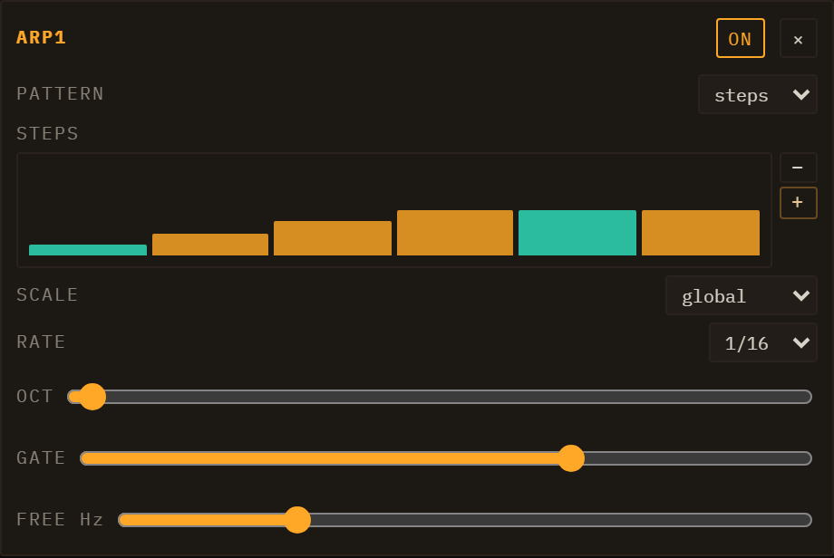

# Modulation & Note FX

Every lane has two signal-processing layers that sit *before* its engine's audio output and *around* its note stream: **Modulators** shape sounds over time by continuously driving engine parameters, and **Note FX** transform the note events before they reach the engine. Both are per-lane and saved with the session.

*The FM engine editor. The MODULATORS section (LFO1 + ADSR1) and the NOTE FX row are visible at the bottom of the panel.*

---

## Modulators

Open any lane's engine editor and scroll to the **MODULATORS** section. Press **+ ADSR**, **+ LFO**, **+ Per-Note** or **+ S&H** to add a modulator; you can add as many as you need. Each modulator appears as a card with its own controls, an **ON / OFF** toggle, and a **×** remove button.

That row of buttons is not a fixed list — it is built from whatever modulators are registered, so a plugin that ships one adds its own button. **S&H and Per-Note are exactly that**: modulators that arrive as external plugins rather than from Loom's own source, and behave like any other.

**The section is not empty to begin with.** Every engine arrives with its own modulators already wired, and on some engines they are load-bearing rather than decorative:

| Engine | Ships with |
| --- | --- |
| Subtractive | Four — two ADSRs (which **are** the amp and filter envelopes) plus two free LFOs |
| West Coast | Two ADSRs (wavefolder + low-pass gate) plus two LFOs |
| Wavetable | An ADSR on filter cutoff, plus a free LFO |
| FM, Karplus | One LFO and one ADSR |
| TB-303 | One LFO only — by design; its envelopes are part of the engine |

On Subtractive in particular, deleting the two ADSRs removes the amplitude and filter envelopes: they are not extras sitting on top of the sound, they *are* the sound's shape.

**A preset can carry its own modulators.** Loading one replaces the lane's modulator set with the preset's — because for some patches the modulation *is* the patch. A wobble bass is an LFO on the filter cutoff; without it there is no wobble. On Subtractive that is not the exception but the rule: all 103 of its factory presets arrive with their envelopes and LFOs wired, which is why loading one and reading its MODULATORS section is the quickest way to learn what this section can do. One of them, **PLUCK Per-Note Pulse**, is built on the Per-Note modulator described below.

### LFO

An LFO generates a periodic waveform that you route to one or more target parameters.

| Control | Description |
|---------|-------------|
| WAVE | Waveform shape: Sine, Tri, Sqr, or Saw |
| RATE | *(FREE mode)* the free-running rate, set with a log-scaled knob and shown in **bpm** (LFO cycles per minute), from ultra-slow sweeps (under 1 bpm) up to audio-rate wobble. The slow half of the knob travel covers the slow rates, so gentle sweeps are easy to dial in. |
| BARS / FEEL | *(SYNC mode)* **BARS** is a free numeric input for the cycle length in bars-per-cycle (e.g. `0.25` = a quarter-bar cycle, `4` = one cycle every four bars; any value from 1/16-bar up to 64 bars). **FEEL** offsets it — **Str** (straight), **Trip** (triplet), **Dot** (dotted). This replaced the old fixed RATIO dropdown, so you can sync to any cycle length, not just preset divisions. |
| FREE / SYNC | Toggles between the free-running bpm RATE knob (FREE) and the tempo-locked BARS + FEEL controls (SYNC). |
| POLARITY | **-1..+1** (bipolar, default) oscillates symmetrically around the param's centre. **0..1** (unipolar) only pushes the parameter upward. |
| RETRIG | One 3-way control with three states: **Free** — one lane-wide LFO whose phase runs continuously off the clock, like a classic analogue LFO. **Note** — one lane-wide LFO whose phase restarts on every note-on, so its shape lands the same way on each note. **Voice** — each played note gets its own LFO, born with the note. |

**Musical difference between the lane-wide settings and Voice:** with Free or Note the whole lane shares one LFO, so a chord breathes as one — all notes rise and fall together, which is what you want for a pad that should feel like a single instrument. **Voice** gives each note its own cycle, so notes played at different moments drift out of step with each other and the chord shimmers instead of pulsing. On fast, staccato playing the difference is dramatic; on a slow sustained chord it is subtle.

**Free vs Note** matters most with a slow LFO and short notes: with Free, a note might catch the LFO anywhere in its cycle, so consecutive notes sound inconsistent; with Note, every note gets the same sweep from the same starting point. (On **Voice** a retrigger setting would be redundant — the LFO already starts with the note — which is why the three states share one control rather than two.)

### ADSR

An ADSR produces a classic Attack–Decay–Sustain–Release envelope that fires once on each note trigger and follows the note's gate duration. Every note always gets its own independent envelope — unlike the LFO, an ADSR has no RETRIG control, because per-note is the only behaviour that makes sense for it. Its card carries the four knobs and nothing else.

| Control | Range | Default |
|---------|-------|---------|
| A (Attack) | 1 ms – 2 s | 10 ms |
| D (Decay) | 1 ms – 4 s | 300 ms |
| S (Sustain) | 0 – 100 % | 70 % |
| R (Release) | 1 ms – 8 s | 300 ms |

### S&H (sample & hold)

S&H latches a new random value at a steady rate and **holds** it until the next one. Where the LFO glides, this jumps: it is the stepped, jittery movement of a classic modular random source. Aim it at a filter cutoff for burbling per-step colour, at pitch for a small amount of analogue drift, or at a send for a randomly appearing effect.

| Control | Range | Default |
|---------|-------|---------|
| Rate | 0.1 – 20 Hz | 6 Hz |
| Bipolar | Unipolar / Bipolar | Bipolar |

**Bipolar** swings both ways around the destination's current value; **Unipolar** only adds. Like the LFO it can run shared across the lane or per voice.

The steps are random but not *unrepeatable*: the value of a given step is derived from its index, so the same passage lands identically every time — the offline render and what you heard live agree exactly.

### Per-Note

Every other modulator answers *what time is it*. This one answers **which note is this** — it is a function of the note's position in the sequence of notes played, not of the clock. The value is fixed when the note starts and **never moves while the note sounds**, and the same note always gets the same value.

It is the modulator to reach for when consecutive notes should not be identical: a touch on filter cutoff and the line stops sounding machine-stamped; a touch on pulse width and every note has its own body.

| Control | Range | Default |
|---------|-------|---------|
| Pattern | 0 – 1 | 0.618… |
| Skew | 0 – 1 | 0 |
| Polarity | Unipolar / Bipolar | Bipolar |

**Pattern is the instrument.** It says how far the value walks from one note to the next: **0.5** alternates between two values, **0.25** cycles every four notes, **0.75** every four but in a different order — and the golden-ratio default, 0.618…, **never repeats**. That precision matters: any short decimal is a fraction, and every fraction comes back round eventually. **Skew** slides the whole sequence along without changing its shape, which is how two Per-Notes on the same Pattern can be made to disagree. **Polarity** follows the S&H convention — Unipolar only pushes the destination one way from where you set it, Bipolar lets a note land under the knob as well as over it.

There is no depth control on the card, because every destination row already has one.

**One caveat.** Because it counts notes rather than reading the clock, an offline render that starts partway through does **not** reproduce what you heard from the top: the note that was the fortieth is now the first. This is the opposite of the S&H guarantee above, and it is the price of the value depending on which note it is.

### Destinations and depth

Below each modulator card's controls is a destination list. To route the modulator:

1. Select a target from the dropdown — it lists all automatable parameters for the lane's engine, the lane's own mixer column (level, pan, both sends, the three EQ bands), plus any lane inserts, master inserts, and master sends (reverb, delay). Modulating the lane's level or a send is how you get tremolo, auto-pan or a rhythmic send; it swings around wherever the fader sits rather than replacing it — see [Automating and modulating the mixer column](07-mixing-and-fx.md#automating-and-modulating-the-mixer-column).
2. Press **+ Destination**. A new row appears showing the target name and a **DEPTH** knob (range –1 to +1, default 0.5).

The depth knob scales the modulator's effect. A value of 1.0 means the full output range of the modulator sweeps the full range of the destination parameter (in the parameter's native units). –1.0 inverts the modulation direction. Multiple destinations can share the same modulator at different depth values.

Remove a destination with its **×** button. Remove the whole modulator with the **×** on the card header.

---

## Note FX

The **NOTE FX** section sits directly below MODULATORS. Note FX processors intercept the lane's note stream before it reaches the engine, transforming which notes are played and when. Add a processor with **+ Arp**, **+ Chord** or **+ Random**. Each processor shows an **ON / OFF** button and a **×** remove button.

Note FX are per-lane and persist with the lane's engine state. Loading a demo resets them to the demo's configuration.

### Arpeggiator

The Arp takes each held note and generates a rapid sequence of notes from it according to a scale and direction pattern.

| Control | Options / Range | Description |
|---------|-----------------|-------------|
| PATTERN | up, down, updown, random, cosmic, **steps** | Direction of the arpeggio. **cosmic** adds occasional octave jumps and random steps for an unpredictable feel; **steps** is a pattern you write yourself — see below. |
| SCALE | **global**, major, minor, pentMinor, phrygian, chromatic | Where the arp's notes come from. **global** is the default and is not a scale of its own: the run walks the degrees of the *session's* key upward from the note you played, so it stays in the song. The named scales are transposed onto the played note instead, which is the older behaviour and can leave the key — in C major, playing E gives E-F-G-A-B on **global** and E-F♯-G♯-A-B on **major**. |
| RATE | free, 1/4, 1/8, 1/8t, 1/16 *(default)*, 1/16t, 1/32 | Step rate in musical divisions (BPM-synced), or free Hz. |
| OCT | 1–4 | Number of octaves the arp spans, **1 by default**: the run stays in the octave you played. Higher values are opt-in and cycle the scale across more octaves before repeating. |
| GATE | 0.05–1.0 (default 0.7) | Fraction of the step interval during which each arp note is held. Lower values create a more staccato feel. |
| FREE Hz | 0.5–32 Hz (default 8) | Rate used when RATE is set to *free*. |

The Arp fires as many notes as fit inside the original note's gate duration, so longer notes produce longer runs.

**PATTERN = steps — the pattern you paint.** Choosing *steps* reveals a **STEPS** row of bars beneath the controls. Drag across it to paint, exactly as you would an automation lane; `−` and `+` change the pattern's length, from 1 to 32 steps, and lengthening repeats the last step rather than the whole cycle.

What a bar's height sets is **which note of the run**, not which pitch — the pattern is written in positions, so it survives everything that would otherwise break it. Transpose the part, change the key, change the scale, change OCT: the pattern still means the same thing, because SCALE and OCT decide the pool the positions point into and the positions themselves do not move. Eight rungs are available above the floor.

**A bar dragged all the way down is a rest.** It keeps its slot — nothing sounds there and nothing shifts up to fill it — which is what lets you write a rhythm and not just an order. Every fourth bar is drawn brighter so you can count without a ruler.

The default is `0 1 2 3`, the plain upward walk written out, so switching to *steps* changes nothing until you edit it. A pattern with every bar at rest plays silence; it does not fall back to the walk.

### Chord

The Chord processor expands each incoming note into a chord built on that note as the root. Out of the box the note you played is part of what you hear — the octave shift is a switch you throw deliberately, never something the processor does behind your back.

| Control | Options | Description |
|---------|---------|-------------|
| CHORD | maj, min, maj7, min7, sus2, sus4, dim, **free** | Chord voicing to generate. **free** replaces the named voicing with three intervals you dial yourself. |
| INT 1 / INT 2 / INT 3 | –24 to +24 semitones (4 / 7 / 0) | Only with CHORD = *free*: the three intervals above (or below) the root. **A zero switches that voice off** rather than doubling the root — the root always sounds, so a two-note voicing is one interval at 0. |
| IN KEY | off *(default)* / scale / chord | Whether the notes it produces are pulled into the song's harmony. See below. |
| OCT SHIFT | ON / OFF (off by default) | Enables the octave shift. While off the OCT slider is hidden and completely bypassed, so the chord stays rooted on the note you played. |
| OCT | –2 to +2 | Only with OCT SHIFT on: transposes the whole chord, root included, that many octaves. |

All notes in the chord share the original note's timing and gate length. The chord is also built in the **session's** key now: playing live used to be answered in A minor whatever the song said, so the same lane with the same settings was in two different keys depending on whether the note came from a clip or from your fingers.

**IN KEY — staying in the key is not the same as landing on the chord.**

- **scale** snaps every note to the session's key and scale. You cannot play a wrong note, but you can still play a passing note the chord underneath does not contain — which is often what you want, and is why this is not the stronger setting. Be aware of one consequence: in a major scale every out-of-scale note sits exactly between two neighbours, and a tie resolves upward, so a D major triad in C major comes out D-G-A rather than D minor.
- **chord** snaps to the pitch classes of the chord sounding at that bar of the progression. It cannot sound wrong against the harmony — and it cannot sound like a melody either, because it is locked to three notes. With no progression to read it falls back to *scale*.

Conforming can land two intervals on the same note; the duplicate is dropped rather than played twice.

### Random

The Random processor introduces controlled uncertainty into a part — the humanising pass that keeps a loop from sounding like a loop. It is built around **chance sliders**: each of the four things it can vary has its own 0–1 probability, and **every one of them starts at 0**, so adding the processor changes nothing until you ask it to. Turn one up and it intervenes on that fraction of notes.

| Control | Range / Options | Description |
|---------|-----------------|-------------|
| CHANCE | 0–1 (default 0) | How often the **pitch** is moved |
| CHOICES | 1–24 (default 6) | How many alternative pitches are in the pool |
| INTERVAL | 1–12 semitones (default 1) | The spacing between those choices |
| MODE | random / alt | *random* picks freely; *alt* walks round-robin through the pool, which is more even and less clumpy |
| SIGN | add / sub / bi (default bi) | Whether it may move up only, down only, or both ways |
| SCALE | ON / OFF (**on** by default) | Snaps every generated pitch to a key and scale, so the randomness stays in the song. Switching it on reveals **ROOT** and **SCALE** selects, both of which start on **Global** — they follow the song's own key until you pick something else |
| VEL CHANCE / VEL RND | 0–1 (0 / 0.3) | How often, and how far, the **velocity** varies. This is the one to reach for first: a little velocity variation is most of what "played by a human" means |
| VEL SMOOTH | 0–1 (default 0) | How much the velocity variation is smoothed from note to note. At 0 each note is drawn independently, which reads as twitchy; turned up, the loudness drifts instead of jumping |
| VEL DRIFT | 0.05–8 Hz (default 1) | How fast that drift moves. Only does anything while VEL SMOOTH is above 0 |
| DUR CHANCE / DUR RND | 0–1 (0 / 0.3) | How often, and how far, the **gate length** varies (at 1, between half and double) |
| DROP | 0–1 (default 0) | How often a note is **silenced** outright — the fastest way to thin a dense pattern into something with space in it |

The randomness is reseeded each time the transport starts, and stable within one run: a pass you liked stays the way it was until you stop and start again.

---

## Automation

Loom records parameter automation in two ways:

**Real-time knob recording (Performance view):** in the session/I-O header row, make sure the REC mode selector beside **● REC** is set to **🎛 take** (the default), then press **● REC** to arm recording and press Play. While recording in take mode, every knob you move *and* every clip launch is captured as automation in the current take. Automation is written at a sub-step resolution derived from the BPM. Press **● REC** again to disarm. (The other two REC modes — **⏱ live** and **⚡ offline** — export WAV audio instead of recording automation; see [Transport](02-transport.md) for the unified REC group.)

**Per-clip envelopes (Session view):** each clip can carry automation lanes independent of the Performance take system. Open the inspector for a clip and scroll below the note editor to the automation section. Select a parameter from the dropdown and click the add button to create an envelope lane for that clip. Envelopes are stored alongside the clip's notes in the session file.

The quickest way in is not that dropdown at all: **right-click the knob you want to automate**. The menu offers *Automate in clip "&lt;name&gt;"* (or *Edit automation in clip …* if a lane already exists) and takes you straight to it. A knob that cannot be automated at all — the master strip's, for instance — simply does not open a menu. One that *is* automatable but not reachable right now does open it, with the entry greyed out and the reason on it ("This track has no clips", "Master and send FX automate on the timeline — switch to Performance").

### Drawing into a clip envelope

Each lane sits below the note editor with its own header:

- **Line / Flat** — the two brush buttons at the top of the automation section. **Line** draws a ramp between where you press and where you release; **Flat** paints one constant value across the drag. The choice applies to every lane.
- **On / Off** — mutes the curve without deleting it.
- **Smooth / Stepped** — switches interpolation from smooth to a staircase that holds one value per step.
- **×** — removes the lane.

### The LFO generator

Rather than draw a repeating shape by hand, each lane's header carries a small generator that writes one for you:

- **Shape** — Sine, Triangle, Saw up, Saw down, Square or Random.
- **Rate** — a musical division of the **bar**: 4 bars, 2 bars, 1 bar, 1/2, 1/4, 1/8 or 1/16. 1/16 means sixteen cycles per bar, the fastest this menu offers.
- **Depth** — 100 %, 75 %, 50 % or 25 % of the lane's full height.
- **Loop only** — when the clip has a loop region, confines the fill to it instead of the whole lane.
- **LFO** — the button that actually draws it. One press is one undoable step.

On a **Stepped** lane the wave is sampled once per step, so a rate faster than the step grid cannot show a full cycle.

### The length an envelope runs on

An envelope spans the clip's **full length in bars** and repeats on that period. That matches the notes only while the whole clip is playing. If you shorten what plays — either with the clip's own loop region or with the scene's Global loop — the notes repeat on the shorter window but the envelope keeps running on the full clip, so the curve gradually slides against them. Set the loop first, then draw.

When you move a clip to a lane running a different engine, envelopes whose parameter ID no longer exists in the new engine are disabled automatically (they remain in the clip but do not play back until re-enabled or deleted).

---

*See also: [Engines](04-engines.md) for the parameters you can modulate, [Mixing & FX](07-mixing-and-fx.md) for lane inserts and master FX whose parameters also appear as modulation destinations, and [Transport](02-transport.md) for the REC button and Performance view.*
