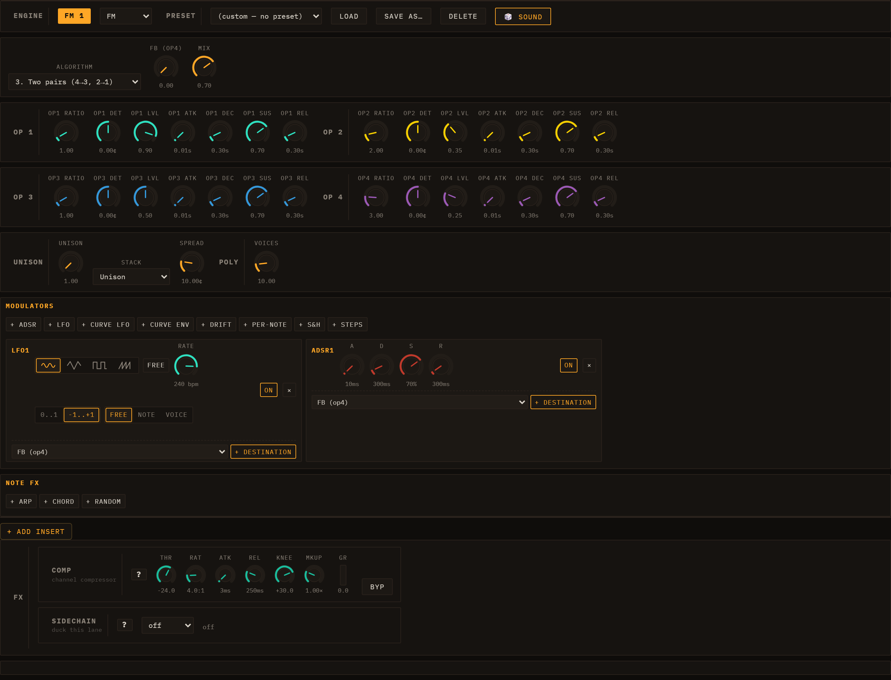

# Modulation & Note FX

Every lane has two signal-processing layers that sit *before* its engine's audio output and *around* its note stream: **Modulators** shape sounds over time by continuously driving engine parameters, and **Note FX** transform the note events before they reach the engine. Both are per-lane and saved with the session.

*The FM engine editor. The MODULATORS section (LFO1 + ADSR1) and the NOTE FX row are visible at the bottom of the panel.*

---

## Modulators

Open any lane's engine editor and scroll to the **MODULATORS** section. Press **+ LFO** or **+ ADSR** to add a modulator; you can add as many as you need. Each modulator appears as a card with its own controls, an **ON / OFF** toggle, and a **×** remove button.

**The section is not empty to begin with.** Every engine arrives with its own modulators already wired, and on some engines they are load-bearing rather than decorative:

| Engine | Ships with |
| --- | --- |
| Subtractive | Four — two ADSRs (which **are** the amp and filter envelopes) plus two free LFOs |
| West Coast | Two ADSRs (wavefolder + low-pass gate) plus two LFOs |
| Wavetable | An ADSR on filter cutoff, plus a free LFO |
| FM, Karplus | One LFO and one ADSR |
| TB-303 | One LFO only — by design; its envelopes are part of the engine |

On Subtractive in particular, deleting the two ADSRs removes the amplitude and filter envelopes: they are not extras sitting on top of the sound, they *are* the sound's shape.

**A preset can carry its own modulators.** Loading one replaces the lane's modulator set with the preset's — because for some patches the modulation *is* the patch. A wobble bass is an LFO on the filter cutoff; without it there is no wobble. Six of the Subtractive presets ship one today: **BASS Wobble LFO**, **BASS Neuro**, **PAD Shimmer**, **PAD Cosmic**, **PAD Ethereal** and **LEAD Sync Sweep**. Load one and look at the MODULATORS section to see how it was built — they are the quickest way to learn what this section can do.

### LFO

An LFO generates a periodic waveform that you route to one or more target parameters.

| Control | Description |
|---------|-------------|
| WAVE | Waveform shape: Sine, Tri, Sqr, or Saw |
| RATE | *(FREE mode)* the free-running rate, set with a log-scaled knob and shown in **bpm** (LFO cycles per minute), from ultra-slow sweeps (under 1 bpm) up to audio-rate wobble. The slow half of the knob travel covers the slow rates, so gentle sweeps are easy to dial in. |
| BARS / FEEL | *(SYNC mode)* **BARS** is a free numeric input for the cycle length in bars-per-cycle (e.g. `0.25` = a quarter-bar cycle, `4` = one cycle every four bars; any value from 1/16-bar up to 64 bars). **FEEL** offsets it — **Str** (straight), **Trip** (triplet), **Dot** (dotted). This replaced the old fixed RATIO dropdown, so you can sync to any cycle length, not just preset divisions. |
| FREE / SYNC | Toggles between the free-running bpm RATE knob (FREE) and the tempo-locked BARS + FEEL controls (SYNC). |
| POLARITY | **-1..+1** (bipolar, default) oscillates symmetrically around the param's centre. **0..1** (unipolar) only pushes the parameter upward. |
| RETRIG | One 3-way control with three states: **Free** — one lane-wide LFO whose phase runs continuously off the clock, like a classic analogue LFO. **Note** — one lane-wide LFO whose phase restarts on every note-on, so its shape lands the same way on each note. **Voice** — each played note gets its own LFO, born with the note. |

**Musical difference between the lane-wide settings and Voice:** with Free or Note the whole lane shares one LFO, so a chord breathes as one — all notes rise and fall together, which is what you want for a pad that should feel like a single instrument. **Voice** gives each note its own cycle, so notes played at different moments drift out of step with each other and the chord shimmers instead of pulsing. On fast, staccato playing the difference is dramatic; on a slow sustained chord it is subtle.

**Free vs Note** matters most with a slow LFO and short notes: with Free, a note might catch the LFO anywhere in its cycle, so consecutive notes sound inconsistent; with Note, every note gets the same sweep from the same starting point. (On **Voice** a retrigger setting would be redundant — the LFO already starts with the note — which is why the three states share one control rather than two.)

### ADSR

An ADSR produces a classic Attack–Decay–Sustain–Release envelope that fires once on each note trigger and follows the note's gate duration. Every note always gets its own independent envelope — unlike the LFO, an ADSR has no RETRIG control, because per-note is the only behaviour that makes sense for it. Its card carries the four knobs and nothing else.

| Control | Range | Default |
|---------|-------|---------|
| A (Attack) | 1 ms – 2 s | 10 ms |
| D (Decay) | 1 ms – 4 s | 300 ms |
| S (Sustain) | 0 – 100 % | 70 % |
| R (Release) | 1 ms – 8 s | 300 ms |

### Destinations and depth

Below each modulator card's controls is a destination list. To route the modulator:

1. Select a target from the dropdown — it lists all automatable parameters for the lane's engine, plus any lane inserts, master inserts, and master sends (reverb, delay).
2. Press **+ Destination**. A new row appears showing the target name and a **DEPTH** knob (range –1 to +1, default 0.5).

The depth knob scales the modulator's effect. A value of 1.0 means the full output range of the modulator sweeps the full range of the destination parameter (in the parameter's native units). –1.0 inverts the modulation direction. Multiple destinations can share the same modulator at different depth values.

Remove a destination with its **×** button. Remove the whole modulator with the **×** on the card header.

---

## Note FX

The **NOTE FX** section sits directly below MODULATORS. Note FX processors intercept the lane's note stream before it reaches the engine, transforming which notes are played and when. Add a processor with **+ Arp** or **+ Chord**. Each processor shows an **ON / OFF** button and a **×** remove button.

Note FX are per-lane and persist with the lane's engine state. Loading a demo resets them to the demo's configuration.

### Arpeggiator

The Arp takes each held note and generates a rapid sequence of notes from it according to a scale and direction pattern.

| Control | Options / Range | Description |
|---------|-----------------|-------------|
| PATTERN | up, down, updown, random, cosmic | Direction of the arpeggio. **cosmic** adds occasional octave jumps and random steps for an unpredictable feel. |
| SCALE | major, minor, pentMinor, phrygian, chromatic | Scale from which arp notes are drawn, starting from the held root note. |
| RATE | free, 1/4, 1/8, 1/8t, 1/16, 1/16t, 1/32 | Step rate in musical divisions (BPM-synced), or free Hz. |
| OCT | 1–4 | Number of octaves the arp spans. Higher values cycle the scale across more octaves before repeating. |
| GATE | 0.05–1.0 | Fraction of the step interval during which each arp note is held. Lower values create a more staccato feel. |
| FREE Hz | 0.5–32 Hz | Rate used when RATE is set to *free*. |

The Arp fires as many notes as fit inside the original note's gate duration, so longer notes produce longer runs.

### Chord

The Chord processor replaces each incoming note with a chord built on that note as the root.

| Control | Options | Description |
|---------|---------|-------------|
| CHORD | maj, min, maj7, min7, sus2, sus4, dim | Chord voicing to generate |
| OCT | –2 to +2 | Octave offset applied to all notes in the chord |

All notes in the chord share the original note's timing and gate length.

---

## Automation

Loom records parameter automation in two ways:

**Real-time knob recording (Performance view):** in the session/I-O header row, make sure the REC mode selector beside **● REC** is set to **🎛 take** (the default), then press **● REC** to arm recording and press Play. While recording in take mode, every knob you move *and* every clip launch is captured as automation in the current take. Automation is written at a sub-step resolution derived from the BPM. Press **● REC** again to disarm. (The other two REC modes — **⏱ live** and **⚡ offline** — export WAV audio instead of recording automation; see [Transport](02-transport.md) for the unified REC group.)

**Per-clip envelopes (Session view):** each clip can carry automation lanes independent of the Performance take system. Open the inspector for a clip and scroll below the note editor to the automation section. Select a parameter from the dropdown and click the add button to create an envelope lane for that clip. Envelopes are stored alongside the clip's notes in the session file.

The quickest way in is not that dropdown at all: **right-click the knob you want to automate**. The menu offers *Automate in clip "&lt;name&gt;"* (or *Edit automation in clip …* if a lane already exists) and takes you straight to it. A knob that cannot be automated at all — the master strip's, for instance — simply does not open a menu. One that *is* automatable but not reachable right now does open it, with the entry greyed out and the reason on it ("This track has no clips", "Master and send FX automate on the timeline — switch to Performance").

### Drawing into a clip envelope

Each lane sits below the note editor with its own header:

- **Line / Flat** — the two brush buttons at the top of the automation section. **Line** draws a ramp between where you press and where you release; **Flat** paints one constant value across the drag. The choice applies to every lane.
- **On / Off** — mutes the curve without deleting it.
- **Smooth / Stepped** — switches interpolation from smooth to a staircase that holds one value per step.
- **×** — removes the lane.

### The LFO generator

Rather than draw a repeating shape by hand, each lane's header carries a small generator that writes one for you:

- **Shape** — Sine, Triangle, Saw up, Saw down, Square or Random.
- **Rate** — a musical division of the **bar**: 4 bars, 2 bars, 1 bar, 1/2, 1/4, 1/8 or 1/16. 1/16 means sixteen cycles per bar, the fastest this menu offers.
- **Depth** — 100 %, 75 %, 50 % or 25 % of the lane's full height.
- **Loop only** — when the clip has a loop region, confines the fill to it instead of the whole lane.
- **LFO** — the button that actually draws it. One press is one undoable step.

On a **Stepped** lane the wave is sampled once per step, so a rate faster than the step grid cannot show a full cycle.

### The length an envelope runs on

An envelope spans the clip's **full length in bars** and repeats on that period. That matches the notes only while the whole clip is playing. If you shorten what plays — either with the clip's own loop region or with the scene's Global loop — the notes repeat on the shorter window but the envelope keeps running on the full clip, so the curve gradually slides against them. Set the loop first, then draw.

When you move a clip to a lane running a different engine, envelopes whose parameter ID no longer exists in the new engine are disabled automatically (they remain in the clip but do not play back until re-enabled or deleted).

---

*See also: [Engines](04-engines.md) for the parameters you can modulate, [Mixing & FX](07-mixing-and-fx.md) for lane inserts and master FX whose parameters also appear as modulation destinations, and [Transport](02-transport.md) for the REC button and Performance view.*
