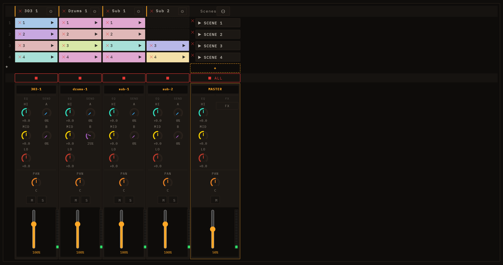
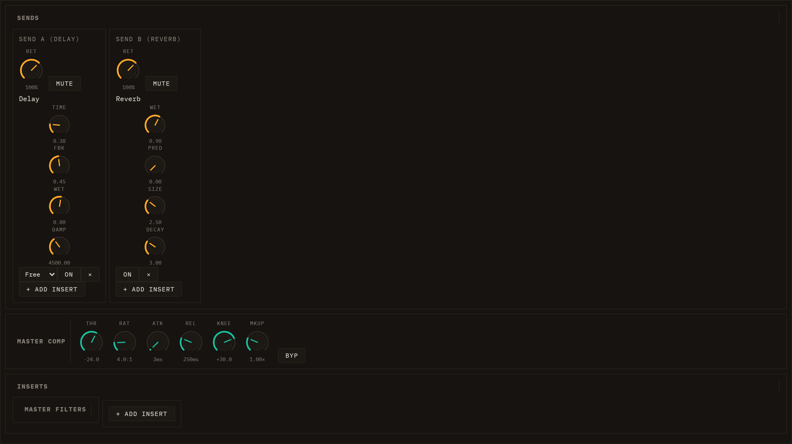

# Mixing & FX

Every lane in Loom has its own signal path from the synthesis engine through to the master output. This chapter explains how that path is structured, what controls are available per lane, and how the shared Master FX panel ties everything together.

---

## Signal flow overview

```
Lane engine → lane insert chain → channel strip (EQ → comp → level → pan → mute → duck) → master bus
                                                                               ├──→ Send A (gain) ─┐
                                                                               └──→ Send B (gain) ─┤
master bus → master insert chain → master compressor → output      Send A / Send B returns ──┘
```

In short: the engine's audio passes through any per-lane inserts first, then the channel strip where EQ, sends, pan, and level are applied. The processed signal joins the master bus, which runs through the master insert chain and the master compressor before reaching the speaker. The two **Send A / Send B** buses are parallel return channels: each lane feeds them a post-fader amount, and each send runs its own insert chain (seeded **A = Delay, B = Reverb**) before returning to the master.

---

## Per-lane channel strip

Each lane owns a `ChannelStrip`. Its controls are visible below the session grid in the lane's row.



### Level (fader)

The vertical slider sets the lane's output gain as a linear multiplier (0–1 = silence to unity; the percentage label reflects the current value). This is the last gain stage before output, applied after EQ and the per-lane compressor.

### Pan

The **PAN** knob positions the lane in the stereo field. Centre (0) is the default; turning it left or right continuously shifts the image. The pan value is automatable and can be modulated — see [Modulation & Note FX](06-modulation-and-note-fx.md).

### Mute and Solo

**M** silences the lane by zeroing its mute gain node. **S** solos the lane: all other lanes are muted in the UI while solo is active. Both controls affect what the sidechain tap feeds downstream — a muted lane's tap still carries pre-mute signal so sidechain routing remains stable.

### 3-band EQ

The three EQ knobs apply before the per-lane compressor:

| Knob | Filter type | Centre frequency | Notes |
|------|------------|-----------------|-------|
| **LO** | Low-shelf | 200 Hz | Boost or cut lows; default ±0 dB |
| **MID** | Peaking | 1 000 Hz | Q = 1; adds presence or scoops the midrange |
| **HI** | High-shelf | 4 500 Hz | Boost or cut highs and air |

All three bands are ±dB adjustments. EQ gain AudioParams are exposed to modulation so you can automate filter sweeps from the modulation panel.

### Send A and Send B

The two send knobs — **A** and **B** — control how much of this lane's post-duck signal is fed into the two shared send buses. They replaced the old fixed REV/DLY knobs. Send A and Send B are general-purpose return channels, seeded **A = Delay** and **B = Reverb**, but you can change what effect lives in each — see [Send A / Send B return modules](#sends--send-a-and-send-b). The knobs are independent wet levels: 0 = dry only, higher values mix more of the lane into that send's effect. Sends are post-fader, so they follow the lane's level and sidechain ducking. (Saved knob ids are `mix.<lane>.sendA` / `mix.<lane>.sendB`; old saves with `…rev` / `…dly` amounts migrate automatically — reverb→B, delay→A.)

---

## Per-lane inserts

Every lane also has a private insert chain that sits *before* the channel strip — the engine's audio passes through it first. If you open the lane's inspector and add FX to its insert list, those effects process the lane signal exclusively and do not affect any other lane.

**Inserts vs sends:** an insert is a serial in-line processor that the signal passes *through*; a send is a parallel path that taps a copy of the signal into a shared return. Use inserts for tone-shaping a single lane; use sends when several lanes should share one effect (a common reverb space, a tempo-synced delay). Loom no longer privileges any effect — reverb and delay are ordinary inserts too, and they just happen to be the default residents of the Send A / Send B return chains.

**The same picker everywhere.** Every insert rack — per lane (including audio lanes), on each send return, and on the master — draws from one unified effect picker: **Filter (multifilter)**, **Distortion**, **Reverb**, **Delay**, **Compressor**, and **Limiter**. See [Master FX panel](#master-fx-panel) below for each effect's parameters. Any insert's parameters are modulation and Performance-automation destinations, wherever the insert sits.

---

## Master FX panel

The master bus has its own strip at the foot of the **scenes column** of the mixer row — a full column laid out like a lane strip, so it lines up with them: a **MASTER** label, an **EQ** section (HI / MID / LO), an **FX** button (in the lane's SEND slot — the master has no sends), a **PAN** knob, a **Mute** button (no Solo — meaningless on the master), and a fader that mirrors the master **Volume** plus a VU meter. The master EQ, pan and mute shape the whole mix; they are saved with the session and the EQ/pan are undoable like any knob. Click the **FX** button to open the **Master FX panel** below the grid (click again to close it). *(The panel's content — SENDS, MASTER COMP, INSERTS — was previously a separate "Master FX" tab; the controls are identical, only the way you open them changed.)*



### SENDS — Send A and Send B

The SENDS section shows the two send buses as **return modules**. Each module is a *simple return* — a **return level**, a **mute**, and an **insert rack** — with no EQ or pan of its own. Whatever effects sit in a send's rack process everything the lanes send into it; the per-lane **A** / **B** knobs set how much each lane contributes. By default **Send A holds a Delay** and **Send B holds a Reverb**, but you can add, remove, reorder, or replace inserts in either rack from the same picker used everywhere else — so a send can carry a whole chain (say a filter into a delay), not just one effect.

The default reverb and delay expose the parameters below (and behave like any other insert — bypass per slot, modulatable params, etc.).

**REVERB** parameters:

| Param | Range | Description |
|-------|-------|-------------|
| Wet | 0–1.5 | Wet output level |
| PreD | 0–0.5 s | Pre-delay before the reverb tail starts |
| Size | 0.05–8 s | Impulse response length (room size) |
| Decay | 0.1–10 | Tail decay shape (higher = longer tail) |

The reverb is a convolution reverb with a procedurally generated impulse response. Size and Decay rebuild the impulse in real time when adjusted.

**DELAY** parameters:

| Param | Range | Description |
|-------|-------|-------------|
| Time | 0.01–2 s | Delay time. A **SYNC** toggle on the delay insert locks the time to the project tempo and re-locks whenever the BPM changes |
| Fbk | 0–0.95 | Feedback amount |
| Wet | 0–1.5 | Wet output level |
| Damp | 200–12 000 Hz | Low-pass filter on the feedback loop; lower values darken repeats |

### MASTER COMP

The master compressor sits at the tail of the master chain, after all inserts. It uses the same `CompBlock` as the per-lane strip compressor, so the parameters are identical:

| Param | Range | Default | Description |
|-------|-------|---------|-------------|
| Bypass | on/off | on | Pass-through when on |
| Threshold | −100 to 0 dB | −24 dB | Level above which compression starts |
| Ratio | 1–20 | 4 | Compression ratio |
| Attack | 0–1 s | 0.003 s | Gain reduction onset time |
| Release | 0–1 s | 0.25 s | Gain recovery time |
| Knee | 0–40 dB | 30 dB | Transition softness around the threshold |
| Makeup | ~0–4 (linear) | 1 | Post-compression gain, up to about +12 dB |

The master compressor is bypassed by default. Enable it for glue and loudness control on the final mix, or to tame transient peaks before export. See [Saving & Export](09-saving-and-export.md) for how the master bus feeds the offline render.

### INSERTS — the master rack

Below MASTER COMP, the INSERTS section holds the master insert chain. Add a slot from the picker and pick its type. The **same six plugin types** are available in every rack — per lane, per send, and here on the master:

**Filter (multifilter)**
- Type: LP / HP / BP / Notch
- Freq: 20–20 000 Hz (exponential)
- Q: 0.1–24

**Distortion (Dist)**
- Drive: 0–1 — waveshaper saturation amount (4x oversampled)
- Mix: 0–1 — dry/wet blend

**Reverb** — same parameters as the Send B reverb above (Wet, PreD, Size, Decay). Use as an insert to reverb the full master rather than via a send.

**Delay** — same parameters as the Send A delay (Time + SYNC, Fbk, Wet, Damp). Use as an insert for a master-bus slapback or stutter.

**Compressor** — the same `CompBlock` dynamics compressor as the channel-strip and master compressors, now insertable anywhere. Params: Bypass, Threshold, Ratio, Attack, Release, Knee, Makeup (see [MASTER COMP](#master-comp) for ranges).

**Limiter** — a brickwall limiter (ratio 20:1, hard knee, near-zero attack) for catching peaks. Params: **Ceiling** (the level it will not exceed) and **Release**.

Slots in the chain are ordered in series: the output of each slot feeds the input of the next. Each slot has a bypass toggle so you can A/B it without removing it. Individual slots can be removed; adding the same type multiple times is allowed.

The master insert chain processes the full mixed signal, after the EQ/pan of the master strip and before the master compressor — distinct from the Send A/B returns, which receive per-lane amounts and sum back into the master independently.

---

## Sidechain compression

Loom includes a sidechain ducking system. Any lane's channel strip can be ducked by the signal level of another lane (the *source*). The ducker follows the source lane's envelope via a full-wave rectifier and two smoothing filters, then reduces the target lane's gain proportionally:

```
duckGain ≈ 1 − depth × env(source)
```

Sidechain parameters (set per lane in the lane inspector):

| Param | Range | Default | Description |
|-------|-------|---------|-------------|
| Source | lane selector | — | Which lane's post-mute tap drives the duck |
| Depth | 0–1 | 0.6 | How deep the gain dips at full envelope |
| Attack | s | 0.005 s | How quickly the ducker opens (gain rises) |
| Release | s | 0.25 s | How quickly the ducker closes (gain falls) |
| Threshold | dB | −40 dB | Source envelope must exceed this to duck at all |

A typical use case is kick-drum ducking: set a bass or pad lane's sidechain source to the kick lane. Every kick hit momentarily ducks the bass, creating a pumping effect common in electronic music. Because the tap is taken from the source lane post-mute (but pre-duck), muting the source stops the ducking without feedback loops.

The sidechain bus is separate from the compressor block available on each channel strip. The per-lane compressor (`CompBlock`) is a standard dynamics compressor in the signal path; the sidechain ducker is a parallel envelope-follower that modulates gain. Both can be active simultaneously.

---

For engine-level sound design that feeds the channel strips, see [Engines](04-engines.md). For LFO and ADSR modulation of EQ, sends, pan, and other AudioParams, see [Modulation & Note FX](06-modulation-and-note-fx.md).
