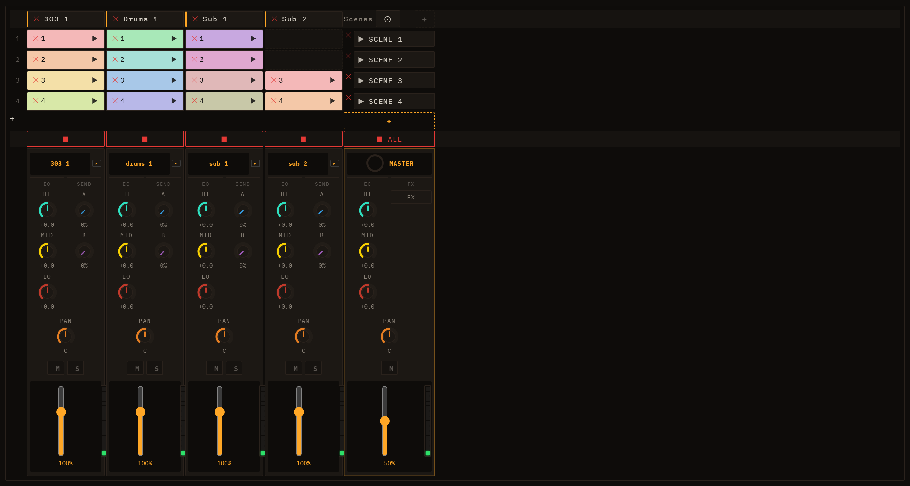
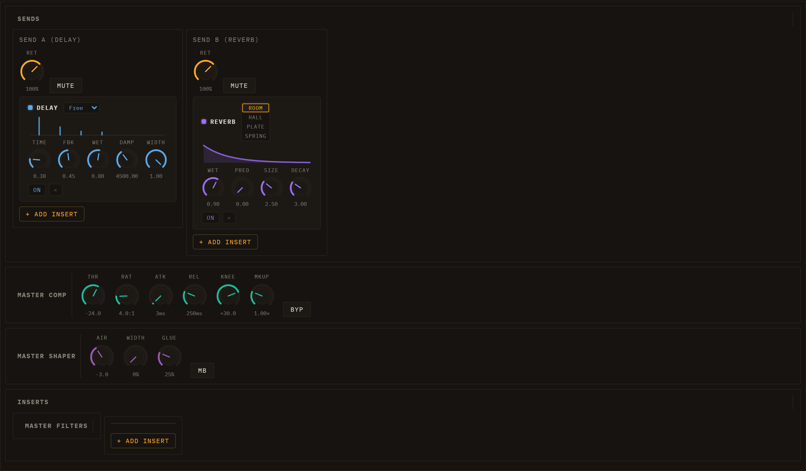
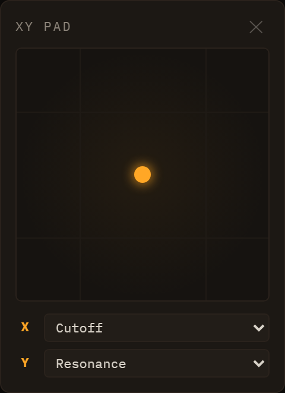

# Mixing & FX

Every lane in Loom has its own signal path from the synthesis engine through to the master output. This chapter explains how that path is structured, what controls are available per lane, and how the shared Master FX panel ties everything together.

---

## Signal flow overview

```
Lane engine → lane insert chain → channel strip (EQ → comp → level → pan → mute → duck) → master bus
                                                                               ├──→ Send A (gain) ─┐
                                                                               └──→ Send B (gain) ─┤
master bus → master insert chain → master compressor → output      Send A / Send B returns ──┘
```

In short: the engine's audio passes through any per-lane inserts first, then the channel strip where EQ, sends, pan, and level are applied. The processed signal joins the master bus, which runs through the master insert chain and the master compressor before reaching the speaker. The two **Send A / Send B** buses are parallel return channels: each lane feeds them a post-fader amount, and each send runs its own insert chain (seeded **A = Delay, B = Reverb**) before returning to the master.

---

## Per-lane channel strip

Each lane owns a `ChannelStrip`. Its controls are visible below the session grid in the lane's row.



### Level (fader)

The vertical slider sets the lane's output gain as a linear multiplier (0–1 = silence to unity; the percentage label reflects the current value). This is the last gain stage before output, applied after EQ and the per-lane compressor.

### Pan

The **PAN** knob positions the lane in the stereo field. Centre (0) is the default; turning it left or right continuously shifts the image. The pan value is automatable and can be modulated — see [Modulation & Note FX](06-modulation-and-note-fx.md).

### Mute and Solo

**M** silences the lane by zeroing its mute gain node. **S** solos the lane: all other lanes are muted in the UI while solo is active. Both controls affect what the sidechain tap feeds downstream — a muted lane's tap still carries pre-mute signal so sidechain routing remains stable.

### 3-band EQ

The three EQ knobs apply before the per-lane compressor:

| Knob | Filter type | Centre frequency | Notes |
|------|------------|-----------------|-------|
| **LO** | Low-shelf | 200 Hz | Boost or cut lows; default ±0 dB |
| **MID** | Peaking | 1 000 Hz | Q = 1; adds presence or scoops the midrange |
| **HI** | High-shelf | 4 500 Hz | Boost or cut highs and air |

All three bands are ±dB adjustments. EQ gain AudioParams are exposed to modulation so you can automate filter sweeps from the modulation panel.

### Send A and Send B

The two send knobs — **A** and **B** — control how much of this lane's post-duck signal is fed into the two shared send buses. They replaced the old fixed REV/DLY knobs. Send A and Send B are general-purpose return channels, seeded **A = Delay** and **B = Reverb**, but you can change what effect lives in each — see [Send A / Send B return modules](#sends--send-a-and-send-b). The knobs are independent wet levels: 0 = dry only, higher values mix more of the lane into that send's effect. Sends are post-fader, so they follow the lane's level and sidechain ducking. (Old saves with `…rev` / `…dly` amounts migrate automatically — reverb→B, delay→A.)

### Automating and modulating the mixer column

Level, pan, both sends and the three EQ bands are ordinary lane parameters, which
means each of them shows up in the automation destination picker, in the XY pad's
axis lists, in the modulation panel's target dropdown and in the knob's own
right-click menu — on **every** lane, whatever engine it runs. This used to be
true of drum lanes only, so a drum lane's volume could be automated and a
Subtractive lane's could not; the mixer now declares its parameters once for
everybody. Their automation ids are `<lane>.bus.level`, `<lane>.bus.pan`,
`<lane>.bus.delaySend`, `<lane>.bus.reverbSend` and `<lane>.bus.eq.low` / `.mid` /
`.high` — the lane id first, exactly like an engine param. (Sessions saved before
this carry the old `mix.<lane>.<param>` form for drum lanes; they load, but the
ids you see in the picker today are the `bus.*` ones.)

One difference worth knowing between **automating** a fader and **modulating**
it: automation writes the gain directly, while a modulator is summed onto a trim
that sits in front of it. That is deliberate — a bipolar LFO summed straight onto
a gain would push it below zero on the trough, which does not quieten the lane, it
flips its phase and makes it cancel against everything else in the mix. With the
trim, full depth swings the lane between silence and double its fader position,
and the modulation stays relative to wherever you left the fader.

---

## Per-lane inserts

Every lane also has a private insert chain that sits *before* the channel strip — the engine's audio passes through it first. If you open the lane's inspector and add FX to its insert list, those effects process the lane signal exclusively and do not affect any other lane.

**Inserts vs sends:** an insert is a serial in-line processor that the signal passes *through*; a send is a parallel path that taps a copy of the signal into a shared return. Use inserts for tone-shaping a single lane; use sends when several lanes should share one effect (a common reverb space, a tempo-synced delay). Loom no longer privileges any effect — reverb and delay are ordinary inserts too, and they just happen to be the default residents of the Send A / Send B return chains.

**The same picker everywhere.** Every insert rack — per lane (including audio lanes), on each send return, and on the master — draws from one unified effect picker, whose eleven entries read: **Filter**, **Dist**, **Reverb**, **Delay**, **Compressor**, **Limiter**, **Trem/Gate**, **Chorus**, **Flanger**, **Phaser**, and **Crush**. See [Master FX panel](#master-fx-panel) below for each effect's parameters. Any insert's parameters are modulation and Performance-automation destinations, wherever the insert sits.

---

## Master FX panel

The master bus has its own strip at the foot of the **scenes column** of the mixer row — a full column laid out like a lane strip, so it lines up with them: a **MASTER** label, an **EQ** section (HI / MID / LO), an **FX** button (in the lane's SEND slot — the master has no sends), a **PAN** knob, a **Mute** button (no Solo — meaningless on the master), and a fader that mirrors the master **Volume** plus a VU meter. The master EQ, pan and mute shape the whole mix; they are saved with the session and the EQ/pan are undoable like any knob. Click the **FX** button to open the **Master FX panel** below the grid (click again to close it). *(The panel's content — SENDS, MASTER COMP, INSERTS — was previously a separate "Master FX" tab; the controls are identical, only the way you open them changed.)*



### SENDS — Send A and Send B

The SENDS section shows the two send buses as **return modules**. Each module is a *simple return* — a **return level**, a **mute**, and an **insert rack** — with no EQ or pan of its own. Whatever effects sit in a send's rack process everything the lanes send into it; the per-lane **A** / **B** knobs set how much each lane contributes. By default **Send A holds a Delay** and **Send B holds a Reverb**, but you can add, remove, reorder, or replace inserts in either rack from the same picker used everywhere else — so a send can carry a whole chain (say a filter into a delay), not just one effect.

The default reverb and delay expose the parameters below (and behave like any other insert — bypass per slot, modulatable params, etc.).

**REVERB** parameters:

| Param | Range | Description |
|-------|-------|-------------|
| Wet | 0–1.5 | Wet output level |
| PreD | 0–0.5 s | Pre-delay before the reverb tail starts |
| Size | 0.05–8 s | Impulse response length (room size) |
| Decay | 0.1–10 | Tail decay shape (higher = longer tail) |
| Type | ROOM / HALL / PLATE / SPRING | The character of the generated space |

The reverb is a convolution reverb with a procedurally generated impulse response. Size, Decay and Type rebuild the impulse in real time when adjusted.

**DELAY** parameters:

| Param | Range | Description |
|-------|-------|-------------|
| Time | 0.01–2 s | Delay time, used when Sync is Free |
| Sync | Free, 1/4, 1/8, 1/8., 1/8t, 1/16, 1/16t | Pick a musical division and the delay time locks to the project tempo, re-locking on every BPM change. **Free** uses the Time knob instead |
| Fbk | 0–0.95 | Feedback amount |
| Wet | 0–1.5 | Wet output level |
| Damp | 200–12 000 Hz | Low-pass filter on the feedback loop; lower values darken repeats |
| Width | 0–1 | Stereo width of the repeats (default 1) |

### MASTER COMP

The master compressor sits at the tail of the master chain, after all inserts. It uses the same `CompBlock` as the per-lane strip compressor, so the parameters are identical:

| Param | Range | Default | Description |
|-------|-------|---------|-------------|
| Bypass | on/off | on | Pass-through when on |
| Threshold | −100 to 0 dB | −24 dB | Level above which compression starts |
| Ratio | 1–20 | 4 | Compression ratio |
| Attack | 0–1 s | 0.003 s | Gain reduction onset time |
| Release | 0–1 s | 0.25 s | Gain recovery time |
| Knee | 0–40 dB | 30 dB | Transition softness around the threshold |
| Makeup | ~0–4 (linear) | 1 | Post-compression gain, up to about +12 dB |

The master compressor is bypassed by default. Enable it for glue and loudness control on the final mix, or to tame transient peaks before export. See [Saving & Export](09-saving-and-export.md) for how the master bus feeds the offline render.

### INSERTS — the master rack

Below MASTER COMP, the INSERTS section holds the master insert chain. Add a slot from the picker and pick its type. The **same eleven plugin types** are available in every rack — per lane, per send, and here on the master:

**Filter (multifilter)**
- Type: LP / HP / BP / Notch
- Freq: 20–20 000 Hz (exponential)
- Q: 0.1–24

**Distortion (Dist)**
- Drive: 0–1 — waveshaper saturation amount (4x oversampled)
- Mix: 0–1 — dry/wet blend

**Reverb** — same parameters as the Send B reverb above (Wet, PreD, Size, Decay, Type). Use as an insert to reverb the full master rather than via a send.

**Delay** — same parameters as the Send A delay (Time, Sync, Fbk, Wet, Damp, Width). Use as an insert for a master-bus slapback or stutter.

**Compressor** — the same `CompBlock` dynamics compressor as the channel-strip and master compressors, now insertable anywhere. Its own ranges are narrower than the master's:

- Thr: −60 to 0 dB (default −24)
- Ratio: 1–20 (default 4)
- Atk: 0.001–1 s (default 0.003)
- Rel: 0.001–1 s (default 0.25)
- Knee: 0–40 dB (default 30)
- Mkup: 0–4 (default 1)

There is no Bypass among them — to A/B an insert, use the slot's own bypass toggle described at the end of this section.

**Limiter** — a brickwall limiter (ratio 20:1, hard knee, near-zero attack) for catching peaks.

- Ceil: −30 to 0 dB — the level it will not exceed
- Rel: 0.001–0.5 s — how quickly it lets go

**Tremolo (Trem/Gate)** — an LFO opening and closing the volume. The oldest modulation effect there is: slow and shallow it breathes, fast and deep it chops the sound into a rhythm of its own. Lovely on pads, electric-piano parts and sustained chords. It is also the trance gate: **Square shape + a 1/16 Sync + a little Smth** is that sound, which is why there is no separate gate effect.

- Rate: 0.1–12 Hz — how fast it pulses, used when Sync is Free
- Depth: 0–1 — how far it closes between pulses (at 1 it cuts to silence)
- Shape: SIN / SQR / TRI / SAW — the wave it opens and closes with
- Sync: Free, 1/4, 1/8, 1/8., 1/8t, 1/16, 1/16t — lock the pulse to the project tempo instead of the Rate knob
- Smth: 0.2–50 ms — smooths the LFO, so a square shape does not click at the edges

**Chorus** — a delayed copy of the signal, detuned by a slow LFO and mixed back in. The two copies drift in and out of tune with each other, which the ear reads as several players at once. Thickens thin sounds and widens single-note leads without changing their pitch.
- Rate: 0.05–8 Hz — speed of the detuning wobble
- Depth: 0–1 — how far it detunes
- Mix: 0–1 — dry/wet blend (start around 0.5)

**Flanger** — the same idea as the chorus but with a much shorter delay and its output fed back into itself. Instead of thickening, the copies cancel each other at a comb of frequencies that sweeps up and down — the classic jet-plane whoosh. Feedback sharpens the effect from a gentle sweep to a metallic scream.
- Rate: 0.05–8 Hz — speed of the sweep
- Depth: 0–1 — how far the sweep travels
- Fbk: 0–1 — feedback; the higher, the more resonant and metallic
- Mix: 0–1 — dry/wet blend

**Phaser** — four all-pass filters whose corner frequencies an LFO sweeps together. They shift phase without changing volume, so mixing them back with the dry signal creates notches that slide through the sound. Similar in spirit to the flanger but smoother and more liquid — a staple on electric pianos, funk guitar and pads.
- Rate: 0.05–8 Hz — sweep speed
- Depth: 0–1 — how far the notches travel
- Fbk: 0–1 — feedback; deepens the notches
- Mix: 0–1 — dry/wet blend

**Bitcrusher (Crush)** — digital degradation. Reducing the bit depth quantises the waveform to a coarse staircase, adding the gritty, harmonic distortion of early samplers and game consoles; the tone control then dulls the result the way a low sample rate would. At extreme settings it destroys the sound completely, which is often the point.
- Bits: 1–16 — amplitude resolution; 16 is nearly clean, 1 is a square-wave wreck
- Tone: 200–20 000 Hz — a lowpass for the lo-fi dullness
- Mix: 0–1 — dry/wet blend
- Dith: 0–2 — noise summed in *before* the bit reduction, scaled to the step size. It trades the gritty, signal-locked distortion of low bit depths for an even hiss, which usually sounds better on quiet material

Slots in the chain are ordered in series: the output of each slot feeds the input of the next. Each slot has a bypass toggle so you can A/B it without removing it. Individual slots can be removed; adding the same type multiple times is allowed.

The master insert chain processes the full mixed signal, after the EQ/pan of the master strip and before the master compressor — distinct from the Send A/B returns, which receive per-lane amounts and sum back into the master independently.

---

## XY pad

The **▣ XY** button in the session bar opens a floating pad — a Kaoss-style controller for playing two parameters at once with a single gesture.



It stays out of the way rather than taking over the screen: the panel floats above the interface and is **not modal**, so the knobs it drives stay visible and you can watch them move while you sweep.

**Assign the axes.** Below the square surface are two dropdowns, **X** and **Y**. Each lists every automatable parameter in the session, grouped by lane — the same set of destinations an LFO or ADSR can target: engine parameters, channel-strip and insert controls, anything with a knob. Pick one per axis; leave an axis on *— none —* to make the pad one-dimensional.

**Play it.** Drag anywhere on the square. Horizontal position sets the X parameter, vertical the Y, each mapped across that parameter's full range — bottom-left is both at minimum, top-right both at maximum. The dot follows your finger, and the assigned knobs turn with it, because the pad drives them through exactly the same path your mouse would.

The classic pairing is a filter's **cutoff on X and resonance on Y**: one diagonal sweep and you have the filter gesture that defines most electronic music. But any two continuous parameters work — delay time against feedback, distortion drive against mix, two engine parameters from different lanes at once.

Two things to know:

- Assignments are **not saved** with the session — the pad starts empty on each reload.
- Pad moves are **not captured** by Performance take recording; the automation recorder only follows knobs you turn directly.

---

## Sidechain compression

Loom includes a sidechain ducking system. Any lane's channel strip can be ducked by the signal level of another lane (the *source*). A small envelope follower rectifies the source, chases it upwards at the **Attack** time constant and falls back at the **Release** one, and turns whatever exceeds the threshold into a gain multiplier for the target lane:

```
duckGain = 1 − depth × (env(source) − threshold)     clamped to [0, 1]
```

The multiplier can never leave `[0, 1]`: at worst the lane goes silent, and when the source stops the follower returns to zero and the lane comes back. That is a guarantee, not an observation — it is why the follower is a one-pole running in its own audio worklet rather than a pair of filter nodes, which is what it was until 2026-07-27. A filter slow enough to smooth a 0.25 s release sits at 0.64 Hz, close enough to the edge of stability that single-precision rounding error accumulated instead of decaying: the "envelope" grew without bound even with the source at exactly zero, the multiplier drifted past zero into negative territory, and the ducked lane first disappeared and then came back **phase-inverted and louder** — a fault that survived pressing stop, which is why relaunching a loop could sound completely different from letting it run.

Sidechain parameters (set per lane in the lane inspector):

| Param | Range | Default | Description |
|-------|-------|---------|-------------|
| Source | lane selector | — | Which lane's post-mute tap drives the duck |
| Depth | 0–1 | 0.6 | How deep the gain dips at full envelope |
| Attack | s | 0.005 s | How fast the duck clamps down when the source hits |
| Release | s | 0.25 s | How fast the lane comes back up once the source falls |
| Threshold | dB | −40 dB | Source envelope must exceed this to duck at all |

A typical use case is kick-drum ducking: set a bass or pad lane's sidechain source to the kick lane. Every kick hit momentarily ducks the bass, creating a pumping effect common in electronic music. Because the tap is taken from the source lane post-mute (but pre-duck), muting the source stops the ducking without feedback loops.

The sidechain bus is separate from the compressor block available on each channel strip. The per-lane compressor (`CompBlock`) is a standard dynamics compressor in the signal path; the sidechain ducker is a parallel envelope-follower that modulates gain. Both can be active simultaneously.

---

For engine-level sound design that feeds the channel strips, see [Engines](04-engines.md). For LFO and ADSR modulation of EQ, sends, pan, and other AudioParams, see [Modulation & Note FX](06-modulation-and-note-fx.md).
