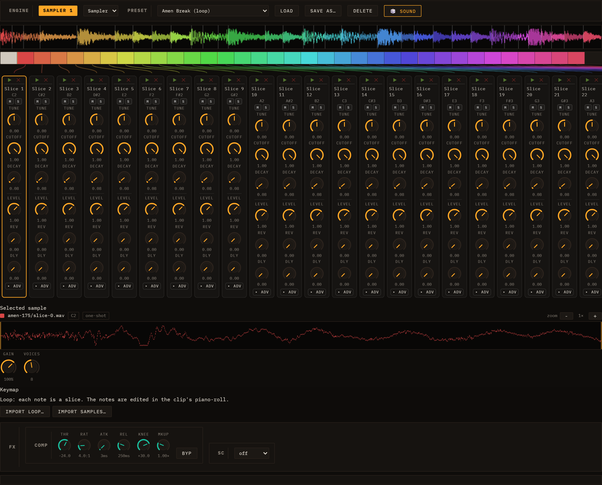

# MIDI & Samples

This chapter covers two ways to bring external material into a Loom session: importing a Standard MIDI File to populate lanes and clips automatically, and loading audio samples into the Sampler engine to build melodic instruments or drum kits.

---

## MIDI Import


The MIDI Import panel lives in the toolbar at the top of the screen, next to the demo picker. Click **MIDI Import** to expand it.

### Loading a file

Click the file picker and choose a `.mid` or `.midi` file. Loom reads the file immediately — no server, no upload. The parser extracts every track's name, General MIDI programme number, and all note-on/note-off pairs (converted to start tick, duration, MIDI note, velocity, and channel). Only the first tempo event in the file is used; if no tempo is present, the session BPM stays as it is.

Empty tracks (those with no note events) are silently skipped.

### The track list

After parsing, a row appears for each non-empty track showing:

- A **checkbox** to include or exclude that track from the import.
- The **track index**, track name (cleaned of control characters), note count, pitch range, and programme number.
- A **preset dropdown**. The GM programme number is looked up against every engine's preset catalogue, and the matching presets are offered at the top of the list (e.g. programme 33 "Acoustic Bass" will surface TB-303 and Subtractive bass presets). Below a divider, every preset from every engine is available so you can override the suggestion freely.
- A **▶ audition button** that plays a short three-note arpeggio through the currently selected preset without touching the session. Use this to compare options before committing.

### Importing

Click **Import MIDI**. A confirmation dialog asks whether to **Add** or **Replace**:

- **OK (Add)** appends the imported lanes and a new scene to the current session. The new clips are placed on the new scene row so they line up correctly with the scene's launch button.
- **Cancel (Replace)** clears the session and seeds it with only the imported content.

Loom creates one lane per selected track. The lane's name is taken from the matched preset (e.g. "TB Bass"), while the clip inside it keeps the original track name. If the file contained a tempo, the session BPM is updated to match. The import launches the new scene immediately.

The conversion scales MIDI ticks to Loom's internal grid (based on quarter notes divided into four 16th steps), so the notes land on the correct beats regardless of the file's tick resolution.

See [Engines](04-engines.md) for what each engine sounds like, and [Sessions, Lanes, Clips & Scenes](03-sessions-lanes-clips-scenes.md) for how to rearrange lanes and scenes after import.

---

## Sampler


The Sampler is a polyphonic playback engine that maps audio across the keyboard and plays it back at the correct pitch per note. A Sampler lane can be three things — a **melodic instrument** (samples spread across ranges of keys), a **drumkit** (one sample per key), or a **loop** (a sliced loop played as a sequence of notes) — and all three share **one inspector layout**.

### Presets are the instruments

The Sampler's bundled instruments — drumkits, melodic instruments, and loops — *are* its presets: pick one straight from the standard **PRESET** dropdown at the top of the inspector (grouped **Drumkit / Melodic / Loop**). Selecting one downloads + decodes its WAVs into IndexedDB (so it persists across reloads) and loads it. There is no separate picker. Loom ships ready-made kits (**TR-808**, **Acoustic**, **Dirt**), melodic instruments, and loops — all working on the live deploy without a manual import.

### The channel layout

Whatever you load, the inspector has the same shape:

- A **keyboard map** across the top — coloured markers at each sound's key (drumkit / loop) or coloured range bands (melodic) — with **connector lines** down to the strips.
- A row of **channel strips**, one per sound. Each strip carries its **name** (the GM voice for a drumkit — KICK, SNARE…; the note for a melodic zone; **Slice N** for a loop slice), its trigger **key**, a **▶ play** button to audition the sample and a **✕** to delete that sound (a row at the top of the strip, above the knobs), per-sound knobs (TUNE / CUTOFF / DECAY / LEVEL / REV / DLY plus an **▸ adv** block), and **M / S** mute-solo. A **＋** tile at the end of the row adds a sound.
- A **Selected sample** editor below — click any strip and it shows that sample's waveform on a canvas with a **−/＋ zoom**, the filename, the key, a one-shot/loop badge, and (for melodic) editable **root / lo / hi**.

Every sound is keyed by its own note, so each pad / zone / slice has its **own** parameters and mute-solo — nothing is shared between sounds.

### Building your own

**Import samples…** (multi-select) decodes each file, stores it in IndexedDB (so it persists across reloads), and adds it as a new melodic zone spanning the full keyboard with the root at middle C (MIDI 60); narrow each zone's root and low/high boundary in the sample editor. On a drumkit, the **＋** tile clones the last pad onto the next free key.

### Keymap and repitch

A sound's **keymap entry** has a root note and a low/high key range. When a note falls in the range, the sample plays at a rate of `2^((midi − rootNote) / 12)` — equal-temperament repitching — so a melodic instrument's zones span the keyboard chromatically while a drumkit pad or a loop slice sits on a single key.

### Per-sound parameters

Every sound — a drumkit pad, a melodic zone, or a loop slice — has its own set of parameters, all read at trigger time:

| Parameter | Range | Default | Description |
| --- | --- | --- | --- |
| TUNE | −24 to +24 st | 0 | Pitch offset in semitones, applied on top of keymap repitch |
| CUTOFF | 0–1 | 1 | Lowpass filter cutoff (0 ≈ 60 Hz, 1 = fully open) |
| RES | 0–1 | 0 | Filter resonance |
| ATTACK | 0.001–2 s | 0.005 s | Amplitude envelope attack time |
| DECAY | 0.005–4 s | 0.08 s | Release tail after the gate closes |
| LEVEL | 0–1.5 | 1 | Pad output level |
| PAN | −1 to +1 | 0 | Stereo pan position |
| REV | 0–1 | 0 | Send level to the lane's reverb insert |
| DLY | 0–1 | 0 | Send level to the lane's delay insert |
| LOOP | Off / On | Off | When On, the sample loops while the gate is held |
| LSTART | 0–1 | 0 | Loop start point as a fraction of sample duration |
| RETRIG | Poly / Mono | Poly | Mono cuts the previous hit on re-trigger; Poly layers them |

These live in each channel strip — drumkit, melodic, and loop all share the same per-channel rack (there is no eight-pad limit and no separate knob row).

### Drumkits

A drumkit is one sample per key, edited on the **drum-grid** (the same grid as the Drum Machine engine). A kit holds **any number of sounds** — not just eight — and you grow or shrink it with the **＋** tile and each strip's **✕**. Loom ships three ready-made sample kits (**TR-808**, **Acoustic**, **Dirt**); pick one from the PRESET dropdown and the lane is ready to play. The kit is rebuilt fresh from its manifest on each session load, so the WAVs never need re-importing.

### Loops



A loop is sliced into segments mapped to **consecutive notes**, so playing the keys in order replays the groove. Above the strips the **whole loop** is drawn as one continuous, colour-coded waveform with a cut line at every slice. Selecting a loop also **drops a note clip** onto the lane — one note per slice, each placed at its exact position so the notes form a continuous **staircase** — opened in the piano-roll; hit Play and it replays the loop, now as discrete notes you can move, mute, repitch or re-order. The clip keeps the loop's waveform as its header.

See [Editing Clips](05-editing-clips.md) for drawing patterns in the drum grid, and [Engines](04-engines.md) for the Drum Machine engine (which lists every kit — synth and sample — in a unified preset table).

---

## Audio channel

The **audio channel** is the first-class way to bring a finished loop into a Loom session: drop a WAV and it plays **tempo-locked to the project without changing pitch**, with its waveform shown as a header above the clip editor. It stays a pure audio loop; to chop a loop into individually editable note slices, load it through the Sampler's **Loop** family instead (see [Sampler](#sampler)).


### Creating an audio channel

There are two ways to add one:

- **+ Audio button** — at the end of the lane tab row, next to the engine picker, sits a **+ Audio** button. Click it and pick a WAV. Loom decodes the file, stores it in IndexedDB (so it survives a reload), estimates its original tempo, and creates a **new audio lane** holding the loop as an audio clip. The clip opens automatically in the inspector.
- **Drag onto an audio-lane cell** — once an audio lane exists, you can drag another WAV directly onto one of its grid cells to place a second audio clip there.

Each new audio lane gets a launch button on its scene row, so it is immediately playable alongside the rest of the session.

### The audio-clip editor


An audio clip has no note grid. Clicking it opens the **audio-clip editor** — a **♺ Warp ON / OFF** toggle (tempo-locking, see below) above a **waveform header**.

The waveform header shows a peak view of the buffer with a bar/beat ruler, any detected slice markers (orange), and a live playhead while the clip plays. This same header also appears **above** the normal piano-roll or drum-grid for any clip that references a buffer, so you always see the audio you are editing against.

### Tempo-lock (Warp)

With **Warp ON** (the default), the audio channel plays in time with the project BPM using a pitch-preserving WSOLA time-stretch:

- **At the loop's native BPM** the stretch ratio is ≈ 1, so playback is essentially identical to the source file.
- **At any other project BPM** the buffer is time-stretched to fit — faster or slower — **without changing pitch**. The stretched buffer is cached and re-rendered automatically whenever you change the project tempo, so the loop stays locked as you experiment.

With **Warp OFF** the loop plays at its natural speed with no tempo sync — useful when you want the audio exactly as recorded.

> First-play note: on the very first loop iteration after import (before the stretch cache is warm) playback briefly falls back to a varispeed render — a slight pitch shift that self-heals from the next iteration. At the loop's native tempo the ratio is ≈ 1, so even that first pass is near-identical.

### Slicing a loop into notes

The audio channel itself is a pure WAV loop. To chop a loop into individually editable hits, load it through the Sampler's **Loop** family (see [Sampler](#sampler)) rather than the audio channel. Loom detects slice points (from embedded **Acid / `cue` / AIFF** markers when present, or by onset detection plus a tempo estimate), stores one short sample per slice in IndexedDB, and creates a **note clip** that triggers the slices in order on a piano-roll — so the groove plays back identically, now as discrete, editable notes. Move, mute, repitch, or re-order the hits in the piano-roll, and tweak each slice's tune/cutoff/decay/level/pan in its channel strip (see [Per-sound parameters](#per-sound-parameters)); the clip keeps the original waveform as its header. *(Earlier builds did this from a **✂ Slice → pads** button on the audio channel; that moved to the Sampler's Loop family.)*

---

## Stem separation (optional, local service)

Stem separation lets you drop a finished song into Loom and get it back as four separate Sampler lanes — **Vocals**, **Drums**, **Bass**, and **Other** — so you can mute, solo, and remix each part inside the existing session.


### How it works

Click **☰ Stems…** in the session bar (the second header row, alongside Save / Load / MIDI). A dialog titled "Separate into stems" opens and immediately checks whether the local helper service is reachable:

- **Service found** — the hint line reads "4 tracks (Vocals / Drums / Bass / Other) via the local service." and the **Separate** button becomes active once you pick a file.
- **Service not found** — the hint reads "Can't find the stems service at localhost:8765. Is it running?" and Separate stays disabled. Start the service (see below), then re-open the dialog.

To separate a track: pick an audio file with the file picker, then click **Separate**. The dialog shows a progress bar:

1. **"Uploading…"** — the file is being uploaded to the local service.
2. **"Separating… m:ss"** — the service is running Demucs; the counter shows elapsed time. The bar may be indeterminate if the model does not report fine-grained progress.
3. On success the dialog closes automatically and four new Sampler lanes appear in the session — one per stem, each holding a full-length one-shot clip sized to the song. Hitting Play reconstructs the original mix; mute or solo any lane to isolate parts.

The entire lane-creation is a **single undo step**, so you can undo all four lanes at once.

**Cancelar** aborts a running job and frees the temporary files on the service. **Cerrar** closes the dialog (only available when no job is running).

### Opt-in nature

The feature is entirely opt-in. If you never start the service, nothing else in Loom changes — the ☰ Stems… button is the only touch point, and it degrades gracefully to a clear "service not found" message.

Stems land in IndexedDB as ordinary sample assets: they survive browser reloads just like any other sample you import.

### Setting up the local service

The separation runs on your machine via a small Python service in `tools/stem-service/`. It requires **Python 3.10+** and **ffmpeg** on your PATH.

```bash
cd tools/stem-service
python -m venv .venv
# macOS / Linux:
. .venv/bin/activate
# Windows:
.venv\Scripts\activate

pip install -r requirements.txt
uvicorn app:app --port 8765
```

The first time you separate a track the service downloads the Demucs `htdemucs` model automatically (several hundred MB). Subsequent runs skip the download. Separation takes roughly **1–2 minutes per song** on CPU; a GPU-enabled PyTorch build is much faster.

### Codespaces and custom service URL

If you want to run the service in a GitHub Codespace (a Linux VM with Python), start it there with the same commands above, forward port 8765, and paste the resulting HTTPS URL into the browser console:

```js
localStorage.loomStemServiceUrl = 'https://your-codespace-url-8765.preview.app.github.dev'
```

The same override works for any non-default host. CORS for `localhost:5173` (dev), `localhost:4173` (preview), and the GitHub Pages origin is already configured in the service.

> Note: Chrome's *Private Network Access* policy may add a preflight request when the Pages version of Loom calls `http://localhost:8765`. The lowest-friction setup is running Loom locally (`npm run dev`) alongside the service.

For full notes on CORS, the HTTP contract, and the Codespaces workflow, see [`tools/stem-service/README.md`](../../tools/stem-service/README.md).
