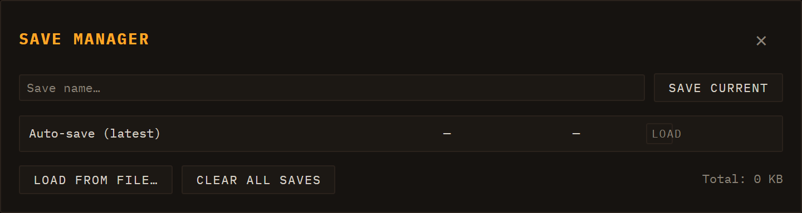

# Saving & Export

Loom keeps everything in the browser. There is no account, no cloud, and no server upload — your sessions live in your browser's `localStorage` and on your own filesystem when you export them. This chapter covers how to save and restore sessions, undo your work, and render a scene to a WAV file.

---

## Sessions in the browser

Every parameter, every lane, every clip, and every scene is part of the current session. Changes take effect immediately; nothing is auto-committed to disk. When you close the tab, the browser preserves the last-saved state via an autosave entry in `localStorage`, so reopening Loom typically drops you back where you left off.

Three buttons on the session bar (the second header row) drive session management:

| Button | What it does |
| --- | --- |
| **🗋 New** | Discards the current session and starts a blank, empty one (tooltip "Nueva sesión vacía"). |
| **Save** | Opens the Save Manager with the name field ready to type. |
| **Load** | Opens the Save Manager to browse and restore a saved session. |

See [Transport](02-transport.md) for the full two-row header layout (transport & tempo on top, session & I/O below).

---

## Save Manager

Clicking **Save** or **Load** opens the Save Manager modal. It is the single place where all session persistence happens.

### Saving a session

Type a name in the text field at the top and click **Save current** (or press Enter). Loom writes the full session state — BPM, time signature, every lane's engine + inserts + clips + scenes, the mixer state, and the arrangement take if one exists — into `localStorage` under a unique key, and also updates the autosave slot. The entry appears in the list immediately.

The save format is versioned (`schemaVersion: 3`). When you load an older file Loom migrates it automatically; saves with an unrecognised schema version are rejected with a warning rather than loading broken state.

### The saved-session list

Each row in the list shows the session name, date/time, and size in KB. Per entry you can:

- **Load** — restores the session and closes the modal.
- **⤓** (download) — exports the entry as a `.json` file to your filesystem without closing the modal.
- **✎** (rename) — prompts for a new name in place.
- **🗑** (delete) — confirms and removes the entry.

The topmost row is **Auto-save (latest)**, which always reflects the state at the time of the last named save.

### Load from file…

Imports a `.json` file you previously downloaded (or received from someone else). Loom validates the schema before applying it; an invalid file shows an alert.

### Clear all saves

Removes every named entry from `localStorage`. The autosave slot is preserved. A confirmation dialog appears before anything is deleted.

### Storage readout

The footer shows the total size of all named saves, so you can keep an eye on `localStorage` usage.

---

## Undo / redo

Loom maintains a global undo stack that covers all session mutations: adding or removing lanes and clips, editing notes in the piano roll or drum grid, changing engine parameters via knobs, and more. The keyboard shortcuts are:

| Action | Shortcut |
| --- | --- |
| Undo | Ctrl+Z / Cmd+Z |
| Redo | Ctrl+Shift+Z / Cmd+Shift+Z or Ctrl+Y |

Knob gestures are bracketed — Loom snapshots the state at the moment you grab a knob and commits when you release, so a single drag is a single undo step. The shortcuts are inactive when a text input has focus, so typing a save name does not accidentally undo your work. Loading a session clears the undo history.

---

## WAV export

WAV export is part of the unified **REC** group on the session bar (second header row), not a separate button. The **● REC** button (tooltip "Grabar — el modo se elige al lado") records using whichever mode is selected in the adjacent **mode selector** (`#rec-mode`):

- **🎛 take** (default) — records knob moves and clip launches into a performance take (not a WAV).
- **⏱ live** — records the live master output in real time to a stereo 16-bit WAV file.
- **⚡ offline** — renders the current scene to a WAV file offline (faster than real time).

To export audio, pick **⏱ live** or **⚡ offline** and press **● REC**. The two WAV backends behave as described below.

### ⏱ live (real-time WAV)

The real-time backend is the ground-truth render. Loom restarts the scene from the top, taps the live master output (after all inserts, compression, and master FX), captures the audio through an `AudioWorklet` recorder, and stops the transport when the capture finishes. What you hear during the export is exactly what ends up in the file — the same signal path, the same timing, the same random variation from any voice that uses it.

Because it captures live audio, it takes exactly as long as the scene itself.

### ⚡ offline (fast WAV render)

The offline backend rebuilds the full audio graph — lanes, inserts, master bus — inside an `OfflineAudioContext`, applies every lane's current sound state, batch-schedules all note events, and renders faster than real time without touching the live session. It shares the same encoder and download step as the real-time path, so the output format is identical.

Offline rendering is faster but it replicates the deterministic part of the signal path; any non-deterministic element (e.g. a voice with random modulation at note-on) may differ from the live sound.

### What gets exported

- **One pass of the scene.** The export captures one full iteration of the longest clip across all sounding lanes. Shorter clips in the same scene loop to fill that window, matching runtime behaviour. There is no infinite-loop export.
- **FX tail.** A 2-second tail is appended after the music ends so reverb decay and delay repeats are not cut off abruptly.
- **A scene must be playing.** If no scene is active when you press **● REC** in a WAV mode (⏱ live or ⚡ offline), Loom shows a brief notice and does nothing. Launch a scene first (see [Sessions](03-sessions-lanes-clips-scenes.md)), then export.
- **File name.** The download is named `loom-scene-<timestamp>.wav`.

After the export finishes the transport stops.

---

## Live build and GitHub Pages

The public instance of Loom is deployed automatically to [https://ijol.github.io/Loom/](https://ijol.github.io/Loom/) — every push to `main` triggers a GitHub Actions workflow that runs `vite build --base=/Loom/` and deploys the result to GitHub Pages. The standard `npm run build` (base `/`) is for local development or self-hosting on any other path.
