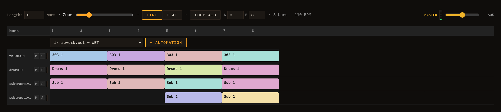

# Performance & Arrangement

Loom has two main views: **Session** and **Performance**. The Session view is the clip grid you work in most of the time — lanes, clips, and scenes launched on demand. The Performance view is a linear **arrangement timeline**: a fixed song laid out from left to right with a playhead that moves forward through it, starts at the beginning, and stops at the end.

Switch between the two views using the **Session / Performance** toggle in the transport bar (`#mode-toggle`). Switching stops playback. See [Transport](02-transport.md) for the full transport layout.

---

## Three ways to fill the arrangement

The arrangement starts empty. There are three ways to give it content.

### 1. Copy to Performance

The fastest route from a working session to a playable song is the **⤉ Copy-to-Performance** button (`#copy-to-performance`) in the session bar of the header — now an icon-only button with the tooltip "Copiar las escenas a la timeline de Performance". Clicking it calls `arrangementFromSession`, which walks your scenes in order and lays them out as a linear song:

- Each scene becomes one section.
- The section length equals the longest effective clip in that scene (measured in bars). If a clip has a loop sub-region enabled, its sub-region length is used instead of the full clip length.
- Every lane that has a clip assigned for that scene gets a timeline band covering the section.

After the layout is computed, Loom switches you to Performance automatically. **This one is not undoable** — it overwrites whatever arrangement was there, so copy before you start editing bands by hand, not after.

### 2. Record a take live

You can record the arrangement in real time while you play.

Recording is driven by the unified **REC** control in the session bar, which has three modes selectable beside the **● REC** button: **🎛 take** (the default — captures knob moves + clip launches into a performance take, described below), **⏱ live** (records real-time audio to a WAV file), and **⚡ offline** (renders the current scene to WAV offline, faster than real time). The steps below assume **🎛 take** is selected.

1. Make sure the REC mode selector (`#rec-mode`, next to the REC button) is set to **🎛 take** — its default. (The other two modes, **⏱ live** and **⚡ offline**, record audio to WAV instead; see [Saving & Export](09-saving-and-export.md).) Then click **● REC** (`#rec`) in the session bar to arm recording.
2. Stay in Session view and press Play. Recording begins.
3. Launch clips and scenes as you would for a performance. Move any knobs whose automation you want captured.
4. Press Stop. Loom finalises the take: any still-open clip events are clamped to the stop time, durations are computed, and the recorded content appears in the Performance view as timeline bands and automation curves.

If you arm REC and then switch to Performance mode before pressing Play, the arm is cleared automatically (a toast notification appears) because Performance mode drives playback from the arrangement directly rather than from the live session.

### 3. MIDI import

When you import a Standard MIDI File via the **MIDI Import** panel (see [MIDI & Samples](08-midi-and-samples.md)), Loom calls the same `arrangementFromSession` logic after building the session. Because an imported MIDI file produces a single scene whose clips span the full song, the arrangement comes out as one long section per lane — the complete track laid out linearly from bar 1.

---

## The timeline

Once the arrangement has content, the Performance view shows:

- **Toolbar** — Length (bars), Zoom slider, automation brush (Line / Flat), Loop A–B toggle, and a readout showing total bars and BPM.
- **Ruler** — a bar-numbered ruler across the top. When the A–B loop is active, a loop brace with two drag handles sits on the ruler.
- **Clip bands** — one row per lane. Each recorded or copied clip event is shown as a coloured block, labelled with the clip name, spanning the bars it occupies.
- **Automation curves** — below each clip band, any recorded or drawn automation curves appear. Each curve corresponds to one parameter (identified by its ID). You can draw into curves directly using the Line or Flat brush.
- **Master automation** — any automation curves routed to global (master) parameters appear in a separate section at the bottom.
- **Playhead** — a vertical line (`#perf-playhead`) that moves in real time via `requestAnimationFrame` while the arrangement is playing.

Bands are fully editable by hand — you do not have to re-record to change the layout:

- **Move** — drag the body of a band. It snaps to the beat, and later bands on that lane ripple forward so the lane stays ordered and non-overlapping.
- **Resize** — drag the handle at either end.
- **Delete** — click the **×** on the band.

All three are undoable (but see the note on Performance's separate undo stack below).

---

## A–B loop brace

The **Loop A–B** button in the Performance toolbar toggles the arrangement-wide loop brace. When active:

- Two drag handles on the ruler mark the loop start (A) and loop end (B). Drag either handle to set the window; handles snap to whole bars.
- The playhead wraps within [A, B). When it reaches B, all lanes are stopped and playback re-anchors to A instantly. Any clip that was already active spanning A is relaunched at the wrap point so there is no gap.
- When Loop A–B is off, Loom plays in **song mode**: the arrangement runs from the beginning to `durationSec` and stops — every lane is halted and the transport stops.

This loop brace operates on the arrangement timeline as a whole. It is distinct from the **per-clip loop brace** available inside the piano-roll and drum-grid editors, which loops a sub-region within a single clip. See [Editing Clips](05-editing-clips.md) for the per-clip loop.

---

## Song playback

Press Play while in Performance mode to start playback from the beginning of the arrangement. The arrangement's own play state is used — it is independent of the live Session runtime. The playhead advances, clips launch at their scheduled times, and automation curves are applied continuously.

At the end of the arrangement (when Loop A–B is off), all lanes stop and `onArrangementEnd` fires, which stops the transport. You can press Play again to restart from the top.

Knob automation written into the arrangement's curves is applied every lookahead tick alongside clip launches. Automation values are normalised (0–1) internally and mapped to each parameter's min–max range at playback time.

---

## Automation lanes

Automation curves can be added by hand — you do not have to record a take first. Set a non-zero **Length** in the toolbar (or record/copy content so the arrangement has a duration), then use the automation header that appears just below the ruler.

### Adding a lane

The header row contains a grouped parameter dropdown and a **+ Automation** button. The dropdown lists every automatable parameter in the project, organised by prefix (lane ID or `master`). Each entry shows the parameter ID and its label — for example `lane-1.fx.reverb.wet — WET`. Select the parameter you want, then click **+ Automation**. A new lane appears below the clip band for that lane (or in the Master section for global parameters). The curve starts flat at the parameter's current value.

### Drawing the shape

Two brush buttons in the toolbar control how you paint:

- **Line** — click and drag to draw a ramp between the start and end points of the gesture. Use this for smooth fades, filter sweeps, or any gradual change.
- **Flat** — paints a constant value across the drag range. Use this for step-style automation or to hold a value steady across a section.

The active brush is highlighted. Each lane also exposes **On / Off** and **Smooth / Stepped** toggles in its header. **On / Off** mutes the curve without deleting it. **Stepped** switches interpolation from smooth linear to staircase, snapping the value at each sub-step boundary — useful for parameter jumps that should be instantaneous.

### Removing a lane

Click the **×** button on the right side of the lane header to remove the curve entirely. The action is undoable with Ctrl+Z / Cmd+Z.

### How automation curves play back

Curves added manually behave identically to curves captured by recording. During arrangement playback they are applied continuously alongside clip launches — knob values are updated every lookahead tick, mapped from the normalised 0–1 curve to the parameter's min–max range. Curves generated by a recorded take (see [Transport — REC](02-transport.md)) and manually drawn curves live in the same list and can coexist on the same lane.

For modulator-driven per-lane automation (LFO / ADSR) that runs in Session view rather than the arrangement timeline, see [Modulation & Note FX](06-modulation-and-note-fx.md).

---

## Lane mute, solo & VU meters

Each lane header — visible in both the session lane strip and the mixer — carries three live controls:

- **M (Mute)** — silences the lane's audio output. The lane continues to schedule notes; unmuting restores it at full level with no re-trigger.
- **S (Solo)** — solos this lane, temporarily muting all other lanes. Multiple lanes can be soloed simultaneously; un-soloing the last one restores normal playback.
- **VU meter** — a vertical level meter in the lane header shows the lane's live output RMS. It gives an at-a-glance read of which lanes are active and how loud each one is during a take or a performance.

Mute and solo states are saved with the session.

---

## Persistence

The arrangement is saved as part of the session file (schema version 3). Recorded takes — clip bands, automation curves, loop brace position — survive Save / Load and browser restarts.

**Performance has its own, separate undo stack.** This surprises people, so it is worth stating plainly: while you are in Performance mode, `Ctrl+Z` / `Ctrl+Y` undo **timeline edits only** — moving, resizing or deleting bands, length and zoom changes, adding or removing curves, drawing automation. Those keystrokes never reach session undo, even when the timeline stack is empty and nothing happens. Conversely, session edits are invisible to Performance's undo. Switch back to Session view to undo session changes.

Two things are outside undo entirely: the **raw recording** (a take is finalised on Stop and does not enter the stack) and **Copy to Performance** (it overwrites the arrangement outright).

See [Saving & Export](09-saving-and-export.md) for how sessions are saved and loaded.
