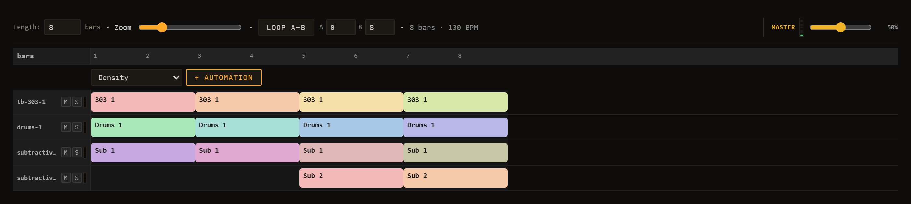

# Performance & Arrangement

Loom has two main views: **Session** and **Performance**. The Session view is the clip grid you work in most of the time — lanes, clips, and scenes launched on demand. The Performance view is a linear **arrangement timeline**: a fixed song laid out from left to right with a playhead that moves forward through it, starts at the beginning, and stops at the end.

Switch between the two views using the **Session / Performance** toggle in the transport bar (`#mode-toggle`). Switching stops playback. See [Transport](02-transport.md) for the full transport layout.

---

## Five ways to fill the arrangement

The arrangement starts empty — and an empty arrangement invites its primary gesture: **drop audio loops on it**.

### 1. Drop audio loops (the primary gesture)

Drag audio files (WAV, MP3, FLAC, OGG, M4A, AIFF) from your file manager anywhere onto the Performance view — the big **"Drop audio loops to start"** invitation when the timeline is empty, or the **＋ new lane** strip at the bottom once it has content. Each file becomes:

- a new **Audio lane**, named after the file;
- a clip **fitted to the session tempo**: the file is assumed to be a loop, its duration rounds to the nearest whole-bar count and the clip warps to fit exactly (pure arithmetic — no beat detection). The band's **bars-chip** shows the fit; if the rounding guessed wrong, the clip's own Warp editor corrects it;
- a **band** on the timeline at the bar you dropped it, showing the loop's **waveform** with tick marks where it repeats.

Dropping several files at once creates one lane per file, all starting at the drop bar. Nothing about this is a parallel world: the dropped loop is an **ordinary session clip on an ordinary Audio lane** — it appears in the Session grid too, launches from there like any clip, and saves in the session file with its sample in the project's sample store.

### 2. Record a loop (●)

The other way in is to **record** a loop instead of dropping one. The **●** button — in the Performance toolbar, and on the big invitation when the timeline is empty — is a bar-quantized looper:

1. Press **●**. Recording is armed for the **next bar boundary** — the button blinks and the toolbar shows *recording at bar N…*. If the transport is stopped, it starts playing first.
2. When the bar arrives, recording begins. The button turns solid red with a live bar count, and a red ghost band grows on the **＋ new lane** strip where the take will land.
3. Press **●** again. Recording continues to the **end of the current bar** and stops there — the cut is sample-exact, so the loop is always a whole number of bars with no tail.
4. The take lands exactly like a dropped file: a new **Audio lane**, a clip at the session tempo, and a band at the bar where recording **started**. Undo removes it like any drop.

What it records is chosen by the **source selector** next to ●:

- **Master** (the default) — resamples Loom's own output: everything you hear becomes the loop. No permissions needed.
- **System** — records the computer's audio via the browser's screen-share picker (tick **share audio** — a browser tab, a different app, anything).
- **Mic** — records the microphone, unprocessed (no echo cancellation or noise suppression — it is music, not a call).

For the external sources a **🎧 monitor** toggle appears; it is **off by default** — turn it on to hear what you are recording through Loom (mind the feedback loop with a live microphone on speakers).

Escape hatches: **Esc** cancels a countdown or a recording outright; pressing **⏹ Stop** while recording keeps the whole bars already played and drops the partial one (if no bar has completed, the take is discarded); switching views cancels a countdown but lets a running recording finish and land.

### 3. Copy to Performance

The fastest route from a working session to a playable song is the **⤉ Copy-to-Performance** button (`#copy-to-performance`) in the session bar of the header — now an icon-only button with the tooltip "Copy the scenes to the Performance timeline". Clicking it calls `arrangementFromSession`, which walks your scenes in order and lays them out as a linear song:

- Each scene becomes one section.
- The section length equals the longest effective clip in that scene (measured in bars). If a clip has a loop sub-region enabled, its sub-region length is used instead of the full clip length.
- Every lane that has a clip assigned for that scene gets a timeline band covering the section.

After the layout is computed, Loom switches you to Performance automatically. **This one is not undoable** — it overwrites whatever arrangement was there, so copy before you start editing bands by hand, not after.

### 4. Record a take live

You can record the arrangement in real time while you play.

Recording is driven by the unified **REC** control in the session bar, which has three modes selectable beside the **● REC** button: **🎛 take** (the default — captures knob moves + clip launches into a performance take, described below), **⏱ live** (records real-time audio to a WAV file), and **⚡ offline** (renders the current scene to WAV offline, faster than real time). The steps below assume **🎛 take** is selected.

1. Make sure the REC mode selector (`#rec-mode`, next to the REC button) is set to **🎛 take** — its default. (The other two modes, **⏱ live** and **⚡ offline**, record audio to WAV instead; see [Saving & Export](09-saving-and-export.md).) Then click **● REC** (`#rec`) in the session bar to arm recording.
2. Stay in Session view and press Play. Recording begins.
3. Launch clips and scenes as you would for a performance. Move any knobs whose automation you want captured.
4. Press Stop. Loom finalises the take: any still-open clip events are clamped to the stop time, durations are computed, and the recorded content appears in the Performance view as timeline bands and automation curves.

If you arm REC and then switch to Performance mode before pressing Play, the arm is cleared automatically (a toast notification appears) because Performance mode drives playback from the arrangement directly rather than from the live session.

### 5. MIDI import

When you import a Standard MIDI File via **File ▸ Import MIDI…** (see [MIDI & Samples](08-midi-and-samples.md)), Loom calls the same `arrangementFromSession` logic after building the session. Because an imported MIDI file produces a single scene whose clips span the full song, the arrangement comes out as one long section per lane — the complete track laid out linearly from bar 1.

---

## The timeline

Once the arrangement has content, the Performance view shows **one scrolling surface**: the ruler stays pinned to the top, the lane labels stay pinned to the left, and everything scrolls together (the rows used to scroll independently and desync on a long song). Zoom and horizontal scroll are remembered **per machine**, not in the save file.

- **Toolbar** — Length (bars), a Zoom slider (16–400 pixels per bar; Ctrl+wheel works anywhere on the timeline), the **Loop A–B** toggle with numeric **A** and **B** bar fields beside it, and a readout showing total bars and BPM.
- **Ruler** — a bar-numbered ruler across the top. **Click it to move the playhead** (playing or stopped); **drag on empty ruler space to set the A–B loop**. When the loop is active, its brace with two drag handles sits on the ruler.
- **Clip bands** — one row per lane. An audio band shows its **waveform** (with tick marks where the loop repeats, and a bars-chip naming the fit); a MIDI band shows a **mini note preview**. A **muted** band paints dimmed; a **selected** one carries a blue outline.
- **＋ new lane strip** — the permanent drop target at the bottom: drop an audio loop, get a lane.
- **Automation curves** — below each clip band, any recorded or drawn automation curves appear. You can draw into curves directly using the Line or Flat brush.
- **Master automation** — curves routed to global (master) parameters, in a section at the bottom.
- **Playhead** — a vertical line that moves in real time while the arrangement plays, scrolling with the content.

### Editing bands

Bands are first-class objects with a selection model — you do not have to re-record to change the layout:

- **Select** — click a band; **Shift-click** adds or removes it from the selection; drag on empty track space draws a **marquee**; clicking empty space clears.
- **Move** — drag the body. The default is **free movement**: the band lands where you drop it (snapped to the beat), gaps are allowed, and a collision clamps it against its neighbour. Hold **Shift** while dragging for the old **ripple** behaviour (later bands push forward); hold **Alt** to disable the beat snap. Dragging **vertically** onto another lane row moves the band to that lane. **Escape** cancels a drag in flight.
- **Resize** — drag the handle at either end. The **left edge is an honest trim**: it slides the band's content offset with it, so what you hear stays anchored to the bars — trimming reveals or covers material instead of shifting it. Resizing clamps against neighbours; it never moves another band.
- **Delete** — press **Delete** (or click the band's **×**).
- **Keyboard** — **Ctrl+D** duplicates the selection, **Ctrl+C / Ctrl+V** copy and paste it at the playhead (relative offsets preserved, on the bands' own lanes).
- **Right-click** a band for the context menu: **Mute** (the band stays but never fires — the gate is in the scheduler, so a muted band is genuinely silent), **Split at playhead** (two bands; the right half keeps playing the same material via its content offset), **Duplicate**, **Delete**.

All of it is undoable on Performance's own stack (see below).

---

## A–B loop brace

The **Loop A–B** button in the Performance toolbar toggles the arrangement-wide loop brace. When active:

- Two drag handles on the ruler mark the loop start (A) and loop end (B). Drag either handle to set the window; handles snap to whole bars. You can also **type the bars** into the **A** and **B** fields next to the Loop A–B button, which is far easier on a long song — typing a value also switches the loop on.
- The playhead wraps within [A, B). When it reaches B, all lanes are stopped and playback re-anchors to A instantly. Any clip that was already active spanning A is relaunched at the wrap point so there is no gap.
- When Loop A–B is off, Loom plays in **song mode**: the arrangement runs from the beginning to `durationSec` and stops — every lane is halted and the transport stops.

This loop brace operates on the arrangement timeline as a whole, and it is **the same region** as the clip editor's **Global** loop: set A–B here and the active scene's shared loop follows, and when you switch back into Performance the brace picks the scene's shared loop up — but only if that loop is switched **on**. A scene whose shared loop is off leaves the A–B window you had here untouched rather than clearing it. It is still distinct from a clip's *own* (non-Global) loop brace, which repeats a sub-region inside that one clip. See [Editing Clips](05-editing-clips.md) for both.

---

## Song playback

Press Play while in Performance mode to start playback from the beginning of the arrangement (or click the ruler to start anywhere). The arrangement's own play state is used — it is independent of the live Session runtime. The playhead advances, clips launch at their scheduled times, and automation curves are applied continuously. A band that was left-trimmed enters its clip **already started** — the music under the playhead is the music you placed there.

**The timeline wins over WEAVE**, with the same rule the Session grid keeps: the moment the arrangement drives a lane, that lane's weave (or follow) is suspended, exactly as if a scene had launched it. The WEAVE panel takes the lane back with its own ▶.

At the end of the arrangement (when Loop A–B is off), all lanes stop and `onArrangementEnd` fires, which stops the transport. You can press Play again to restart from the top.

Knob automation written into the arrangement's curves is applied every lookahead tick alongside clip launches. Automation values are normalised (0–1) internally and mapped to each parameter's min–max range at playback time.

---

## Automation lanes

Automation curves can be added by hand — you do not have to record a take first. Set a non-zero **Length** in the toolbar (or record/copy content so the arrangement has a duration), then use the automation header that appears just below the ruler.

### Adding a lane

The header row contains a grouped parameter dropdown and a **+ Automation** button. The dropdown lists every automatable parameter in the project, organised by prefix (lane ID or `master`). Each entry shows the parameter ID and its label — for example `lane-1.fx.reverb.wet — WET`. Each lane's **mixer column is in there too**: `bus.level`, `bus.pan`, `bus.delaySend`, `bus.reverbSend`, the three `bus.eq.*` bands — and, under the MIXER heading, `mixer.mute` and `mixer.solo` as 0/1 stepped curves — so a fade-in, a pan sweep, a send that opens up over eight bars or a section that drops the drums is drawn here like any other curve. Select the parameter you want, then click **+ Automation**. A new lane appears below the clip band for that lane (or in the Master section for global parameters). The curve starts flat at the parameter's current value.

There is a quicker route for a knob you can see: **right-click it**. In Performance view the menu offers *Automate on the timeline* (or *Edit automation on the timeline* if a curve already exists) and jumps you straight to it. The same menu in Session view targets the open clip instead — see [Modulation & Note FX](06-modulation-and-note-fx.md).

### Drawing the shape

Two brush buttons sit in that same automation header, after the **+ Automation** button and under the label **Brush**. They only appear once at least one curve exists — per-lane or on master — so on a fresh arrangement there is no Brush label to find:

- **Line** — click and drag to draw a ramp between the start and end points of the gesture. Use this for smooth fades, filter sweeps, or any gradual change.
- **Flat** — paints a constant value across the drag range. Use this for step-style automation or to hold a value steady across a section.

The active brush is highlighted, and the choice applies to every curve. Each lane also exposes **On / Off** and **Smooth / Stepped** toggles in its header. **On / Off** mutes the curve without deleting it. **Stepped** switches interpolation from smooth linear to staircase, snapping the value at each sub-step boundary — useful for parameter jumps that should be instantaneous.

### Removing a lane

Click the **×** button on the right side of the lane header to remove the curve entirely. The action is undoable with Ctrl+Z / Cmd+Z.

### How automation curves play back

Curves added manually behave identically to curves captured by recording. During arrangement playback they are applied continuously alongside clip launches — knob values are updated every lookahead tick, mapped from the normalised 0–1 curve to the parameter's min–max range. Curves generated by a recorded take (see [Transport — REC](02-transport.md)) and manually drawn curves live in the same list and can coexist on the same lane.

For modulator-driven per-lane automation (LFO / ADSR) that runs in Session view rather than the arrangement timeline, see [Modulation & Note FX](06-modulation-and-note-fx.md).

---

## Lane mute & solo — two kinds, side by side

The Performance lane header carries **two pairs** of buttons, and they mean different things:

- **S▸ / M▸ (launch-solo / launch-mute, accent-coloured)** — the **arrangement** stops driving lanes. Launch-solo a lane and the take launches clips and applies automation ONLY there; what was already sounding on the other lanes finishes **at the next bar** (a musical handover, not a cut). Un-solo and the freed lanes re-enter the band under the playhead immediately. This is "solo this loop" in the musical sense, and it is fully reversible mid-song.
- **m / s (the mixer's audio mute/solo)** — the classic desk pair: silences the lane's audio **bus** instantly, tails included. The lane keeps scheduling underneath. These are the SAME switches as the mixer's and the clip editor's — one pair, three places.
- **VU meter** — a vertical level meter shows the lane's live output RMS.

The audio pair is saved with the session; the launch pair is performance state.

**The mixer's mute and solo are also automatable**: every lane lists `mixer.mute` and `mixer.solo` (under the MIXER heading) in the + Automation picker, as 0/1 stepped curves — and pressing m/s **while a take records** writes the press into the take, so a mute performance replays like any knob move. See [Mixing & FX](07-mixing-and-fx.md#mute-and-solo).

---

## Persistence

The arrangement is saved as part of the session file (schema version 3). Recorded takes — clip bands, automation curves, loop brace position — survive Save / Load and browser restarts.

**Performance has its own, separate undo stack.** This surprises people, so it is worth stating plainly: while you are in Performance mode, `Ctrl+Z` / `Ctrl+Y` undo **timeline edits only** — moving, resizing or deleting bands, length and zoom changes, adding or removing curves, drawing automation. Those keystrokes never reach session undo, even when the timeline stack is empty and nothing happens. Conversely, session edits are invisible to Performance's undo. Switch back to Session view to undo session changes.

Two things are outside undo entirely: the **raw recording** (a take is finalised on Stop and does not enter the stack) and **Copy to Performance** (it overwrites the arrangement outright).

See [Saving & Export](09-saving-and-export.md) for how sessions are saved and loaded.
