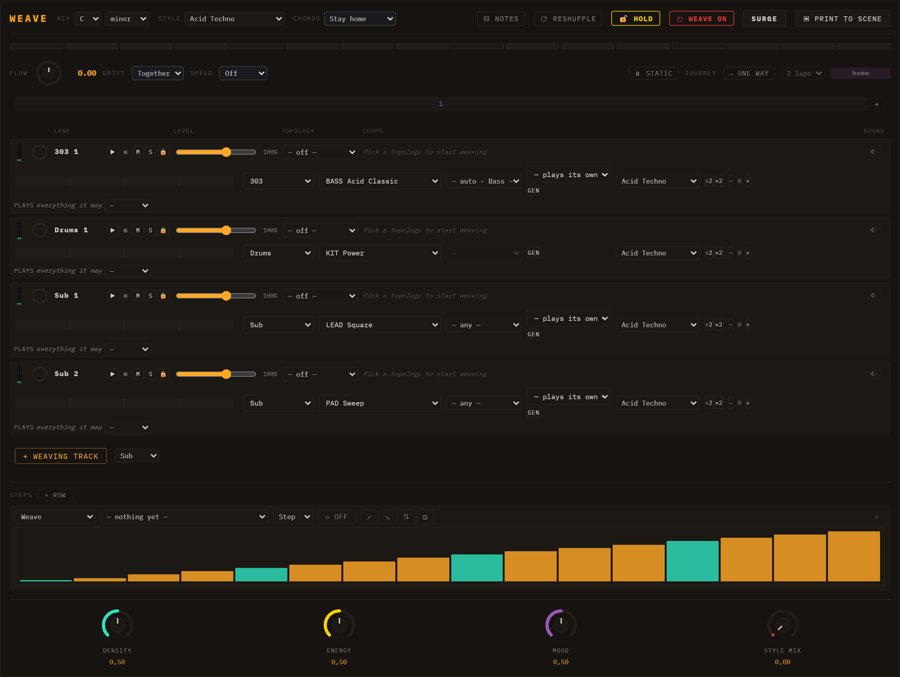
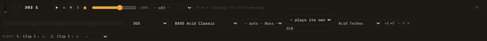
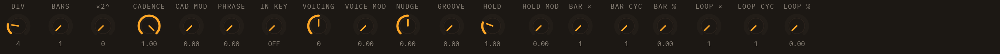

# WEAVE

**WEAVE** is a third view, beside Session and Performance. Where the Session grid launches clips you wrote, WEAVE **crossfades between loops** — and keeps crossfading, on its own, for as long as you let it. A scene made in WEAVE is not a fixed arrangement; it is one that keeps finding new material while you steer it.

Open it from the view toggle in the transport bar. WEAVE is a **panel plugin**: it ships in `plugins/weave/` and is loaded at runtime like any engine or insert, which means it can be absent from a build without the rest of the app noticing.

---

## The idea in one paragraph

Every track in WEAVE plays a **blend of two or more loops** instead of its own clip. Where the blend sits is a position you can move by hand or leave to the master flow. The two loops never simply alternate: what they SHARE stays put — that shared skeleton is what holds the bar together — and what differs hands over gradually. Melodic material is blended in **scale degrees**, so a crossfade cannot detune; it can only move between notes that are in the key.

You are never editing the loops. WEAVE is a tool that sits ON TOP of the session: switch a track's weave off and its clip is exactly as you left it.

---

## The track row

Each track is one row of up to four lines. The top line is what a hand reaches for while the music runs; the second is what you set once and leave; the third appears only while the track is generating; the fourth is the list of loops it may draw from.

**Top line, left to right:**

- **VU meter** — what the track is putting out, the same meter the mixer column shows. It keeps reading with the transport stopped, because a held note or a reverb tail is still sound.
- **Loop ring** — where this track is in its bar, and how long is left of a queued change.
- **Name**, then **▶ ■ M S 🔒** — launch, stop, mute, solo, and **lock**. A locked track holds the loops it has while everything else travels. Mute and solo are the mixer's own, not a second pair.
- **Level** — the same gain as the mixer column, with its percentage beside it.
- **Topology** — how this track weaves. See below. The blank entry, `— off —`, returns the track to simply playing its clip.
- **The weaving control itself** — a dial, a queue or a square, depending on the topology.
- **◐ Sound** — off by default. See *Playing one part on several instruments*.

**Second line:** the note bar this track is about to play, then which slot (on a rack), instrument, preset, part, **who it follows**, **GEN**, **how long it takes to repeat itself**, style shelf, half/double time, and octave. The three in bold have sections of their own below.

**Third line:** the generator's controls, and only while **GEN** is lit. On every other track the line is there and empty, so switching a track on does not shove the tracks below it down the screen.

**Fourth line — PLAYS:** the loops this track draws from. See *The list a track draws from*.

---

## Topologies — how a track weaves

Pick one per track from the dropdown.

### A→B

Two loops and a dial between them. When the dial reaches the far end, **B becomes the new A and a fresh loop is drawn for B** — so the journey never ends and never returns to where it began. Where that fresh loop comes from is decided by the track's **PLAYS** list, if it has one; see below.

The control is an **endless dial**, not a fader, and it is dragged **up and down**. A dial rather than a fader because a fader promises two ends, and with the scene evolving there are none.

The names sit either side as *from → to*.

### Cloud

Four loops, one in each corner of a square, and a dot you drag. An edge behaves like a plain two-loop crossfade; the middle is the one place all four sound at once.

A cloud walks its lap along a **path**, because the master flow is one number and a square is two:

- **RIM** — the four sides. The dot spends its whole lap on an edge, so every corner arrives as a clean handover.
- **CROSS** — side, diagonal, side, diagonal. The same four corners, but it crosses the middle twice a lap, alternating clean handovers with everything piling up.

A cloud evolves too: each lap swaps out **the corner the dot is furthest from** — the one nobody is hearing — so four laps renew the whole square, one corner at a time.

### Queue

An ordered list with a cursor, always crossfading between the two entries it sits between. Finite where A→B is endless, but walkable backwards. It is no longer offered in the dropdown; a saved track already on it keeps working.

---

## The master flow

The header controls move every unlocked track at once.

- **Flow** — the master dial, and a readout of where the scene is.
- **Drift** — **Together**, **Offset** or **Free**: where the tracks stand relative to one another. This is a **layout, applied once, the moment you pick it** — *Together* puts every track on the same number, *Offset* fans them out evenly, and *Free* places nothing at all. After that the dial moves every track by the same amount, so **the distances between them are carried, not replaced**. Move one track's own dial and its new distance from the others is the distance from then on. A **locked** track is left where it is, and so is a track with no weave.
- **Speed** — how long one full journey takes, in bars. **Off** by default: a panel that started travelling the moment you opened it would change a session you had not touched.
- **EVOLVE / STATIC** — what happens at the END of a lap. **STATIC** is a scene you place by hand and it stays placed. **EVOLVE** draws fresh material on arrival, which is what makes a scene keep moving.
- **Journey** — two controls, because how far a journey goes and whether it comes home are two decisions. The button reads **→ One way** or **⇄ There and back**; beside it a length picks **2, 4 or 8 laps**. Going out it draws new loops; coming back it walks the ones it already played, so the way home is the same journey in reverse rather than a different one. On a one-way journey the length decides nothing, so it greys out and says so — and it keeps the value you gave it, so turning the round trip back on resumes at the same length.
- **🔒 HOLD** — freeze the arrangement. The chord walk keeps going and the step rack keeps writing; only the loops stop moving.
- **SURGE** — held, not toggled: a momentary push that restores itself when you let go.
- **⟳ Reshuffle** — **tap** to re-deal only the loop you are NOT hearing, which is why it is safe mid-phrase; **hold** it to re-deal every loop at once. A locked track ignores both.

---

## What each track PLAYS — parts and shelves

A track's **part** decides which material it draws and in which register: **Bass**, **Comp**, **Pad**, **Arp** or **Melody**. Leave it unset and the track behaves as it always did. An engine can declare its own default — a TB-303 lane comes out as bass whether or not you mark it.

- **Bass** and **Melody** read the pattern library, at their own octave.
- **Comp**, **Pad** and **Arp** read **no** library at all. Their material is GENERATED as chords, because a chord written as fixed semitones cannot stay in key across the eight scales a session may be in. What you pick for them is a **shape** — the rhythm and the voicing — and the notes follow the session's key, scale and chord progression.
- Marking a track **Arp** also gives it an arpeggiator. Unmarking it does not take the arpeggiator away: by then it is a card with your settings on it.

**Style** picks which shelf of the library this track draws from, independent of the session's own style. A style change lands on the **next** loop drawn, not the one playing — changing it mid-phrase would be a splice, not an evolution.

**Half and double time** (`×2` / `÷2`) and the **octave** (`− +`) both live on the weave, never on the clip. The phrase is always delivered whole: half time stretches it and takes the room it needs.

---

## The list a track draws from

Part and style say what a track **may** draw. The **PLAYS** list, on the fourth line of every track row, says what it **does** draw, and in what order.

Leave it empty and it reads **everything it may**: the track draws from the whole shelf its part and style allow, at random, which is what WEAVE always did. Add a loop and the behaviour changes completely:

- **It is walked in the order you wrote it, and it wraps.** An A→B hand-over goes to the *next* entry rather than drawing at random, so the same four loops come round in the same order, every time.
- **A list of one freezes the track.** There is nowhere to hand over to, so it holds where it is. Falling back to the shelf would play exactly the material you excluded.
- **It outranks the track's own clips and the shelf** — for the hand-over and for the generator both.
- **The picker offers the whole library**, not just this track's shelf. That is deliberate: the list is how you hand a track material from outside its part and its style.
- **A cloud ignores it.** A cloud renews itself by corners, not by hand-overs; the list is A→B's.

Editing: **↑** and **↓** move an entry, **✕** takes it out, and the picker at the end adds one. Buttons rather than drag-and-drop, because the row repaints under your finger. If you delete the loop a travelling track is currently leaving, it rejoins the list at the **top** — the front is what you wrote next.

The list is saved with the session, in the save file.

---

## Following — a track that plays what another track implies

A track can accompany another instead of playing material of its own. Set **Follow `<track>`** on its second line and it stops reading loops and clips entirely: every bar it works out what to play from what the track it follows is playing.

What it plays is decided by its **part** — the same Bass / Comp / Pad / Arp choice as above. Following says *whose* harmony; the part says *which player*. A bass takes roots and leans on the change; a comp reads a rhythm from the style; a pad takes the nearest inversion; an arp walks the chord's own tones and is deliberately not voice-led, because an arpeggio is heard as a line.

The harmony is **taken, not deduced**, in that order of preference: a progression you wrote by hand, then the session's own, and only then an analysis of the leader's notes. The analysis is the last resort because it is the weakest — a one-bar library loop transposed per bar reads back as a single chord, and most of the shelf does exactly that.

Worth knowing:

- **It reads the leader AHEAD**, not behind. That is what lets a cadence be placed before it arrives, and what makes an offline render come out the same as what you heard.
- **Its harmony changes only where a BAR does**, and only while it is playing. A chord arriving mid-bar would re-schedule music already sounding.
- **Following and weaving are exclusive, both ways.** Choosing a leader shelves the track's weave; switching back to *— plays its own —* hands it back exactly as it was. Choosing a topology clears the follow.
- A **percussion** track cannot follow: it has no part to play. The control is simply not built rather than offered empty.

---

## GEN — a read head over the track's own material

**GEN** is the amber switch beside the follow picker. It is the third thing that can decide what a track plays, and the strongest of the three after following: with GEN on, the track stops playing its loops and starts **reading** them.

**What it actually does.** The track's loops are folded into a single bar exactly as the weave folds them. That bar's **pitches** become an ordered pool — the rhythm is thrown away — and a read head walks a pattern you set, taking one pitch per step. It invents nothing: everything you hear was already in the material. What you are dialling is *how it is read*.

**Where the material comes from**, in this order: the track's **PLAYS** list, then its own clips that have notes in them, then the style shelf. With none of the three there is nothing to read, so the switch simply does not come on. Switching GEN on shelves the track's weave selection and switching it off hands it back untouched, so nothing is lost either way.

The controls are the third line of the track row, and they come in five groups.

**The grid — how the bar is cut up**

| Control | Range | Default | What it does |
|---|---|---|---|
| DIV | 1–16 | 4 | How many steps cut one bar. 4 is quarters in 4/4; the meter still says how long a bar is, so 6/8 wants 6 |
| BARS | 1–16 | 1 | How many bars before the pattern comes round again. This is also the phrase length PHRASE reads |
| ×2^ | 0–3 | 0 | A power-of-two multiplier on that length — ×1, ×2, ×4, ×8. Separate from BARS because "my phrase is four bars" and "now take four times as long to get through it" are different gestures |

**Which steps fire**

| Control | Range | Default | What it does |
|---|---|---|---|
| CADENCE | 0–1 | 1 | A **floor on metric weight**, not a pattern. At 1 every step of the division fires; turning it down drops the weak positions first and the strong ones last; at 0 the track is silent |
| CAD MOD | 0–1 | 0 | How much that floor varies from step to step. At 0 every bar of the pattern has an identical rhythm. It swings either side of the knob, so the average stays where you put it |
| PHRASE | 0–1 | 0 | How much a bar's position in the phrase floors it: the opening bar states, the middle bars thin out, the turnaround comes back |

**Which note it lands on**

| Control | Range | Default | What it does |
|---|---|---|---|
| IN KEY | OFF / SCALE / CHORD | OFF | SCALE snaps to the track's key — a passing note the chord does not contain still gets through. CHORD locks to the chord tones of the progression at that bar: it cannot sound wrong, and it cannot sound like a melody. OFF is honest rather than lazy — the blend already walks scale degrees |
| VOICING | −7…+7 | 0 | Moves the note by whole **tones of the set** — chord tones on CHORD, scale degrees on SCALE. Not semitones: that would be a transposition, which is what the octave buttons are for |
| VOICE MOD | 0–1 | 0 | Per-step variation on VOICING, up to three tones either way at full depth |

VOICING and VOICE MOD do nothing while IN KEY is OFF. Off means off in both halves.

**Where the hit lands, and how long it holds**

| Control | Range | Default | What it does |
|---|---|---|---|
| NUDGE | −1…+1 | 0 | How far off its step a hit sits, in fractions of a step; negative is early. Fractions, so the feel survives a change of DIV |
| GROOVE | 0–1 | 0 | Per-step variation on NUDGE. **This is what makes it a groove rather than a shift** — at 0 every hit moves the same way, which just reads as the track being late |
| HOLD | 0.05–4 | 1 | Note length as a multiple of its step. 1 fills the step, below it detaches — and **above 1 the notes overlap, which is how the generator slides**: on a 303 (or any engine that infers portamento from overlap) this is the glide control |
| HOLD MOD | 0–1 | 0 | Per-step variation on HOLD, up to a step either way |

**The two wheels** — six controls that move the read head itself, three per wheel: **×** how far one turn moves it, **CYC** how many turns the wheel takes to come round (1 means it is not turning), and **%** how much of it is applied. The `%` is the one that switches the wheel on; the other two describe a wheel that is not yet moving anything.

- **BAR ×/CYC/%** turns once per bar of the pattern, so what it does repeats when the pattern does — a figure you can learn.
- **LOOP ×/CYC/%** turns once per lap, so it never repeats inside a pass. This is the one that reaches material a short pattern would otherwise never get to.

Two readings that explain most surprises:

- **The pool is read on every step, whether or not that step fires.** Turning CADENCE down gives you *the same line with holes in it*, not a different line.
- **CADENCE reads the pattern's own bar; IN KEY reads the song's.** The rhythm repeats with the pattern, the harmony walks the progression.

Worth knowing:

- **BAR MOD does nothing out of the box.** The default pattern is one bar long, and a wheel that turns once per bar has one turn to make. Raise BARS (or ×2^) first.
- **A pool longer than the pattern has a tail nobody hears** until LOOP % is raised.
- **A scene launch does not stop the generator.** The grid takes the *weave* off a track; generating and following are properties of the song, saved on the track, and they carry on.
- **Switch GEN off before you give a track a leader.** Turning GEN on clears a follow, but picking a leader does not turn GEN off — and following wins, so the switch stays lit over a track that is not generating.

Everything here is saved with the session and undoable, and it lives on the track rather than in the panel: close WEAVE and the track keeps generating.

---

## How long a track takes to repeat itself

Beside the follow picker is a five-rung ladder: **Loop · Turns · Travels · Wanders · Never repeats**.

It does not add notes and it does not make anything busier. It buys **length** — how long the track plays before it plays the same way twice. At *Loop* the accompaniment is a loop in the ordinary sense. Each rung up brings in another wheel that turns at its own rate: which figure it uses, which colour the chord takes, which register it sits in, how dense it leans. Because those rates share no common factor, the combination takes far longer to come round than any of them does alone.

Set it by ear rather than by the label. *Turns* is the default and is enough for most tracks. The top of the ladder is a long piece of music, and on a short one it can read as drifting rather than developing.

---

## Playing one part on several instruments

The **◐** button is a second axis: the weave decides which NOTES play, this decides **what they are played on**.

Turning it on builds what it needs — the track becomes a **rack** of instruments, its own sound in the first slot and others alongside, each on its own preset. The control then wears the shape of that track's loop control: a **fader** on A→B, a **square** on a cloud. Off, it collapses back to just the button.

Without it, each note plays on the instrument of the loop it came from. With it, every note reaches every instrument and the control balances them. Either the loop chooses the instrument or you do — never both.

The `1 2` buttons on the second line pick which slot the instrument and preset dropdowns are pointing at.

---

## The chord progression

Every chordal track follows one progression, walked across the session's bars and shown as a bar with the current chord in Roman numerals. Pick a catalogue entry, or edit the strip and it becomes yours — the catalogue is never written to. "Stay home" is a single chord and no journey.

**The progression travels too**, in the same legs the loops do. The first chord never moves — home is what a departure is measured against — an interior chord may be swapped for its diatonic relative, and the last alternates with V as a turnaround. Only ONE chord moves per leg: harmony is far less forgiving than timbre, and two changing at once stops reading as a variation and starts reading as a wrong chord.

If the progression is longer than a track's clip, the track hears a **window** of it at a time rather than the first two chords for ever; a short progression tiles instead.

**The progression is the session's, not the panel's.** It is stored with the key and the scale — the same question asked at three different rates — which is why the Chord note-FX's *chord* setting and the generator's `IN KEY = CHORD` can both read it, on any lane, whether or not WEAVE is open.

---

## The macros

Four knobs colour everything at once, and each of them changes the MUSIC rather than the treatment of it.

- **Density** and **Energy** rewrite the notes themselves.
- **Mood** chooses the scale the blends walk their degrees in, from brightest to darkest. At its neutral it does not mean "no scale": the session's own scale is home, and a travelling scene still wanders a step either side of home and holds there a couple of legs. Mood only says where home is.
- **Style mix** decides how far a track may stray from the session's style, and how often. A stray steps one to three places along a catalogue ordered by family, so a downtempo scene drifts to its neighbours instead of landing in jungle and back.

At their neutral positions they say nothing at all.

> There used to be six. **Space** and **Motion** are gone: they were the only two that moved PARAMETERS rather than notes, and a knob that sweeps a reverb is spent after its first pass while one that rewrites the music keeps giving.

---

## The step rack

Below the tracks is a row of bars pointing at a **destination** — any parameter a knob can move. It moves that parameter **in time with the loop** rather than on a curve of its own, which is what a step row on an old sequencer was for. **+ ROW** adds another; each row has its own length and its own mode, so a sixteen-step row cannot silence a four-step one.

Its value goes to the audio object and never to the track's saved sound: the row owns the value, and stamping its momentary position into a preset is the mistake that door exists to avoid.

---

## Switching the whole thing off

**⏻ WEAVE ON / OFF** unplugs the panel. Off, it stops the transport and every track goes back to playing exactly what it played before WEAVE existed — nothing is undone, nothing is lost, and plugging it back in does not start anything on its own. It is the honest way to hear the session underneath.

**+ WEAVING TRACK** adds a track that arrives already weaving: a new lane, an empty carrier clip, and its first two library loops picked for you. A track that arrived empty would leave the panel as useless as it was.

---

## PRINT — keeping what you heard

**PRINT** freezes what the weave is playing into a new scene: a full lap of the chord progression, laid end to end, as ordinary clips you can edit. It is an output, never the goal — the weave carries on folding either way.

Launching a printed scene plays what was printed, even on a track that is still weaving — the grid wins, as below. (This used to be a known limitation, with a note telling you to switch the track's topology off first. Do not: choosing a topology is now exactly the gesture that takes the track *back* from the grid.)

---

## Two things worth knowing

**The grid wins.** Launch a scene and every weaving track hands itself back to it: each one plays the clip that scene gives it, or is silent where the scene leaves it empty. Launching a single clip from the grid does the same for that track alone. Nothing is destroyed — the topology, the loops, the position and the list are all still there — and the panel takes the track back the moment you use it: its own **▶**, a topology, or choosing or moving a loop. While the grid holds a track, **Play skips it**, and the panel's own **▶** is how you hand it back.

What the grid takes is the **crossfade**, not the whole track. Following and generating are properties of the song rather than of an open panel, so a track that follows or generates goes on doing it through a scene launch.

(This used to work the other way round, and it is worth knowing which build you are on: a weaving track once read its own selection and nothing else, so every scene sounded the same on it — including a scene of empty clips.)

**Nothing here is undoable.** A weave move is deliberately not an undo entry; it is a performance, not an edit. It IS saved with the session, and it nudges the autosave when it moves.
