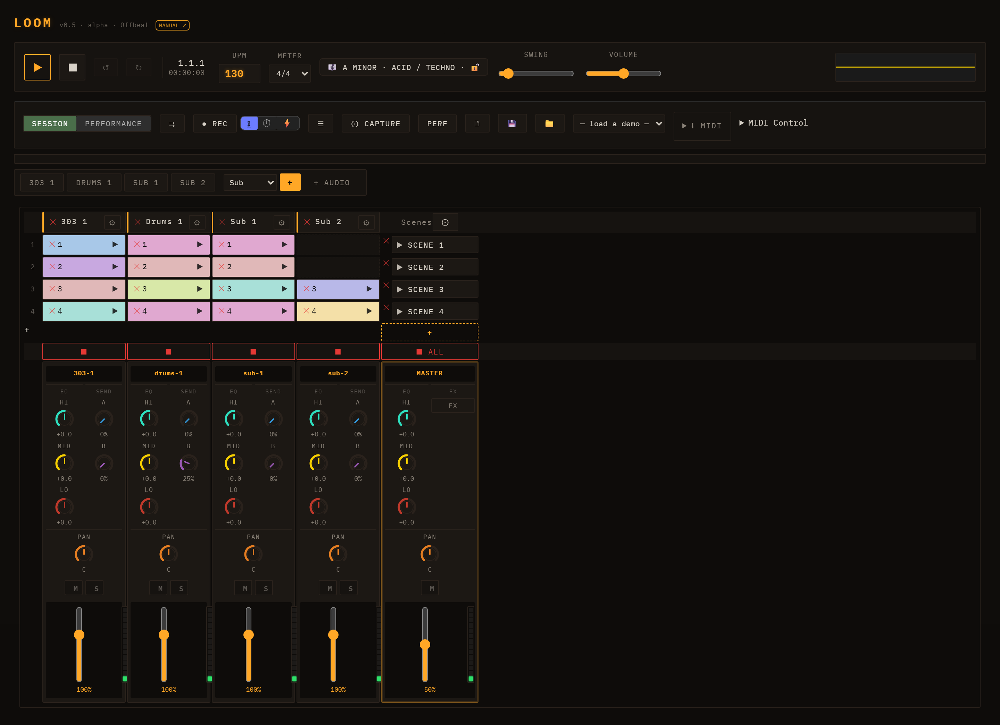

# Loom — Manual

Loom is a browser-based, session-based music workstation. It organises sound into **lanes** (instrument tracks), **clips** (patterns of notes), and **scenes** (rows of clips launched together). Eight synthesis engines are available — TB-303, Subtractive, FM, Wavetable, Karplus-Strong, West Coast, Sampler, and Drum Machine — and all synthesis runs live in the browser with no install or sign-in required.

Beyond the engines, Loom has **note velocity & dynamics** (an Ableton-style velocity lane), **per-clip and arrangement-wide loop regions**, **per-lane modulation and FX** with a sidechain mixer, **MIDI import**, ready-made **sampled drum kits**, a **playable arrangement** timeline, improved **session editing workflow** (inline track/scene rename, duplicate track/scene, and capture-playing-to-scene), optional **stem separation + transcription** (split a finished song into 4 lanes via a local helper and optionally derive editable note/drum lanes), **key & scale musical assistance** (a project key/scale with a scale-locked piano-roll, genre generators, an examples gallery, and a chord-accompaniment maker), and **editable warp markers** for locking audio loops to tempo.

---

*The Loom interface: transport across the top, the session clip grid in the centre, and per-lane channel strips below.*

---

## Table of Contents

|#|Chapter|
|-|-------|
|1|[Getting Started](01-getting-started.md)|
|2|[Transport](02-transport.md)|
|3|[Sessions, Lanes, Clips & Scenes](03-sessions-lanes-clips-scenes.md)|
|4|[Engines](04-engines.md)|
|5|[Editing Clips](05-editing-clips.md)|
|6|[Modulation & Note FX](06-modulation-and-note-fx.md)|
|7|[Mixing & FX](07-mixing-and-fx.md)|
|8|[MIDI & Samples](08-midi-and-samples.md)|
|9|[Saving & Export](09-saving-and-export.md)|
|10|[Performance & Arrangement](10-performance-and-arrangement.md)|
|11|[Developer Guide](11-developer-guide.md)|

---

[Loom-Manual.pdf](Loom-Manual.pdf)

Live demo: <https://ijol.github.io/Loom/>
